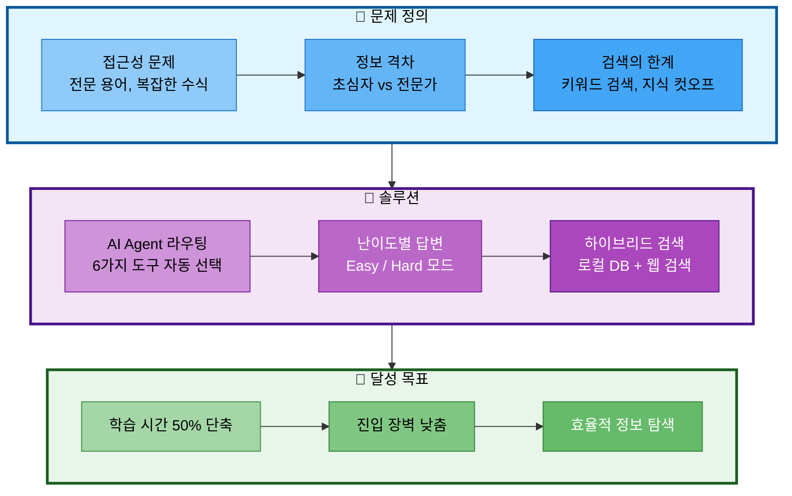

# 01. 프로젝트 개요

## 문서 정보
- **작성일**: 2025-10-30
- **프로젝트명**: 논문 리뷰 챗봇 (AI Agent + RAG)
- **팀명**: 연결의 민족
- **작성자**: 연결의 민족 팀

---

## 1. 프로젝트 배경

### 1.1 문제 정의

AI/ML 분야의 논문은 매일 수백 편씩 발표되지만, 다음과 같은 문제가 있습니다:

1. **접근성 문제**
   - 전문 용어와 수식이 많아 초심자가 이해하기 어려움
   - 논문을 읽고 이해하는 데 많은 시간 소요
   - 최신 논문 정보를 찾기 어려움

2. **정보 격차**
   - 초심자와 전문가의 이해 수준 차이가 큼
   - 동일한 내용도 난이도별로 설명이 필요
   - 용어 설명이 없어 학습 장벽이 높음

3. **검색의 한계**
   - 키워드 검색만으로는 의미적 관련성을 찾기 어려움
   - LLM의 지식 컷오프로 최신 논문 정보 부족
   - 논문 간 비교나 관계 파악이 어려움

---

## 2. 프로젝트 목적

### 2.1 핵심 목표

**AI/ML 논문을 누구나 쉽게 이해하고 활용할 수 있는 지능형 챗봇 개발**

### 2.2 목표 달성 흐름



### 2.2 세부 목표

1. **지능형 질문 응답**
   - 사용자 질문 의도를 분석하여 적절한 도구 자동 선택
   - RAG 검색, 웹 검색, 용어집 등 다양한 소스 활용

2. **난이도별 맞춤 답변**
   - Easy 모드: 초심자를 위한 쉬운 설명 (비유, 실생활 예시)
   - Hard 모드: 전문가를 위한 기술적 설명 (수식, 알고리즘)

3. **최신 정보 제공**
   - 로컬 DB (논문 지식 베이스) + 웹 검색 하이브리드 접근
   - 최신 논문 정보를 실시간으로 검색

4. **사용자 편의성**
   - 직관적인 채팅 인터페이스
   - 대화 히스토리 저장 및 파일 다운로드 기능

---

## 3. 핵심 기능

### 3.1 필수 기능

#### 1. AI Agent 기반 지능형 라우팅
- LangGraph를 활용한 상태 기반 Agent 구현
- 사용자 질문을 분석하여 적절한 도구를 자동 선택
- 6가지 도구 통합 (일반 답변, RAG 검색, 웹 검색, 용어집, 논문 요약, 파일 저장)

#### 2. RAG 기반 논문 검색
- PostgreSQL + pgvector를 사용한 벡터 검색
- OpenAI Embeddings를 활용한 의미적 유사도 검색
- 논문 메타데이터 (제목, 저자, 년도, 카테고리) 조회

#### 3. 웹 검색 기능
- Tavily Search API를 통한 최신 논문 정보 검색
- arXiv, Google Scholar 등에서 실시간 정보 수집

#### 4. 용어집 자동 설명
- 전문 용어 자동 인식 및 설명
- 난이도별 설명 제공 (Easy/Hard)
- 용어집 데이터베이스 + Vector DB 하이브리드 검색

#### 5. 논문 요약 기능
- Langchain load_summarize_chain 활용
- 난이도별 요약 (초심자용/전문가용)
- 섹션별 요약 지원 (Abstract, Method, Conclusion 등)

#### 6. 파일 저장 기능
- 대화 내용을 텍스트 파일로 저장
- 논문 요약 내용 저장
- Streamlit 파일 다운로드 기능

#### 7. 난이도별 답변
- Easy 모드: 쉬운 용어, 비유 사용, 수식 최소화
- Hard 모드: 기술적 세부사항, 수식 포함, 논문 비교

### 3.2 선택 기능 (가산점)

#### 1. Text-to-SQL 기능 (선택)
- 자연어를 SQL 쿼리로 변환
- 논문 통계 정보 조회 (년도별, 저자별 등)

#### 2. 성능 평가 기능 (선택)
- RAG 검색 정확도 평가
- 응답 품질 평가

#### 3. 대화 히스토리 관리
- PostgreSQL 기반 대화 히스토리 저장
- 이전 대화 컨텍스트 유지

---

## 4. 프로젝트 범위

### 4.1 포함 범위

1. **데이터**
   - AI/ML 논문 50-100편 (arXiv 기반)
   - 전문 용어집 50-100개 항목
   - 논문 카테고리: Transformer, BERT, GPT, Attention Mechanism 등

2. **기능**
   - 6가지 필수 도구 (일반 답변, RAG, 웹 검색, 용어집, 요약, 파일 저장)
   - 난이도별 답변 (Easy/Hard)
   - AI Agent 기반 자동 라우팅

3. **인프라**
   - PostgreSQL + pgvector (단일 DB 솔루션)
   - OpenAI GPT-4 / GPT-3.5-turbo
   - Streamlit 웹 UI

### 4.2 제외 범위

1. **다국어 지원**: 한국어/영어만 지원
2. **사용자 인증**: 로그인 기능 없음
3. **대규모 데이터**: 100편 이상의 논문은 향후 확장
4. **멀티모달**: 이미지, 표 분석은 미포함

---

## 5. 프로젝트 제약사항

### 5.1 시간 제약
- **전체 기간**: 2025년 10월 28일 ~ 11월 6일 (10일)
- **핵심 개발 기간**: 10월 30일 ~ 11월 3일 (5일)
- **발표일**: 11월 6일 오후 2시

### 5.2 인력 제약
- **팀 구성**: 4명 (10/31 이후 3명)
  - 최현화 (팀장): 전체 기간 참여
  - 박재홍: 10/28 ~ 10/31 (데이터 수집 담당)
  - 신준엽: 전체 기간 참여 (RAG 담당)
  - 임예슬: 전체 기간 참여 (UI/프롬프트 담당)

### 5.3 기술 제약
- **OpenAI API 비용**: 제한된 예산 (개발 시 GPT-3.5-turbo 사용)
- **Vector DB**: PostgreSQL + pgvector로 통합 (별도 Vector DB 사용 안 함)
- **클라우드**: 로컬 개발 환경 (발표 시 Streamlit Cloud 고려)

### 5.4 데이터 제약
- **논문 수**: 50-100편 (arXiv 중심)
- **데이터 형식**: PDF, arXiv API
- **언어**: 영어 논문 중심 (한국어 설명 제공)

---

## 6. 기대 효과

### 6.1 사용자 측면

1. **학습 시간 단축**
   - 논문 이해 시간을 50% 이상 단축
   - 핵심 내용을 빠르게 파악 가능

2. **진입 장벽 낮춤**
   - 초심자도 최신 AI 논문을 이해 가능
   - 용어 설명으로 학습 장벽 해소

3. **효율적인 정보 탐색**
   - 키워드가 아닌 의미 기반 검색
   - 관련 논문을 빠르게 찾기

### 6.2 기술적 측면

1. **AI Agent 설계 경험**
   - LangGraph를 활용한 복잡한 워크플로우 구현
   - 도구 호출 및 라우팅 로직 설계

2. **RAG 시스템 구축 경험**
   - Vector DB + 관계형 DB 통합
   - 임베딩 및 검색 최적화

3. **프롬프트 엔지니어링**
   - 난이도별 프롬프트 설계
   - Few-shot 프롬프트 활용

---

## 7. 성공 기준

### 7.1 최소 성공 기준 (Must Have)

- ✅ 사용자 질문 입력 시 AI Agent가 적절한 도구 자동 선택
- ✅ 6가지 도구 모두 정상 동작 (일반 답변, RAG, 웹 검색, 용어집, 요약, 파일 저장)
- ✅ RAG로 논문 검색 및 난이도별 답변 생성
- ✅ 웹 검색으로 최신 논문 정보 검색
- ✅ 용어집 자동 설명 기능
- ✅ 논문 요약 기능
- ✅ 파일 저장 기능
- ✅ Easy/Hard 모드 답변 차이 명확
- ✅ Streamlit UI 정상 동작
- ✅ 10개 시나리오 모두 통과
- ✅ 발표 자료 완성

### 7.2 목표 성공 기준 (Should Have)

- ⭐ 50개 이상 논문 데이터 확보
- ⭐ UI 디자인 완성도
- ⭐ 대화 히스토리 관리 기능
- ⭐ 스트리밍 응답 (StreamlitCallbackHandler)

### 7.3 최상 성공 기준 (Nice to Have)

- 🌟 Text-to-SQL 기능 구현
- 🌟 성능 평가 시스템 구현
- 🌟 100개 이상 논문 데이터
- 🌟 Reranking 구현

---

## 8. 팀 구성 및 역할

| 이름 | 역할 | 주요 담당 | 참여 기간 |
|------|------|----------|-----------|
| 최현화 | 팀장 | AI Agent 그래프, LLM 클라이언트, 메모리, 논문 요약 도구, 프로젝트 총괄 | 10/28 ~ 11/6 |
| 박재홍 | 팀원 | 데이터 수집, Document Loader/Splitter, 임베딩 생성, DB 설정 | 10/28 ~ 10/31 |
| 신준엽 | 팀원 | RAG 시스템, RAG 검색 도구, 용어집 도구 | 10/28 ~ 11/6 |
| 임예슬 | 팀원 | Streamlit UI, 프롬프트 템플릿, 웹 검색 도구, 파일 저장 도구 | 10/28 ~ 11/6 |

**팀 협업 방식:**
- Git 브랜치 전략: Feature Branch 워크플로우
- 코드 리뷰: 팀장 승인 후 병합
- 일일 스탠드업: 매일 오전 10시 (15분)
- 커뮤니케이션: Slack/Discord

---

## 9. 주요 기술 스택

### 9.1 Core Technologies

| 구분 | 기술 | 비고 |
|------|------|------|
| LLM API | OpenAI GPT-4 / GPT-3.5-turbo + Solar-pro | OpenAI: 높은 정확도, Function Calling<br/>Solar: 한국어 특화, 비용 효율 |
| Framework | Langchain + LangGraph | AI Agent 및 RAG 통합 |
| Database | PostgreSQL + pgvector | 관계형 + 벡터 검색 통합 |
| Embeddings | OpenAI text-embedding-3-small | 비용 효율적 |
| UI | Streamlit | 빠른 개발, 채팅 UI |
| Web Search | Tavily Search API | AI Agent 도구 |

### 9.2 개발 환경
- Python 3.10+
- Poetry 또는 pip (패키지 관리)
- Git + GitHub (버전 관리)
- VS Code (IDE)

---

## 10. 프로젝트 일정

### 10.1 전체 타임라인

```
10/28 (화) ─── OT 자료 분석 및 프로젝트 방향성 논의
10/29 (수) ─── 팀명, 주제 결정, 자료조사, PRD 작성, 환경 설정
10/30 (목) ─── 핵심 기능 개발 시작 + 멘토링
10/31 (금) ─── 핵심 기능 개발 (박재홍 마지막 날, 1차 병합)
11/01 (토) ─── 기능 개발 계속 (3명)
11/02 (일) ─── 기능 개발 계속
11/03 (월) ─── 2차 병합 + 기능 개발 계속
11/04 (화) ─── 단위 테스트 + 통합 테스트
11/05 (수) ─── 오전 10시까지 개발 완료, 최종 병합, 발표 자료 준비
11/06 (목) ─── 발표 자료 완성 + 발표 (14:00~19:00)
```

### 10.2 마일스톤

#### Phase 1: 사전 준비 (10/29~10/30)
- 개발 환경 설정
- PostgreSQL + pgvector 설정
- 논문 데이터 50-100편 수집

#### Phase 2: 핵심 기능 개발 (10/30~11/03)
- RAG 시스템, AI Agent, 도구 개발
- UI 개발, 프롬프트 엔지니어링

#### Phase 3: 통합 및 테스트 (11/04~11/05 오전)
- 모듈 통합, 엔드투엔드 테스트
- 10개 시나리오 검증

#### Phase 4: 발표 준비 (11/05 오후~11/06)
- 발표 자료 작성, 데모 준비
- README.md 완성

---

## 11. 참고 자료

- Langchain 공식 문서: https://python.langchain.com/docs/
- LangGraph 공식 문서: https://langchain-ai.github.io/langgraph/
- PostgreSQL + pgvector: https://github.com/pgvector/pgvector
- Streamlit 공식 문서: https://docs.streamlit.io/
- arXiv API: https://info.arxiv.org/help/api/index.html
- OpenAI API: https://platform.openai.com/docs/
