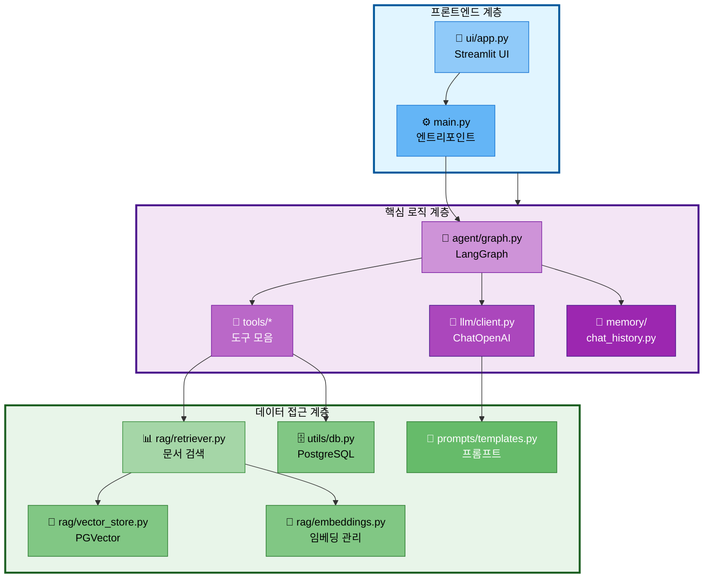
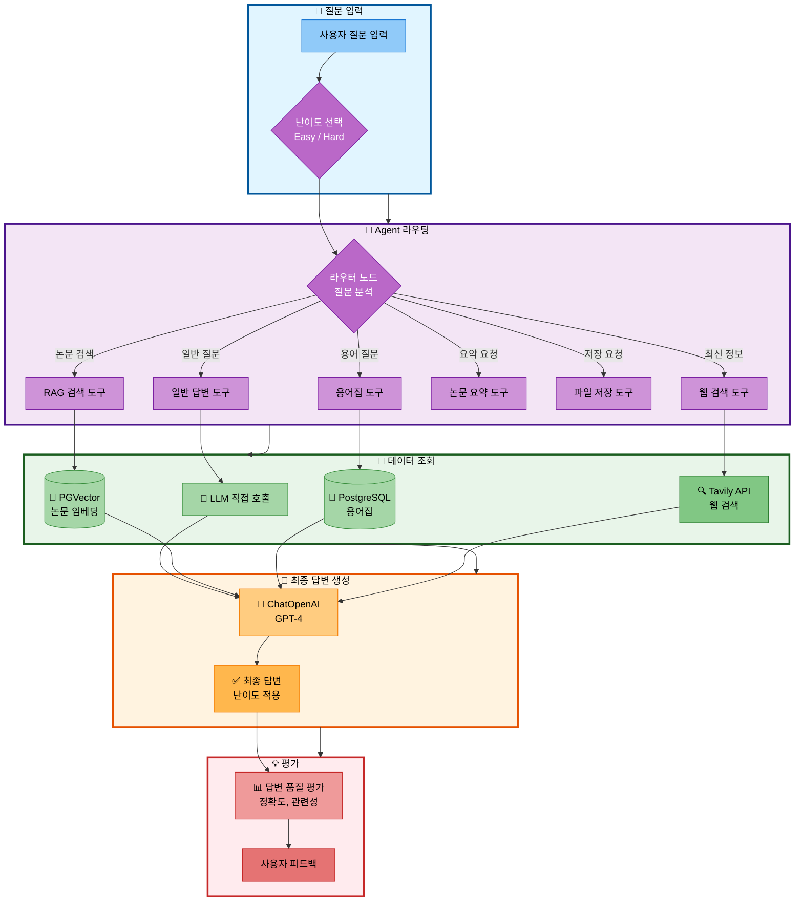

# 02. 프로젝트 구조

## 문서 정보
- **작성일**: 2025-10-30
- **프로젝트명**: 논문 리뷰 챗봇 (AI Agent + RAG)
- **팀명**: 연결의 민족
- **작성자**: 연결의 민족 팀

---

## 1. 디렉토리 구조

### 1.1 전체 구조

```
langchain-project/
├── README.md                      # 프로젝트 소개 및 사용 방법
├── requirements.txt               # Python 패키지 의존성
├── .env.example                   # 환경 변수 템플릿
├── .gitignore                     # Git 무시 파일
│
├── main.py                        # 애플리케이션 엔트리 포인트
│
├── configs/                       # 설정 파일
│   ├── db_config.yaml            # 데이터베이스 설정
│   ├── model_config.yaml         # LLM 모델 설정
│   └── prompt_config.yaml        # 프롬프트 설정
│
├── src/                           # 소스 코드
│   ├── __init__.py
│   │
│   ├── agent/                     # AI Agent (LangGraph)
│   │   ├── __init__.py
│   │   ├── graph.py              # LangGraph StateGraph 정의
│   │   ├── nodes.py              # 노드 함수들
│   │   ├── state.py              # AgentState TypedDict
│   │   └── router.py             # 라우팅 로직
│   │
│   ├── tools/                     # 도구 모음 (6개)
│   │   ├── __init__.py
│   │   ├── general.py            # 일반 답변 도구
│   │   ├── rag_search.py         # RAG 검색 도구
│   │   ├── web_search.py         # 웹 검색 도구 (Tavily)
│   │   ├── glossary.py           # 용어집 도구
│   │   ├── summarize.py          # 논문 요약 도구
│   │   └── file_save.py          # 파일 저장 도구
│   │
│   ├── rag/                       # RAG 시스템
│   │   ├── __init__.py
│   │   ├── retriever.py          # 문서 검색 (Retriever)
│   │   ├── embeddings.py         # 임베딩 관리
│   │   ├── vector_store.py       # PGVector 인터페이스
│   │   └── reranker.py           # 재순위화 (선택)
│   │
│   ├── llm/                       # LLM 클라이언트
│   │   ├── __init__.py
│   │   ├── client.py             # ChatOpenAI 래퍼
│   │   └── config.py             # LLM 설정
│   │
│   ├── prompts/                   # 프롬프트 템플릿
│   │   ├── __init__.py
│   │   ├── templates.py          # PromptTemplate 정의
│   │   ├── easy_mode.py          # Easy 모드 프롬프트
│   │   └── hard_mode.py          # Hard 모드 프롬프트
│   │
│   ├── memory/                    # 대화 메모리
│   │   ├── __init__.py
│   │   └── chat_history.py       # ConversationBufferMemory
│   │
│   ├── data/                      # 데이터 처리
│   │   ├── __init__.py
│   │   ├── document_loader.py    # Document Loader
│   │   ├── text_splitter.py      # RecursiveCharacterTextSplitter
│   │   └── embedder.py           # 임베딩 생성
│   │
│   ├── text2sql/                  # Text-to-SQL (선택)
│   │   ├── __init__.py
│   │   └── sql_generator.py      # SQL 쿼리 생성
│   │
│   ├── evaluation/                # 성능 평가 (선택)
│   │   ├── __init__.py
│   │   ├── rag_evaluator.py      # RAG 평가
│   │   └── metrics.py            # 평가 메트릭
│   │
│   └── utils/                     # 유틸리티
│       ├── __init__.py
│       ├── logger.py             # Logger 클래스
│       ├── db.py                 # PostgreSQL 유틸리티
│       └── config_loader.py      # YAML 설정 로더
│
├── ui/                            # Streamlit UI
│   ├── __init__.py
│   ├── app.py                    # 메인 UI
│   ├── components/               # UI 컴포넌트
│   │   ├── chat_interface.py    # 채팅 인터페이스
│   │   ├── sidebar.py           # 사이드바 (난이도 선택 등)
│   │   └── file_download.py     # 파일 다운로드 버튼
│   └── styles.css                # 커스텀 CSS
│
├── data/                          # 데이터 저장소
│   ├── raw/                      # 원본 데이터
│   │   ├── pdfs/                # 논문 PDF 파일
│   │   ├── json/                # 메타데이터 JSON
│   │   └── txt/                 # 추출된 텍스트
│   │
│   ├── processed/                # 전처리된 데이터
│   │   ├── chunks/              # 청크 분할 데이터
│   │   └── embeddings/          # 임베딩 벡터 (캐시)
│   │
│   └── outputs/                  # 출력 파일
│       ├── conversations/       # 저장된 대화 내용
│       └── summaries/           # 저장된 요약
│
├── experiments/                   # 실험 폴더
│   └── 날짜/                     # YYYYMMDD
│       └── 날짜_시간_실험명/     # 실험별 폴더
│           ├── experiment.log   # 로그 파일
│           ├── config.yaml      # 실험 설정
│           ├── results.json     # 실험 결과
│           └── ...
│
├── scripts/                       # 스크립트
│   ├── collect_papers.py         # 논문 수집 스크립트
│   ├── build_vectordb.py         # VectorDB 구축
│   ├── init_database.py          # DB 초기화
│   └── evaluate_rag.py           # RAG 평가
│
├── tests/                         # 테스트 코드
│   ├── __init__.py
│   ├── test_agent.py             # Agent 테스트
│   ├── test_rag.py               # RAG 테스트
│   ├── test_tools.py             # 도구 테스트
│   └── test_integration.py       # 통합 테스트
│
├── docs/                          # 문서
│   ├── PRD/                      # PRD 문서들
│   │   ├── 01_프로젝트_개요.md
│   │   ├── 02_프로젝트_구조.md
│   │   └── ...
│   │
│   ├── rules/                    # 규칙 문서
│   │   ├── logger_사용법.md
│   │   ├── 실험_폴더명_규칙.md
│   │   └── commit_style.md
│   │
│   ├── roles/                    # 역할 문서
│   │   └── ...
│   │
│   └── mermaid_style.md          # Mermaid 스타일 가이드
│
└── database/                      # DB 관련 파일
    ├── schema.sql                # PostgreSQL 스키마
    ├── migrations/               # 마이그레이션 스크립트
    └── seeds/                    # 시드 데이터 (용어집 등)
```

---

## 2. 모듈별 상세 설명

### 2.1 AI Agent (`src/agent/`)

#### 역할
- 사용자 질문을 분석하여 적절한 도구 선택
- LangGraph StateGraph를 사용한 워크플로우 관리
- 도구 실행 결과를 LLM에 전달하여 최종 답변 생성

#### 주요 파일
- `graph.py`: StateGraph 정의 및 컴파일
- `nodes.py`: 각 노드 함수 (router_node, search_paper_node 등)
- `state.py`: AgentState TypedDict 정의
- `router.py`: 질문 유형 분류 로직

#### 책임자
- 최현화 (팀장)

---

### 2.2 도구 (`src/tools/`)

#### 역할
- AI Agent가 호출할 수 있는 기능 제공
- Langchain @tool 데코레이터 사용
- 각 도구는 독립적으로 실행 가능

#### 주요 파일
1. `general.py`: 일반 질문에 대한 직접 답변
2. `rag_search.py`: 논문 데이터베이스 검색
3. `web_search.py`: TavilySearchResults 활용 웹 검색
4. `glossary.py`: 용어집 검색 및 설명
5. `summarize.py`: load_summarize_chain 활용 요약
6. `file_save.py`: 대화/요약 내용 파일 저장

#### 책임자
- `general.py`: 최현화
- `rag_search.py`, `glossary.py`: 신준엽
- `summarize.py`: 최현화
- `web_search.py`, `file_save.py`: 임예슬

---

### 2.3 RAG 시스템 (`src/rag/`)

#### 역할
- Vector DB와 연동하여 문서 검색
- 임베딩 생성 및 관리
- 검색 결과 재순위화 (선택)

#### 주요 파일
- `retriever.py`: VectorStoreRetriever, MultiQueryRetriever
- `embeddings.py`: OpenAIEmbeddings 래퍼
- `vector_store.py`: PGVector 인터페이스
- `reranker.py`: ContextualCompressionRetriever (선택)

#### 책임자
- 신준엽

---

### 2.4 LLM 클라이언트 (`src/llm/`)

#### 역할
- ChatOpenAI 래퍼 제공
- 에러 핸들링 및 재시도 로직
- 스트리밍 응답 처리
- 토큰 사용량 추적

#### 주요 파일
- `client.py`: LLMClient 클래스
- `config.py`: 모델 설정 (GPT-4, GPT-3.5-turbo)

#### 책임자
- 최현화

---

### 2.5 프롬프트 (`src/prompts/`)

#### 역할
- 난이도별 프롬프트 템플릿 제공
- ChatPromptTemplate 사용
- 도구별 프롬프트 정의

#### 주요 파일
- `templates.py`: 공통 PromptTemplate
- `easy_mode.py`: Easy 모드 프롬프트
- `hard_mode.py`: Hard 모드 프롬프트

#### 책임자
- 임예슬

---

### 2.6 데이터 처리 (`src/data/`)

#### 역할
- 논문 PDF 로드 및 전처리
- 텍스트 분할 (RecursiveCharacterTextSplitter)
- 임베딩 생성

#### 주요 파일
- `document_loader.py`: PyPDFLoader 활용
- `text_splitter.py`: RecursiveCharacterTextSplitter
- `embedder.py`: 임베딩 생성 및 배치 처리

#### 책임자
- 박재홍 (10/31까지)

---

### 2.7 Streamlit UI (`ui/`)

#### 역할
- 사용자 인터페이스 제공
- 채팅 인터페이스, 난이도 선택
- StreamlitCallbackHandler로 Agent 연동
- 파일 다운로드 기능

#### 주요 파일
- `app.py`: 메인 UI
- `components/chat_interface.py`: 채팅 UI
- `components/sidebar.py`: 사이드바
- `components/file_download.py`: 다운로드 버튼

#### 책임자
- 임예슬

---

## 3. 모듈 간 의존성

### 3.1 의존성 다이어그램



### 3.2 의존성 규칙

1. **계층적 의존성**
   - 상위 계층은 하위 계층을 참조 가능
   - 하위 계층은 상위 계층을 참조 불가
   - 동일 계층 내에서는 순환 의존성 금지

2. **인터페이스 분리**
   - 각 모듈은 명확한 인터페이스 제공
   - 구현 세부사항은 숨김 (캡슐화)

3. **공통 유틸리티**
   - `utils/` 모듈은 모든 계층에서 사용 가능
   - 단, utils는 다른 모듈에 의존하지 않음

---

## 4. 데이터 흐름

### 4.1 사용자 질문 처리 흐름



---

## 5. 설정 파일

### 5.1 환경 변수 (.env)

```bash
# OpenAI API
OPENAI_API_KEY=your-openai-api-key

# PostgreSQL
POSTGRES_USER=user
POSTGRES_PASSWORD=password
POSTGRES_HOST=localhost
POSTGRES_PORT=5432
POSTGRES_DB=papers

# Tavily Search API
TAVILY_API_KEY=your-tavily-api-key

# 개발 환경
ENVIRONMENT=development  # development, production
LOG_LEVEL=INFO          # DEBUG, INFO, WARNING, ERROR
```

### 5.2 데이터베이스 설정 (configs/db_config.yaml)

```yaml
postgresql:
  host: localhost
  port: 5432
  database: papers
  user: ${POSTGRES_USER}
  password: ${POSTGRES_PASSWORD}

pgvector:
  collections:
    - name: paper_chunks
      dimension: 1536  # OpenAI text-embedding-3-small
    - name: paper_abstracts
      dimension: 1536
    - name: glossary_embeddings
      dimension: 1536
```

### 5.3 모델 설정 (configs/model_config.yaml)

```yaml
llm:
  development:
    model: gpt-3.5-turbo
    temperature: 0.7
    max_tokens: 2000
  production:
    model: gpt-4
    temperature: 0.7
    max_tokens: 3000

embeddings:
  model: text-embedding-3-small
  dimension: 1536
  batch_size: 100
```

---

## 6. 코드 구조 규칙

### 6.1 임포트 순서

```python
# 1. 표준 라이브러리
import os
import sys
from datetime import datetime

# 2. 서드파티 라이브러리
import numpy as np
from langchain.tools import tool
from langchain_openai import ChatOpenAI

# 3. 로컬 모듈
from src.utils.logger import Logger
from src.llm.client import LLMClient
```

### 6.2 네이밍 규칙

- **파일명**: snake_case (예: `rag_search.py`)
- **클래스명**: PascalCase (예: `LLMClient`)
- **함수명**: snake_case (예: `search_paper_database`)
- **상수**: UPPER_SNAKE_CASE (예: `MAX_CHUNK_SIZE`)
- **변수**: snake_case (예: `user_query`)

### 6.3 독스트링

```python
def search_paper_database(query: str, k: int = 5) -> list:
    """
    논문 데이터베이스에서 관련 논문을 검색합니다.

    Args:
        query (str): 검색 질의
        k (int): 반환할 문서 개수 (기본값: 5)

    Returns:
        list: 검색된 Document 객체 리스트

    Raises:
        ValueError: query가 빈 문자열인 경우

    Example:
        >>> docs = search_paper_database("Transformer architecture", k=3)
        >>> print(len(docs))
        3
    """
    pass
```

---

## 7. 테스트 구조

### 7.1 단위 테스트
- 각 모듈별로 독립적인 테스트
- `tests/test_모듈명.py` 형식

### 7.2 통합 테스트
- 여러 모듈이 함께 동작하는 테스트
- `tests/test_integration.py`

### 7.3 시나리오 테스트
- 실제 사용 시나리오 기반 테스트
- 10개 시나리오 검증

---

## 8. 참고 자료

- Python 프로젝트 구조: https://docs.python-guide.org/writing/structure/
- Langchain 프로젝트 구조: https://python.langchain.com/docs/
- PostgreSQL 설정: https://www.postgresql.org/docs/current/config-setting.html
