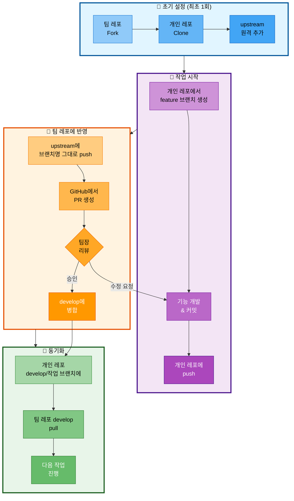

# 03. 브랜치 전략

## 문서 정보
- **작성일**: 2025-10-30
- **프로젝트명**: 논문 리뷰 챗봇 (AI Agent + RAG)
- **팀명**: 연결의 민족
- **작성자**: 연결의 민족 팀

---

## 1. Git 워크플로우

### 1.1 선택한 전략

**Fork & Feature Branch Workflow** 채택

**이유:**
- 팀 레포를 보호하면서 개인별 작업 공간 확보
- 각 팀원이 독립적으로 작업 가능
- 팀장이 코드 품질을 체계적으로 관리 가능
- Pull Request를 통한 명확한 코드 리뷰 프로세스

### 1.2 작업 구조

```
팀 레포 (upstream)
    ↓ fork
개인 레포 (origin) ← 팀원이 clone하여 작업
    ↓ push
팀 레포에 feature 브랜치 생성
    ↓ PR
develop 브랜치로 병합 (팀장 승인)
```

---

## 2. 브랜치 구조

### 2.1 브랜치 유형

```
main (배포용, 항상 안정 상태)
  │
  ├── develop (통합 브랜치)
  │     │
  │     ├── feature/agent-graph           (최현화)
  │     ├── feature/llm-client            (최현화)
  │     ├── feature/memory                (최현화)
  │     ├── feature/tool-summarize        (최현화)
  │     ├── feature/integration           (최현화)
  │     │
  │     ├── feature/data-collection       (박재홍)
  │     ├── feature/document-processing   (박재홍)
  │     ├── feature/database-setup        (박재홍)
  │     │
  │     ├── feature/rag-system            (신준엽)
  │     ├── feature/tool-rag-search       (신준엽)
  │     ├── feature/tool-glossary         (신준엽)
  │     │
  │     ├── feature/streamlit-ui          (임예슬)
  │     ├── feature/prompts               (임예슬)
  │     ├── feature/tool-web-search       (임예슬)
  │     └── feature/tool-file-save        (임예슬)
```

### 2.2 브랜치 설명

#### main 브랜치
- **용도**: 배포용 브랜치 (항상 안정 상태)
- **병합 시점**: 최종 통합 완료 후 (11/05)
- **보호 설정**: Direct Push 금지, PR 필수
- **태그**: 버전 태그 (v1.0.0 등)

#### develop 브랜치
- **용도**: 개발 통합 브랜치
- **병합 시점**: Feature 개발 완료 시
- **보호 설정**: 팀장 승인 필수
- **테스트**: 병합 전 단위 테스트 통과 필수

#### feature 브랜치
- **용도**: 개별 기능 개발
- **명명 규칙**: `feature/기능명`
- **수명**: 기능 개발 완료 후 삭제
- **병합 대상**: develop 브랜치

---

## 3. 작업 흐름

### 3.1 Fork 기반 작업 흐름



**Fork 기반 작업 흐름 설명:**
- 팀 레포를 Fork하여 개인 작업 공간을 확보하고, 팀장 승인을 통한 체계적인 코드 관리 프로세스
- 초기 설정에서는 팀 레포를 Fork하고 개인 레포를 Clone한 후 upstream 원격 저장소를 추가
- 작업 시작 단계에서는 개인 레포에서 feature 브랜치를 생성하고 기능 개발 후 개인 레포에 push
- 팀 레포 반영 단계에서는 upstream에 브랜치명 그대로 push하고 GitHub에서 PR 생성, 팀장 리뷰/승인 후 develop에 병합
- 동기화 단계에서는 개인 레포의 develop 또는 작업 브랜치에 팀 레포의 develop을 pull하여 최신 상태 유지

### 3.2 상세 명령어

#### 0단계: 초기 설정 (최초 1회만)

```bash
# 1. GitHub에서 팀 레포를 Fork (웹에서 진행)
# https://github.com/팀계정/langchain-project → Fork 버튼 클릭

# 2. 개인 레포를 로컬에 Clone
git clone https://github.com/개인계정/langchain-project.git
cd langchain-project

# 3. upstream 원격 저장소 추가 (팀 레포)
git remote add upstream https://github.com/팀계정/langchain-project.git

# 4. 확인
git remote -v
# origin    https://github.com/개인계정/langchain-project.git (개인 레포)
# upstream  https://github.com/팀계정/langchain-project.git (팀 레포)
```

#### 1단계: 작업 시작

```bash
# 1. 개인 레포에서 feature 브랜치 생성
git checkout -b feature/기능명

# 예시
git checkout -b feature/agent-graph
```

#### 2단계: 개발 및 커밋

```bash
# 1. 코드 작성

# 2. 변경 사항 확인
git status
git diff

# 3. 스테이징
git add .

# 4. 커밋 (Conventional Commits 규칙 준수)
git commit -m "feat: Agent 라우터 노드 구현"

# 5. 개인 레포에 push
git push origin feature/기능명
```

#### 3단계: 팀 레포에 반영

```bash
# 1. upstream(팀 레포)에 브랜치명 그대로 push
git push upstream feature/기능명

# 2. GitHub에서 PR 생성 (웹에서 진행)
# - Repository: 팀계정/langchain-project 선택
# - Base: develop
# - Compare: feature/기능명 (팀 레포에 생성된 브랜치)
# - Title: [Feature] 기능 설명
# - Description: 변경 내용, 테스트 방법 등
```

#### 4단계: 병합 후 동기화

```bash
# 팀장이 PR 승인하여 develop에 병합 완료 후

# 방법 1: 개인 레포의 develop 브랜치에 pull
git checkout develop
git pull upstream develop
git push origin develop  # 개인 레포도 동기화

# 방법 2: 현재 작업 브랜치에 pull (계속 작업할 경우)
git checkout feature/기능명
git pull upstream develop
# 충돌 해결 후 계속 작업

# 방법 3: 새 기능 브랜치 생성 후 pull
git checkout -b feature/새기능명
git pull upstream develop
# 최신 develop 기반으로 새 작업 시작
```

**중요: 브랜치 삭제는 팀장만 수행**
- 팀원은 브랜치를 삭제하지 않음
- 모든 개발 브랜치는 유지
- 필요 시 팀장이 판단하여 삭제

---

## 4. 커밋 메시지 규칙

### 4.1 Conventional Commits

**형식:**
```
<타입>(<범위>): <제목>

<본문>

<꼬리말>
```

### 4.2 타입

| 타입 | 설명 | 예시 |
|------|------|------|
| `feat` | 새로운 기능 추가 | `feat: RAG 검색 도구 추가` |
| `fix` | 버그 수정 | `fix: PostgreSQL 연결 오류 해결` |
| `docs` | 문서 변경 | `docs: README 업데이트` |
| `style` | 코드 포맷팅 (기능 변경 없음) | `style: 코드 포맷팅 적용` |
| `refactor` | 리팩토링 | `refactor: retriever 코드 정리` |
| `test` | 테스트 추가/수정 | `test: Agent 테스트 추가` |
| `chore` | 빌드, 설정 변경 | `chore: requirements.txt 업데이트` |

### 4.3 범위 (선택)

- `agent`: AI Agent 관련
- `rag`: RAG 시스템 관련
- `tools`: 도구 관련
- `ui`: UI 관련
- `db`: 데이터베이스 관련

### 4.4 예시

**좋은 커밋 메시지:**
```
feat(agent): LangGraph StateGraph 구현

- AgentState TypedDict 정의
- router_node, search_paper_node 추가
- conditional_edges 설정

Closes #12
```

**나쁜 커밋 메시지:**
```
수정

코드 수정함
```

---

## 5. PR (Pull Request) 규칙

### 5.1 PR 템플릿

```markdown
## 변경 내용
<!-- 무엇을 변경했는지 간략히 설명 -->

## 변경 이유
<!-- 왜 이 변경이 필요한지 설명 -->

## 테스트 방법
<!-- 어떻게 테스트했는지 설명 -->
- [ ] 단위 테스트 통과
- [ ] 수동 테스트 완료

## 스크린샷 (UI 변경 시)
<!-- UI 변경이 있는 경우 스크린샷 첨부 -->

## 체크리스트
- [ ] 코드 스타일 가이드 준수
- [ ] 독스트링 작성
- [ ] 테스트 코드 작성
- [ ] README 업데이트 (필요 시)

## 관련 이슈
Closes #이슈번호
```

### 5.2 PR 생성 규칙

1. **제목 형식**: `[Feature] 기능 설명`
2. **라벨 지정**: `feature`, `bug`, `docs` 등
3. **리뷰어 지정**: 팀장 (최현화)
4. **충돌 해결**: PR 생성 전 upstream/develop과 병합하여 충돌 미리 해결
5. **테스트 필수**: 단위 테스트 통과 확인
6. **PR 대상**: 팀 레포(upstream)의 feature 브랜치 → develop 브랜치로 생성

### 5.3 코드 리뷰 기준

**팀장(리뷰어)이 확인할 사항:**
1. 코드 품질 (가독성, 유지보수성)
2. 버그 가능성
3. 성능 이슈
4. 보안 문제
5. 테스트 커버리지
6. 문서화 여부

**승인 기준:**
- ✅ 코드가 정상 동작함
- ✅ 테스트가 통과함
- ✅ 코드 스타일 가이드 준수
- ✅ 충돌이 없음
- ✅ 문서화가 충분함

---

## 6. 충돌 해결

### 6.1 충돌 발생 시

```bash
# 1. upstream(팀 레포)의 develop 최신 변경사항 가져오기
git fetch upstream

# 2. 현재 작업 중인 feature 브랜치에서 upstream/develop 병합
git checkout feature/기능명
git merge upstream/develop

# 3. 충돌 파일 확인
git status

# 4. 충돌 해결 (에디터에서 수정)
# <<<<<<< HEAD
# 내 변경사항
# =======
# upstream/develop의 변경사항
# >>>>>>> upstream/develop

# 5. 해결 후 스테이징
git add .

# 6. 병합 커밋
git commit -m "merge: upstream develop 브랜치 병합"

# 7. 개인 레포에 Push
git push origin feature/기능명

# 8. upstream(팀 레포)에도 Push
git push upstream feature/기능명
```

### 6.2 충돌 예방

1. **자주 동기화**: upstream develop 변경사항을 자주 가져오기
2. **작은 PR**: 큰 변경보다 작은 변경을 자주 병합
3. **소통**: 같은 파일을 수정할 때 팀원과 소통
4. **모듈 분리**: 각 담당 모듈을 명확히 분리

---

## 7. 브랜치 병합 일정

### 7.1 주요 병합 시점

| 날짜 | 병합 내용 | 비고 |
|------|----------|------|
| 10/30 (목) | 환경 설정, DB 스키마 | 초기 설정 |
| 10/31 (금) | 박재홍 담당 기능 (데이터 수집) | 1차 병합 |
| 11/02 (일) | 각 팀원 주요 기능 | 2차 병합 |
| 11/03 (월) | 통합 기능 | 3차 병합 |
| 11/04 (화) | 버그 수정 | 최종 조정 |
| 11/05 (수) | develop → main | 최종 병합 |

### 7.2 병합 체크리스트

**각 병합 전 확인사항:**
- [ ] 모든 테스트 통과
- [ ] 충돌 해결 완료
- [ ] 코드 리뷰 승인
- [ ] 문서 업데이트
- [ ] 로그 메시지 확인

---

## 8. 긴급 상황 대응

### 8.1 Hotfix 브랜치

**심각한 버그 발견 시:**

```bash
# 1. 개인 레포에서 upstream의 main을 pull
git checkout main
git pull upstream main

# 2. hotfix 브랜치 생성
git checkout -b hotfix/버그명

# 3. 버그 수정 및 커밋
git commit -m "fix: 긴급 버그 수정"

# 4. 개인 레포에 push
git push origin hotfix/버그명

# 5. upstream(팀 레포)에 push
git push upstream hotfix/버그명

# 6. GitHub에서 PR 생성 (main으로)
# - Base: main
# - Compare: hotfix/버그명

# 7. 팀장이 승인 후 develop에도 병합 필요
git checkout develop
git pull upstream develop
git merge hotfix/버그명
git push upstream develop
```

**중요: hotfix 브랜치 삭제는 팀장만 수행**

### 8.2 롤백

**잘못된 병합 시:**

```bash
# 1. upstream(팀 레포)의 develop 이전 커밋으로 되돌리기
git fetch upstream
git checkout develop
git log upstream/develop  # 되돌릴 커밋 해시 확인
git reset --hard <커밋해시>

# 2. 강제 Push (주의! 팀장만 실행)
git push upstream develop --force

# 3. 개인 레포도 동기화
git push origin develop --force
```

**주의:**
- 강제 Push는 **팀장만 수행**
- 팀원들은 팀장에게 문제 보고 후 지시 대기
- 롤백 후 모든 팀원에게 알림 필수 (팀 레포 develop이 변경됨)

---

## 9. Git 규칙 요약

### 9.1 DO

- ✅ 의미 있는 단위로 커밋
- ✅ Conventional Commits 규칙 준수
- ✅ PR 템플릿 작성
- ✅ 코드 리뷰 후 병합
- ✅ develop 자주 Pull
- ✅ feature 브랜치는 짧게 유지

### 9.2 DON'T

- ❌ main에 직접 Push 금지
- ❌ develop에 직접 Push 금지
- ❌ 의미 없는 커밋 메시지
- ❌ 큰 변경사항을 한 번에 커밋
- ❌ 테스트 없이 PR 생성
- ❌ 충돌을 방치

---

## 10. 참고 자료

- Conventional Commits: https://www.conventionalcommits.org/
- Git Flow: https://nvie.com/posts/a-successful-git-branching-model/
- GitHub Flow: https://guides.github.com/introduction/flow/
- PR Best Practices: https://github.com/blog/1943-how-to-write-the-perfect-pull-request
