# 04. 일정 관리

## 문서 정보
- **작성일**: 2025-10-30
- **프로젝트명**: 논문 리뷰 챗봇 (AI Agent + RAG)
- **팀명**: 연결의 민족
- **작성자**: 연결의 민족 팀

---

## 1. 전체 일정 개요

### 1.1 프로젝트 기간
- **시작일**: 2025년 10월 28일 (화)
- **종료일**: 2025년 11월 6일 (목)
- **총 기간**: 10일
- **발표일**: 11월 6일 (목) 14:00~19:00

### 1.2 타임라인 다이어그램

```mermaid
graph TB
    subgraph Phase1["🔸 Phase 1: 사전 준비<br/>10/29~10/30 (2일)"]
        direction TB
        P1A[팀 구성 & 역할 분배] --> P1B[환경 설정 & DB 구축]
        P1B --> P1C[논문 10편 수집 테스트]
    end

    subgraph Phase2["🔹 Phase 2: 핵심 개발<br/>10/30~11/03 (5일)"]
        direction TB
        P2A[AI Agent 구현<br/>LangGraph] --> P2B[6가지 도구 개발<br/>RAG, 웹검색 등]
        P2B --> P2C[Streamlit UI 개발]
        P2C --> P2D[프롬프트 엔지니어링]
    end

    subgraph Phase3["🔺 Phase 3: 통합 & 테스트<br/>11/04~11/05 (1.5일)"]
        direction TB
        P3A[모듈 통합<br/>main.py] --> P3B[10개 시나리오 테스트]
        P3B --> P3C[버그 수정 & 최적화]
    end

    subgraph Phase4["🔶 Phase 4: 발표 준비<br/>11/05~11/06 (1.5일)"]
        direction TB
        P4A[발표 자료 작성] --> P4B[데모 준비 & 리허설]
        P4B --> P4C[✅ 최종 발표<br/>11/06 14:00]
    end

    Phase1 --> Phase2
    Phase2 --> Phase3
    Phase3 --> Phase4

    %% Subgraph 스타일
    style Phase1 fill:#e1f5ff,stroke:#01579b,stroke-width:3px,color:#000
    style Phase2 fill:#f3e5f5,stroke:#4a148c,stroke-width:3px,color:#000
    style Phase3 fill:#e8f5e9,stroke:#1b5e20,stroke-width:3px,color:#000
    style Phase4 fill:#fff3e0,stroke:#e65100,stroke-width:3px,color:#000

    %% 노드 스타일 (Phase 1 - 파랑 계열)
    style P1A fill:#90caf9,stroke:#1976d2,color:#000
    style P1B fill:#64b5f6,stroke:#1976d2,color:#000
    style P1C fill:#42a5f5,stroke:#1565c0,color:#000

    %% 노드 스타일 (Phase 2 - 보라 계열)
    style P2A fill:#ce93d8,stroke:#7b1fa2,color:#000
    style P2B fill:#ba68c8,stroke:#7b1fa2,color:#fff
    style P2C fill:#ab47bc,stroke:#4a148c,color:#fff
    style P2D fill:#9c27b0,stroke:#4a148c,color:#fff

    %% 노드 스타일 (Phase 3 - 녹색 계열)
    style P3A fill:#a5d6a7,stroke:#388e3c,color:#000
    style P3B fill:#81c784,stroke:#2e7d32,color:#000
    style P3C fill:#66bb6a,stroke:#2e7d32,color:#fff

    %% 노드 스타일 (Phase 4 - 주황 계열)
    style P4A fill:#ffcc80,stroke:#f57c00,color:#000
    style P4B fill:#ffb74d,stroke:#f57c00,color:#000
    style P4C fill:#66bb6a,stroke:#2e7d32,color:#fff
```



### 1.3 타임라인 상세

```
10/24 (금) ────┬──── Langchain 온라인 강의 학습
               │
10/27 (월) ────┬──── Langchain 온라인 강의 학습
               │
10/28 (화) ────┼──── OT 자료 분석, 프로젝트 방향성 논의
               │
10/29 (수) ────┼──── 팀명/주제 결정, 자료조사, PRD 작성, 환경 설정
               │
10/30 (목) ────┼──── 핵심 기능 개발 시작 + 멘토링
               │
10/31 (금) ────┼──── 핵심 기능 개발 (박재홍 마지막 날, 1차 병합)
               │
11/01 (토) ────┼──── 기능 개발 계속 (3명)
               │
11/02 (일) ────┼──── 기능 개발 계속
               │
11/03 (월) ────┼──── 2차 병합 + 기능 개발 계속
               │
11/04 (화) ────┼──── 단위 테스트 + 통합 테스트 + 멘토링
               │
11/05 (수) ────┼──── 오전 10시까지 개발 완료 → 최종 병합 및 테스트
               │     발표 자료 준비 시작
11/06 (목) ────┴──── 발표 자료 최종 완료 + 발표 (14:00~19:00)
```

---

## 2. Phase별 상세 일정

### 2.1 Phase 1: 사전 준비 (10/29~10/30, 2일)

#### 목표
- 개발 환경 설정
- 데이터 수집 및 전처리
- 기초 인프라 구축

#### 주요 작업

**10/29 (수)**
- 오전
  - ✅ 팀명 결정: "연결의 민족"
  - ✅ 프로젝트 주제 확정
  - ✅ 역할 분배
- 오후
  - ✅ 자료조사 (기술 스택, 논문 소스, 아키텍처)
  - ✅ PRD 문서 작성 시작
  - ✅ Git 저장소 설정

**10/30 (목)**
- 오전
  - PostgreSQL + pgvector 설치 및 설정
  - Python 환경 설정 (requirements.txt)
  - arXiv API 테스트
- 오후
  - 멘토링 (진행 상황 공유)
  - 논문 데이터 10편 수집 테스트
  - DB 스키마 생성

#### 완료 기준
- ✅ 모든 팀원 동일한 개발 환경 설정 완료
- ✅ PostgreSQL + pgvector 정상 작동
- ✅ 테스트용 논문 최소 10편 수집
- ✅ Git 브랜치 전략 확정

#### 책임자
- 환경 설정: 전체 팀원
- DB 설정: 박재홍
- 데이터 수집 테스트: 박재홍

---

### 2.2 Phase 2: 핵심 기능 개발 (10/30~11/03, 5일)

#### 목표
- 필수 기능 구현
- 모듈별 독립 개발
- 박재홍 인수인계 (10/31)

#### 세부 일정

**10/30 (목) 오후~10/31 (금)**
- **박재홍** (최종일: 10/31)
  - 논문 데이터 50편 수집
  - Langchain Document Loader 구현
  - RecursiveCharacterTextSplitter 구현
  - OpenAI Embeddings 생성
  - PGVector 적재
  - 인수인계 문서 작성
- **최현화**
  - ChatOpenAI 래퍼 구현
  - LLM 에러 핸들링
  - 토큰 추적 기능
- **신준엽**
  - PGVector Retriever 기본 구현
  - similarity_search 테스트
- **임예슬**
  - Streamlit 기본 UI 구현
  - 채팅 인터페이스 설정

**11/01 (토)**
- **최현화**
  - LangGraph StateGraph 기본 구조
  - AgentState 정의
  - router_node 구현
- **신준엽**
  - MultiQueryRetriever 구현
  - RAG 검색 도구 (@tool) 구현
- **임예슬**
  - Easy/Hard 프롬프트 템플릿
  - 난이도 선택 UI

**11/02 (일)**
- **최현화**
  - conditional_edges 구현
  - 도구 노드 연결
  - ConversationBufferMemory 구현
- **신준엽**
  - 용어집 도구 (@tool) 구현
  - 용어집 데이터베이스 구축
- **임예슬**
  - TavilySearchResults 연동
  - 웹 검색 도구 구현

**11/03 (월)**
- **2차 병합** (오전)
  - develop 브랜치에 모든 기능 병합
  - 통합 테스트 시작
- **최현화**
  - load_summarize_chain 구현
  - 논문 요약 도구 완성
- **신준엽**
  - ContextualCompressionRetriever (선택)
  - RAG 성능 최적화
- **임예슬**
  - 파일 저장 도구 구현
  - StreamlitCallbackHandler 연동

#### 완료 기준
- ✅ 각 모듈 독립 실행 가능
- ✅ 단위 테스트 작성 및 통과
- ✅ 5가지 도구 모두 구현 완료
- ✅ Streamlit UI 기본 동작
- ✅ 논문 데이터 최소 50편 확보

---

### 2.3 Phase 3: 통합 및 테스트 (11/04~11/05 오전, 1.5일)

#### 목표
- 모듈 통합
- 엔드투엔드 테스트
- 버그 수정

#### 세부 일정

**11/04 (화)**
- 오전
  - main.py 통합 (최현화 주도)
  - UI ↔ Agent 연동 테스트
  - 대화 히스토리 통합
- 오후
  - 멘토링 (통합 상황 공유)
  - 10개 시나리오 테스트
  - 버그 수정

**11/05 (수) 오전 (10:00까지)**
- 최종 버그 수정
- 성능 테스트
- 최종 병합 (develop → main)
- 코드 리뷰

#### 완료 기준
- ✅ 전체 시스템 정상 동작
- ✅ 10개 시나리오 모두 통과
- ✅ 치명적 버그 없음
- ✅ main 브랜치에 최종 코드 병합

#### 테스트 시나리오 (10개)

1. "Transformer 논문 설명해줘" (Easy 모드, RAG)
2. "BERT와 GPT의 차이는?" (Hard 모드, RAG)
3. "Attention Mechanism이 뭐야?" (용어집)
4. "2025년 최신 LLM 논문은?" (웹 검색)
5. "Attention Is All You Need 논문 요약해줘" (요약)
6. "이 요약 내용 파일로 저장해줘" (파일 저장)
7. "Self-Attention이 뭐야?" (용어집)
8. "Transformer의 장점은?" (RAG)
9. "BERT 논문의 핵심 기여는?" (RAG)
10. "최신 멀티모달 AI 논문 찾아줘" (웹 검색)

---

### 2.4 Phase 4: 발표 준비 (11/05 오후~11/06, 1.5일)

#### 목표
- 발표 자료 작성
- 데모 준비
- README.md 완성

#### 세부 일정

**11/05 (수) 오후**
- 발표 자료 구조 확정
- 아키텍처 다이어그램 작성 (Mermaid)
- 데모 시나리오 선정 (5개)
- README.md 초안 작성

**11/06 (목) 오전**
- 발표 자료 완성
- 발표 리허설
- 데모 최종 점검
- README.md 최종 검토

**11/06 (목) 오후 (14:00~19:00)**
- 발표 및 질의응답

#### 완료 기준
- ✅ 발표 PDF 완성 (15분 분량)
- ✅ 데모 정상 동작
- ✅ README.md 완성
- ✅ 발표 리허설 2회 이상

#### 발표 구성 (15분)

1. **프로젝트 소개** (2분)
   - 배경, 목표, 핵심 기능
2. **시스템 아키텍처** (3분)
   - AI Agent + RAG 구조
   - Mermaid 다이어그램
3. **핵심 기능 시연** (5분)
   - 5개 시나리오 데모
4. **기술 스택** (2분)
   - Langchain, LangGraph, PostgreSQL, pgvector
5. **어려웠던 점 및 해결** (2분)
   - 짧은 기간, 모듈 통합
6. **향후 개선 방향** (1분)
   - 더 많은 데이터, 성능 최적화

---

## 3. 마일스톤

### 3.1 주요 마일스톤

| 날짜 | 마일스톤 | 완료 기준 |
|------|----------|----------|
| 10/29 | 프로젝트 킥오프 | 역할 분배, 자료조사 완료 |
| 10/30 | 환경 설정 완료 | PostgreSQL, Python 환경 구축 |
| 10/31 | 데이터 수집 완료 | 50편 논문 + 임베딩 저장 |
| 11/02 | 주요 기능 구현 완료 | 5가지 도구 구현 |
| 11/03 | 2차 병합 | develop 통합 완료 |
| 11/04 | 통합 테스트 완료 | 10개 시나리오 통과 |
| 11/05 | 개발 완료 | main 브랜치 최종 병합 |
| 11/06 | 발표 | 프로젝트 발표 및 데모 |

### 3.2 마일스톤 체크리스트

**10/29 (프로젝트 킥오프)**
- [ ] 팀명 및 주제 확정
- [ ] 역할 분배 완료
- [ ] Git 저장소 생성
- [ ] 자료조사 완료
- [ ] PRD 문서 작성 시작

**10/30 (환경 설정 완료)**
- [ ] PostgreSQL + pgvector 설치
- [ ] Python 환경 구축
- [ ] arXiv API 테스트
- [ ] DB 스키마 생성

**10/31 (데이터 수집 완료)**
- [ ] 50편 논문 수집
- [ ] Document Loader 구현
- [ ] 임베딩 생성 및 저장
- [ ] 박재홍 인수인계

**11/02 (주요 기능 구현 완료)**
- [ ] LangGraph Agent 구현
- [ ] 5가지 도구 구현
- [ ] Streamlit UI 구현
- [ ] 프롬프트 템플릿 완성

**11/03 (2차 병합)**
- [ ] develop 브랜치 통합
- [ ] 충돌 해결
- [ ] 통합 테스트 시작

**11/04 (통합 테스트 완료)**
- [ ] main.py 통합
- [ ] 10개 시나리오 테스트
- [ ] 버그 수정

**11/05 (개발 완료)**
- [ ] 최종 병합 (develop → main)
- [ ] README.md 완성
- [ ] 발표 자료 작성 시작

**11/06 (발표)**
- [ ] 발표 자료 완성
- [ ] 데모 준비
- [ ] 발표 및 질의응답

---

## 4. 일일 스탠드업 미팅

### 4.1 미팅 일정
- **시간**: 매일 오전 10시
- **소요 시간**: 15분
- **참여자**: 전체 팀원
- **방식**: Slack/Discord (비동기) 또는 Zoom (동기)

### 4.2 공유 형식

```
[이름]
- 어제: Agent 라우터 노드 구현 완료
- 오늘: 조건부 엣지 구현 예정
- 블로커: PostgreSQL 연결 오류 해결 필요
```

### 4.3 주요 동기화 시점

| 날짜 | 이벤트 | 목적 |
|------|--------|------|
| 10/30 (목) | 멘토링 전 | 환경 설정 상황 공유 |
| 11/01 (금) | 박재홍 인수인계 | 데이터 수집 완료 확인, 역할 재분배 |
| 11/03 (월) | 2차 병합 전 | 각 기능 완료 상황 점검 |
| 11/04 (화) | 멘토링 전 | 통합 테스트 준비 상황 공유 |
| 11/05 (수) | 최종 병합 전 | 버그 수정 완료 확인 |

---

## 5. 리스크 및 대응 방안

### 5.1 주요 리스크

| 리스크 | 확률 | 영향도 | 대응 방안 |
|--------|------|--------|-----------|
| 시간 부족 | 높음 | 높음 | - 선택 기능 포기 (Text-to-SQL)<br/>- 핵심 기능 우선 완성<br/>- 팀장이 통합 작업 집중 지원 |
| 모듈 통합 충돌 | 높음 | 중 | - 주기적인 동기화<br/>- 인터페이스 사전 합의<br/>- 일찍 병합하여 충돌 조기 발견 |
| OpenAI API 비용 초과 | 중 | 중 | - 개발 시 GPT-3.5-turbo 사용<br/>- 최종 테스트만 GPT-4<br/>- 토큰 사용량 모니터링 |
| 팀원 부재 (박재홍) | 확정 | 중 | - 10/31까지 데이터 수집 완료<br/>- 인수인계 문서 작성<br/>- 나머지 팀원이 역할 분담 |

### 5.2 백업 플랜

**시간이 부족할 경우 생략 가능한 기능:**
1. ~~Text-to-SQL~~ (선택 기능)
2. ~~성능 평가 기능~~ (선택 기능)
3. ~~Reranking~~ (RAG 성능 개선 옵션)
4. ~~대화 히스토리 DB 저장~~ (메모리만 사용)

**반드시 완성해야 하는 핵심 기능:**
1. ✅ RAG 논문 검색
2. ✅ 웹 검색
3. ✅ 파일 저장
4. ✅ 용어집 검색
5. ✅ 논문 요약
6. ✅ 난이도별 답변 (Easy/Hard)
7. ✅ Streamlit UI
8. ✅ AI Agent 라우팅

---

## 6. 진행 상황 추적

### 6.1 GitHub Projects (칸반 보드)

**컬럼 구성:**
1. **To Do**: 해야 할 작업
2. **In Progress**: 진행 중인 작업
3. **Review**: 코드 리뷰 대기
4. **Done**: 완료된 작업

**카드 이동 규칙:**
- 작업 시작 시: To Do → In Progress
- PR 생성 시: In Progress → Review
- PR 승인 후: Review → Done

### 6.2 진행률 측정

**전체 진행률 = (완료된 이슈 수 / 전체 이슈 수) × 100**

**일일 체크:**
- 매일 오후 6시에 GitHub Projects 업데이트
- 진행률이 계획보다 낮으면 팀 회의

---

## 7. 참고 자료

- GitHub Projects: https://docs.github.com/en/issues/planning-and-tracking-with-projects
- Agile 방법론: https://www.atlassian.com/agile
- 스크럼 가이드: https://www.scrumguides.org/
