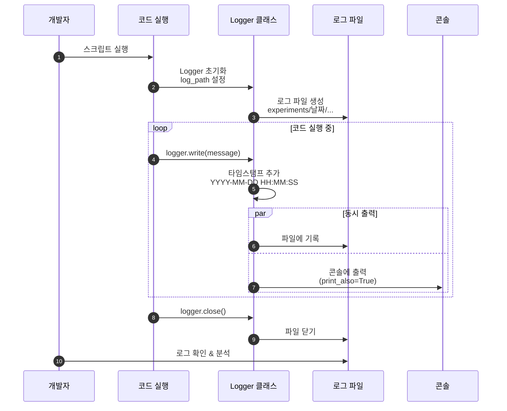

# 05. 로깅 시스템

## 문서 정보
- **작성일**: 2025-10-30
- **프로젝트명**: 논문 리뷰 챗봇 (AI Agent + RAG)
- **팀명**: 연결의 민족
- **작성자**: 연결의 민족 팀

---

## 1. 로깅 시스템 개요

### 1.1 목적

- 개발 과정에서 발생하는 모든 이벤트 기록
- 실험 추적 및 디버깅 지원
- 성능 분석 및 오류 진단
- 프로젝트 진행 상황 문서화

### 1.2 로깅 흐름



**로깅 흐름 설명:**
- 개발자가 코드를 실행하면 Logger 클래스가 초기화되고 로그 파일이 생성되는 전체 프로세스를 표현
- Logger 초기화 시 experiments/날짜/ 경로에 로그 파일이 자동으로 생성
- 코드 실행 중 logger.write() 호출 시 타임스탬프가 자동으로 추가되며 파일과 콘솔에 동시 출력
- 작업 완료 후 logger.close()로 파일을 닫고, 개발자는 로그 파일을 통해 실행 과정을 분석 및 디버깅 가능

### 1.2 로깅 정책

1. **모든 실험은 로그로 기록**
   - 실험 시작/종료 시간
   - 설정 파라미터
   - 실행 결과
   - 오류 메시지

2. **표준 출력 대신 Logger 사용**
   - `print()` 사용 금지
   - `logger.write()` 사용 필수

3. **로그 파일은 실험 폴더에 저장**
   - `experiments/{날짜}/{날짜}_{시간}_{실험명}/experiment.log`

---

## 2. Logger 클래스

### 2.1 위치
- **파일**: `src/utils/logger.py`
- **클래스**: `Logger`

### 2.2 주요 기능

1. **타임스탬프 자동 추가**
   - 모든 로그 메시지에 시간 기록
   - 형식: `YYYY-MM-DD HH:MM:SS | 메시지`

2. **파일 및 콘솔 동시 출력**
   - 파일에 저장 + 콘솔에 출력
   - `print_also` 파라미터로 제어

3. **표준 출력/에러 리디렉션**
   - `start_redirect()`: 모든 `print()` 로그로 저장
   - `stop_redirect()`: 리디렉션 중지

4. **tqdm 진행률 표시 지원**
   - `tqdm_redirect()`: tqdm 출력을 로그로 리디렉션

5. **에러 메시지 색상 구분**
   - `print_error=True`: 콘솔에 빨간색 표시

---

## 3. 기본 사용법

### 3.1 Logger 초기화

```python
import os
from datetime import datetime
from src.utils.logger import Logger

# 로그 폴더 경로 생성
today = datetime.now().strftime("%Y%m%d")        # "20251030"
time_now = datetime.now().strftime("%H%M%S")     # "143052"
experiment_name = "rag_vectordb_build"

# 실험 폴더 생성
log_dir = f"experiments/{today}/{today}_{time_now}_{experiment_name}"
os.makedirs(log_dir, exist_ok=True)

# Logger 인스턴스 생성
logger = Logger(
    log_path=f"{log_dir}/experiment.log",
    print_also=True  # 콘솔에도 출력
)
```

### 3.2 기본 로그 기록

```python
# 일반 로그
logger.write("VectorDB 구축 시작")
logger.write(f"총 {len(documents)}개 문서 로드 완료")

# 파일에만 저장 (콘솔 출력 안함)
logger.write("내부 디버그 정보", print_also=False)

# 에러 메시지 (빨간색)
logger.write("오류: 파일을 찾을 수 없습니다.", print_error=True)

# Logger 종료
logger.close()
```

### 3.3 표준 출력 리디렉션

```python
logger = Logger(f"{log_dir}/training.log")

# 리디렉션 시작
logger.start_redirect()

# 이제 print도 자동으로 로그에 기록됨
print("이 메시지는 로그 파일에 저장됩니다.")
print("에러 발생!", file=sys.stderr)  # stderr도 로그에 기록

# 리디렉션 중지
logger.stop_redirect()

# 이제 print는 일반적으로 동작
print("이 메시지는 콘솔에만 출력됩니다.")

logger.close()
```

---

## 4. 실전 사용 예시

### 4.1 RAG 파이프라인 로그

```python
import os
from datetime import datetime
from src.utils.logger import Logger

def build_vectordb():
    # 로그 폴더 생성
    today = datetime.now().strftime("%Y%m%d")
    time_now = datetime.now().strftime("%H%M%S")
    experiment_name = "rag_vectordb_build"
    log_dir = f"experiments/{today}/{today}_{time_now}_{experiment_name}"
    os.makedirs(log_dir, exist_ok=True)

    # Logger 초기화
    logger = Logger(f"{log_dir}/vectordb_build.log")

    logger.write("=" * 50)
    logger.write("VectorDB 구축 시작")
    logger.write("=" * 50)

    # 문서 로드
    logger.write("문서 로드 중...")
    documents = load_documents("data/raw/")
    logger.write(f"총 {len(documents)}개 문서 로드 완료")

    # 텍스트 분할
    logger.write("텍스트 분할 중...")
    chunks = text_splitter.split_documents(documents)
    logger.write(f"{len(chunks)}개 청크 생성 완료")

    # 임베딩 생성
    logger.write("임베딩 생성 및 VectorDB 저장 중...")
    vectordb = Chroma.from_documents(chunks, embeddings)
    logger.write("VectorDB 구축 완료")

    logger.close()
    return vectordb
```

**로그 출력 예시:**
```
2025-10-30 19:20:15 | ==================================================
2025-10-30 19:20:15 | VectorDB 구축 시작
2025-10-30 19:20:15 | ==================================================
2025-10-30 19:20:15 | 문서 로드 중...
2025-10-30 19:20:18 | 총 45개 문서 로드 완료
2025-10-30 19:20:18 | 텍스트 분할 중...
2025-10-30 19:20:20 | 237개 청크 생성 완료
2025-10-30 19:20:20 | 임베딩 생성 및 VectorDB 저장 중...
2025-10-30 19:22:45 | VectorDB 구축 완료
```

### 4.2 AI Agent 실행 로그

```python
def run_agent(user_query: str):
    # 로그 폴더 생성
    today = datetime.now().strftime("%Y%m%d")
    time_now = datetime.now().strftime("%H%M%S")
    experiment_name = "agent_execution"
    log_dir = f"experiments/{today}/{today}_{time_now}_{experiment_name}"
    os.makedirs(log_dir, exist_ok=True)

    # Logger 초기화
    logger = Logger(f"{log_dir}/agent_execution.log")

    logger.write(f"사용자 질문: {user_query}")

    # 질문 분류
    query_type = router.classify(user_query)
    logger.write(f"질문 유형 분류: {query_type}")

    # 도구 호출
    if query_type == "web_search":
        logger.write("웹 검색 도구 호출")
        result = web_search_tool.run(user_query)
    elif query_type == "rag":
        logger.write("RAG 검색 도구 호출")
        result = rag_tool.run(user_query)
    else:
        logger.write("일반 답변 생성")
        result = llm.generate(user_query)

    logger.write(f"최종 답변 생성 완료 (길이: {len(result)}자)")
    logger.close()

    return result
```

### 4.3 평가 시스템 로그

```python
def evaluate_chatbot(test_questions: list):
    # 로그 폴더 생성
    today = datetime.now().strftime("%Y%m%d")
    time_now = datetime.now().strftime("%H%M%S")
    experiment_name = "chatbot_evaluation"
    log_dir = f"experiments/{today}/{today}_{time_now}_{experiment_name}"
    os.makedirs(log_dir, exist_ok=True)

    # Logger 초기화
    logger = Logger(f"{log_dir}/evaluation.log")

    logger.write("=" * 60)
    logger.write("챗봇 성능 평가 시작")
    logger.write(f"총 {len(test_questions)}개 질문 테스트")
    logger.write("=" * 60)

    scores = []

    for i, question in enumerate(test_questions, 1):
        logger.write(f"\n[{i}/{len(test_questions)}] 질문: {question}")

        try:
            # 챗봇 답변 생성
            answer = chatbot.generate(question)
            logger.write(f"답변: {answer[:100]}...")

            # 평가 점수 계산
            score = evaluator.score(question, answer)
            scores.append(score)
            logger.write(f"평가 점수: {score}/5")

        except Exception as e:
            logger.write(f"오류 발생: {str(e)}", print_error=True)
            scores.append(0)

    # 최종 결과
    avg_score = sum(scores) / len(scores)
    logger.write("\n" + "=" * 60)
    logger.write(f"평가 완료 - 평균 점수: {avg_score:.2f}/5")
    logger.write("=" * 60)

    logger.close()
    return avg_score
```

### 4.4 tqdm 진행률 표시와 함께 사용

```python
from tqdm import tqdm

def process_documents(doc_list: list):
    # 로그 폴더 생성
    today = datetime.now().strftime("%Y%m%d")
    time_now = datetime.now().strftime("%H%M%S")
    experiment_name = "document_processing"
    log_dir = f"experiments/{today}/{today}_{time_now}_{experiment_name}"
    os.makedirs(log_dir, exist_ok=True)

    # Logger 초기화
    logger = Logger(f"{log_dir}/document_processing.log")

    # tqdm 리디렉션 설정
    logger.tqdm_redirect()

    logger.write("문서 처리 시작")

    # tqdm 진행률 표시
    for doc in tqdm(doc_list, desc="문서 처리 중"):
        # 문서 처리 로직
        processed = preprocess(doc)

        # 중요한 이벤트만 로그 기록
        if has_error(processed):
            logger.write(f"경고: {doc.name} 처리 중 오류", print_error=True)

    logger.write("문서 처리 완료")
    logger.close()
```

---

## 5. 로그 파일 위치 규칙

### 5.1 필수 디렉토리 구조

모든 로그 파일은 **experiments/날짜/날짜_시간_실험명/** 구조로 저장:

```
experiments/
├── 20251030/                                      # 날짜 폴더 (YYYYMMDD)
│   ├── 20251030_143052_rag_vectordb_build/       # 날짜_시간_실험명
│   │   ├── vectordb_build.log
│   │   └── (기타 실험 결과 파일)
│   │
│   ├── 20251030_150823_agent_execution/          # 날짜_시간_실험명
│   │   └── agent_execution.log
│   │
│   └── 20251030_163045_chatbot_evaluation/       # 날짜_시간_실험명
│       ├── evaluation.log
│       └── evaluation_results.json
│
└── 20251031/                                      # 다음 날 실험
    └── 20251031_091520_feature_development/
        └── feature.log
```

### 5.2 로그 경로 생성 템플릿

```python
import os
from datetime import datetime

# 1. 날짜와 시간 생성
today = datetime.now().strftime("%Y%m%d")        # "20251030"
time_now = datetime.now().strftime("%H%M%S")     # "143052"

# 2. 실험명/기능명 정의
experiment_name = "vectordb_build"  # 작업 내용에 맞게 변경

# 3. 전체 경로 생성 (날짜/날짜_시간_실험명)
log_dir = f"experiments/{today}/{today}_{time_now}_{experiment_name}"
os.makedirs(log_dir, exist_ok=True)

# 4. Logger 생성
from src.utils.logger import Logger
logger = Logger(f"{log_dir}/experiment.log")
```

### 5.3 실험명 명명 규칙

- **기능 개발**: `feature_<기능명>` (예: `feature_web_search_tool`)
- **RAG 실험**: `rag_<내용>` (예: `rag_vectordb_build`, `rag_retriever_test`)
- **Agent 실험**: `agent_<내용>` (예: `agent_tool_calling`, `agent_routing`)
- **평가**: `eval_<대상>` (예: `eval_chatbot_accuracy`)
- **디버깅**: `debug_<문제>` (예: `debug_memory_leak`)

---

## 6. Logger 클래스 API

### 6.1 주요 메서드

| 메서드 | 설명 | 사용 예시 |
|--------|------|-----------|
| `write(message, print_also=True, print_error=False)` | 로그 메시지 기록 | `logger.write("메시지")` |
| `start_redirect()` | stdout/stderr를 로그로 리디렉션 | `logger.start_redirect()` |
| `stop_redirect()` | 리디렉션 중지 | `logger.stop_redirect()` |
| `tqdm_redirect()` | tqdm 출력을 로그로 리디렉션 | `logger.tqdm_redirect()` |
| `flush()` | 버퍼 플러시 | `logger.flush()` |
| `close()` | 로그 파일 닫기 | `logger.close()` |

### 6.2 매개변수 설명

**`Logger(log_path, print_also=True)`**
- `log_path` (str): 로그 파일 저장 경로
- `print_also` (bool): True면 파일과 콘솔에 동시 출력

**`write(message, print_also=True, print_error=False)`**
- `message` (str): 로그 메시지
- `print_also` (bool): 콘솔 출력 여부
- `print_error` (bool): 에러 메시지 여부 (빨간색)

---

## 7. 주의사항

### 7.1 Logger 종료 필수

작업 완료 후 반드시 `close()`를 호출:

```python
logger = Logger(f"{log_dir}/experiment.log")

# ... 작업 ...

logger.close()  # 필수!
```

### 7.2 print 대신 logger 사용

**❌ 잘못된 예:**
```python
print("VectorDB 구축 시작")
print(f"Epoch: {epoch}, Loss: {loss}")
```

**✅ 올바른 예:**
```python
logger.write("VectorDB 구축 시작")
logger.write(f"Epoch: {epoch}, Loss: {loss}")
```

### 7.3 로그 파일 경로 확인

로그 파일을 저장할 디렉토리를 반드시 생성:

```python
log_dir = f"experiments/{today}/{today}_{time_now}_{experiment_name}"
os.makedirs(log_dir, exist_ok=True)  # 디렉토리 자동 생성
```

### 7.4 빈 메시지 자동 무시

빈 문자열이나 공백만 있는 메시지는 자동으로 무시됨:

```python
logger.write("")        # 기록되지 않음
logger.write("   ")     # 기록되지 않음
```

---

## 8. 로그 분석

### 8.1 로그 파일 찾기

```bash
# 특정 날짜의 모든 실험 보기
ls experiments/20251030/

# 특정 실험명 검색
ls experiments/20251030/ | grep "rag_vectordb"

# 최신 실험 찾기
ls -lt experiments/20251030/ | head -5
```

### 8.2 로그 내용 확인

```bash
# 로그 파일 전체 보기
cat experiments/20251030/20251030_143052_rag_vectordb_build/experiment.log

# 마지막 20줄만 보기
tail -20 experiments/20251030/20251030_143052_rag_vectordb_build/experiment.log

# 실시간 모니터링
tail -f experiments/20251030/20251030_143052_rag_vectordb_build/experiment.log

# 특정 키워드 검색
grep "오류" experiments/20251030/*/experiment.log
```

---

## 9. 로그 활용

### 9.1 디버깅

로그 파일에서 오류 메시지 찾기:

```bash
# 오류 메시지만 필터링
grep -i "error\|오류" experiments/20251030/*/experiment.log

# 특정 실험의 오류 찾기
grep -i "error" experiments/20251030/20251030_143052_rag_vectordb_build/experiment.log
```

### 9.2 성능 분석

로그에서 시간 정보 추출:

```python
import re
from datetime import datetime

def analyze_log_timing(log_path):
    """로그 파일에서 시간 정보를 추출하여 분석"""
    with open(log_path, 'r') as f:
        lines = f.readlines()

    start_time = None
    end_time = None

    for line in lines:
        match = re.match(r'(\d{4}-\d{2}-\d{2} \d{2}:\d{2}:\d{2})', line)
        if match:
            timestamp = datetime.strptime(match.group(1), '%Y-%m-%d %H:%M:%S')
            if start_time is None:
                start_time = timestamp
            end_time = timestamp

    if start_time and end_time:
        duration = (end_time - start_time).total_seconds()
        print(f"실행 시간: {duration:.2f}초")
```

---

## 10. 참고 자료

- Logger 사용법 상세: `docs/rules/logger_사용법.md`
- 실험 폴더 규칙: `docs/rules/실험_폴더명_규칙.md`
- Python logging 모듈: https://docs.python.org/3/library/logging.html
