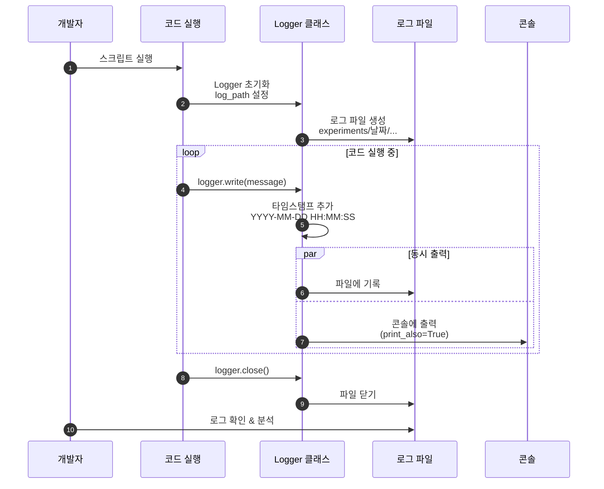

# 05. 로깅 시스템

## 문서 정보
- **작성일**: 2025-10-30
- **프로젝트명**: 논문 리뷰 챗봇 (AI Agent + RAG)
- **팀명**: 연결의 민족
- **작성자**: 연결의 민족 팀

---

## 1. 로깅 시스템 개요

### 1.1 목적

- 개발 과정에서 발생하는 모든 이벤트 기록
- 실험 추적 및 디버깅 지원
- 성능 분석 및 오류 진단
- 프로젝트 진행 상황 문서화

### 1.2 로깅 흐름



**로깅 흐름 설명:**
- 개발자가 코드를 실행하면 Logger 클래스가 초기화되고 로그 파일이 생성되는 전체 프로세스를 표현
- Logger 초기화 시 experiments/날짜/ 경로에 로그 파일이 자동으로 생성
- 코드 실행 중 logger.write() 호출 시 타임스탬프가 자동으로 추가되며 파일과 콘솔에 동시 출력
- 작업 완료 후 logger.close()로 파일을 닫고, 개발자는 로그 파일을 통해 실행 과정을 분석 및 디버깅 가능

### 1.2 로깅 정책

1. **모든 챗봇 실행은 로그로 기록**
   - 실행 시작/종료 시간
   - 사용자 질문 및 난이도
   - AI Agent 도구 선택 및 실행 과정
   - 실행 결과 및 오류 메시지

2. **표준 출력 대신 Logger 사용**
   - `print()` 사용 금지
   - `logger.write()` 사용 필수

3. **로그 파일은 실험 폴더에 저장**
   - **메인 로그**: `experiments/{날짜}/{날짜}_{시간}_session_XXX/chatbot.log`
   - **도구별 로그**: `experiments/{날짜}/{날짜}_{시간}_session_XXX/tools/*.log`

---

## 2. Logger 클래스

### 2.1 위치
- **파일**: `src/utils/logger.py`
- **클래스**: `Logger`

### 2.2 주요 기능

1. **타임스탬프 자동 추가**
   - 모든 로그 메시지에 시간 기록
   - 형식: `YYYY-MM-DD HH:MM:SS | 메시지`

2. **파일 및 콘솔 동시 출력**
   - 파일에 저장 + 콘솔에 출력
   - `print_also` 파라미터로 제어

3. **표준 출력/에러 리디렉션**
   - `start_redirect()`: 모든 `print()` 로그로 저장
   - `stop_redirect()`: 리디렉션 중지

4. **tqdm 진행률 표시 지원**
   - `tqdm_redirect()`: tqdm 출력을 로그로 리디렉션

5. **에러 메시지 색상 구분**
   - `print_error=True`: 콘솔에 빨간색 표시

---

## 3. 기본 사용법

### 3.1 ExperimentManager를 통한 Logger 사용 (권장)

챗봇 실행 시 **ExperimentManager**를 사용하면 자동으로 폴더 및 Logger가 생성됩니다:

```python
from src.utils.experiment_manager import ExperimentManager

# with 문으로 자동 초기화 및 종료
with ExperimentManager() as exp:
    # 자동으로 다음 작업 수행:
    # 1. experiments/20251031/20251031_103015_session_001/ 생성
    # 2. Session ID 자동 부여 (session_001, 002...)
    # 3. chatbot.log 파일 생성
    # 4. Logger 초기화

    # 메인 로그 기록
    exp.logger.write("챗봇 실행 시작")
    exp.logger.write("사용자 질문: RAG에 대해 알려줘")

    # 도구별 Logger 사용
    rag_logger = exp.get_tool_logger('rag_paper')
    rag_logger.write("논문 검색 시작")
    rag_logger.write("검색 완료: 5개 논문 발견")
    rag_logger.close()

    # with 블록이 끝나면 자동으로 Logger 종료
```

### 3.2 Logger 직접 사용 (레거시)

특수한 경우 Logger를 직접 사용할 수 있습니다:

```python
import os
from datetime import datetime
from src.utils.logger import Logger

# 로그 폴더 경로 생성
today = datetime.now().strftime("%Y%m%d")        # "20251031"
time_now = datetime.now().strftime("%H%M%S")     # "103015"

# 실험 폴더 생성
log_dir = f"experiments/{today}/{today}_{time_now}_session_001"
os.makedirs(log_dir, exist_ok=True)

# Logger 인스턴스 생성
logger = Logger(
    log_path=f"{log_dir}/chatbot.log",
    print_also=True  # 콘솔에도 출력
)
```

### 3.3 기본 로그 기록

```python
# 일반 로그
logger.write("VectorDB 구축 시작")
logger.write(f"총 {len(documents)}개 문서 로드 완료")

# 파일에만 저장 (콘솔 출력 안함)
logger.write("내부 디버그 정보", print_also=False)

# 에러 메시지 (빨간색)
logger.write("오류: 파일을 찾을 수 없습니다.", print_error=True)

# Logger 종료
logger.close()
```

### 3.4 표준 출력 리디렉션

```python
logger = Logger(f"{log_dir}/training.log")

# 리디렉션 시작
logger.start_redirect()

# 이제 print도 자동으로 로그에 기록됨
print("이 메시지는 로그 파일에 저장됩니다.")
print("에러 발생!", file=sys.stderr)  # stderr도 로그에 기록

# 리디렉션 중지
logger.stop_redirect()

# 이제 print는 일반적으로 동작
print("이 메시지는 콘솔에만 출력됩니다.")

logger.close()
```

---

## 4. 실전 사용 예시

### 4.1 챗봇 실행 로그 (ExperimentManager 사용)

```python
from src.utils.experiment_manager import ExperimentManager

def run_chatbot(user_query: str, difficulty: str = "easy"):
    with ExperimentManager() as exp:
        # 메인 로그 기록
        exp.logger.write("=" * 50)
        exp.logger.write("챗봇 실행 시작")
        exp.logger.write("=" * 50)
        exp.logger.write(f"사용자 질문: {user_query}")
        exp.logger.write(f"난이도: {difficulty}")

        # 메타데이터 업데이트
        exp.update_metadata(
            user_query=user_query,
            difficulty=difficulty
        )

        # AI Agent 도구 선택
        exp.logger.write("AI Agent 도구 선택 중...")
        tool_name = agent.select_tool(user_query)
        exp.logger.write(f"선택된 도구: {tool_name}")

        # 도구별 Logger 사용
        tool_logger = exp.get_tool_logger(tool_name)
        tool_logger.write(f"{tool_name} 도구 실행 시작")

        # 도구 실행
        if tool_name == "rag_paper":
            tool_logger.write("논문 검색 중...")
            results = rag_paper_tool.run(user_query)
            tool_logger.write(f"검색 완료: {len(results)}개 논문 발견")
        elif tool_name == "web_search":
            tool_logger.write("웹 검색 중...")
            results = web_search_tool.run(user_query)
            tool_logger.write(f"검색 완료: {len(results)}개 결과")

        tool_logger.close()

        # 최종 답변 생성
        exp.logger.write("최종 답변 생성 중...")
        answer = generate_answer(results, difficulty)
        exp.logger.write("답변 생성 완료")

        # 결과 저장
        exp.save_output('response.txt', answer)
        exp.update_metadata(success=True, tool_used=tool_name)

        exp.logger.write("=" * 50)
        exp.logger.write("챗봇 실행 완료")
        exp.logger.write("=" * 50)

        return answer
```

**로그 출력 예시 (chatbot.log):**
```
2025-10-31 10:30:15 | ==================================================
2025-10-31 10:30:15 | 챗봇 실행 시작
2025-10-31 10:30:15 | ==================================================
2025-10-31 10:30:15 | 사용자 질문: RAG에 대해 알려줘
2025-10-31 10:30:15 | 난이도: easy
2025-10-31 10:30:16 | AI Agent 도구 선택 중...
2025-10-31 10:30:16 | 선택된 도구: rag_paper
2025-10-31 10:30:18 | 최종 답변 생성 중...
2025-10-31 10:30:20 | 답변 생성 완료
2025-10-31 10:30:20 | ==================================================
2025-10-31 10:30:20 | 챗봇 실행 완료
2025-10-31 10:30:20 | ==================================================
```

**도구별 로그 예시 (tools/rag_paper.log):**
```
2025-10-31 10:30:16 | rag_paper 도구 실행 시작
2025-10-31 10:30:16 | 논문 검색 중...
2025-10-31 10:30:18 | 검색 완료: 5개 논문 발견
```

### 4.2 DB 쿼리 및 프롬프트 저장

```python
from src.utils.experiment_manager import ExperimentManager

def run_rag_search(user_query: str):
    with ExperimentManager() as exp:
        exp.logger.write("RAG 검색 시작")

        # SQL 쿼리 기록
        exp.log_sql_query(
            query="SELECT * FROM papers WHERE paper_id IN (1, 2, 3)",
            description="논문 메타데이터 조회",
            tool="rag_paper",
            execution_time_ms=12
        )

        # pgvector 검색 기록
        exp.log_pgvector_search({
            "tool": "rag_paper",
            "query_text": user_query,
            "top_k": 5,
            "execution_time_ms": 45
        })

        # 프롬프트 저장
        exp.save_system_prompt(
            system_prompt="당신은 논문을 쉽게 설명하는 전문가입니다.",
            metadata={"난이도": "easy"}
        )

        exp.save_user_prompt(
            user_prompt=f"[질문]\n{user_query}",
            metadata={"검색 결과 수": 5}
        )

        exp.logger.write("RAG 검색 완료")
```

### 4.3 평가 지표 저장

```python
from src.utils.experiment_manager import ExperimentManager

def evaluate_and_log():
    with ExperimentManager() as exp:
        exp.logger.write("평가 지표 수집 시작")

        # RAG 평가 지표 저장
        exp.save_rag_metrics({
            "retrieval_metrics": {
                "recall_at_5": 0.8,
                "precision_at_5": 0.4
            },
            "generation_metrics": {
                "faithfulness": 0.95
            }
        })

        # Agent 정확도 저장
        exp.save_agent_accuracy({
            "routing_decision": {
                "predicted_tool": "rag_paper",
                "correct": True
            }
        })

        # 응답 시간 분석 저장
        exp.save_latency_report({
            "total_latency": {
                "total_time_ms": 5000,
                "status": "PASS"
            }
        })

        # 비용 분석 저장
        exp.save_cost_analysis({
            "llm_usage": {"total_tokens": 2345},
            "cost_breakdown_krw": {"total_cost": 30.51}
        })

        exp.logger.write("평가 지표 저장 완료")
```

### 4.4 tqdm 진행률 표시 (Logger 직접 사용)

tqdm 진행률을 로그에 기록하려면 Logger를 직접 사용:

```python
from tqdm import tqdm
from src.utils.logger import Logger

def process_documents(doc_list: list):
    # Logger 직접 생성
    logger = Logger("experiments/20251031/20251031_103015_session_001/processing.log")

    # tqdm 리디렉션 설정
    logger.tqdm_redirect()

    logger.write("문서 처리 시작")

    # tqdm 진행률 표시
    for doc in tqdm(doc_list, desc="문서 처리 중"):
        processed = preprocess(doc)

        # 중요한 이벤트만 로그 기록
        if has_error(processed):
            logger.write(f"경고: {doc.name} 처리 중 오류", print_error=True)

    logger.write("문서 처리 완료")
    logger.close()
```

---

## 5. 로그 파일 위치 규칙

### 5.1 필수 디렉토리 구조

모든 로그 파일은 **experiments/날짜/날짜_시간_session_XXX/** 구조로 저장:

```
experiments/
└── 20251031/                                # 날짜 (YYYYMMDD)
    ├── 20251031_103015_session_001/         # 시간_session_ID
    │   ├── chatbot.log                      # 메인 실행 로그
    │   ├── metadata.json                    # 실험 메타데이터
    │   ├── config.yaml                      # 전체 설정
    │   │
    │   ├── tools/                           # 도구 실행 로그
    │   │   ├── rag_paper.log
    │   │   ├── rag_glossary.log
    │   │   ├── web_search.log
    │   │   └── ...
    │   │
    │   ├── database/                        # DB 관련 기록
    │   │   ├── queries.sql
    │   │   ├── pgvector_searches.json
    │   │   └── ...
    │   │
    │   ├── prompts/                         # 프롬프트 기록
    │   │   ├── system_prompt.txt
    │   │   ├── user_prompt.txt
    │   │   └── ...
    │   │
    │   ├── ui/                              # UI 관련 기록
    │   │   ├── streamlit_session.json
    │   │   └── ...
    │   │
    │   ├── outputs/                         # 생성된 결과물
    │   │   ├── response.txt
    │   │   └── ...
    │   │
    │   └── evaluation/                      # 평가 지표
    │       ├── rag_metrics.json
    │       ├── agent_accuracy.json
    │       └── ...
    │
    └── 20251031_110234_session_002/         # 다음 실행
        └── ...
```

### 5.2 ExperimentManager 자동 폴더 생성

ExperimentManager는 자동으로 폴더 구조를 생성합니다:

```python
from src.utils.experiment_manager import ExperimentManager

with ExperimentManager() as exp:
    # 자동으로 다음 작업 수행:
    # 1. 당일 폴더 확인 (experiments/20251031/)
    # 2. 기존 session 확인하여 다음 번호 부여 (session_001, 002...)
    # 3. 실험 폴더 생성 (20251031_103015_session_001/)
    # 4. 서브 폴더 6개 생성 (tools, database, prompts, ui, outputs, evaluation)
    # 5. metadata.json 초기화
    # 6. chatbot.log 생성

    # 메인 로그 사용
    exp.logger.write("챗봇 실행 시작")

    # 도구별 로그 사용
    tool_logger = exp.get_tool_logger('rag_paper')
    tool_logger.write("논문 검색 시작")
    tool_logger.close()
```

### 5.3 Session ID 자동 부여

Session ID는 **당일 기준으로 자동 부여**됩니다:

- **형식**: `session_001`, `session_002`, `session_003` ...
- **부여 방식**: 당일 폴더의 기존 session 확인 후 다음 번호
- **시작 번호**: 매일 `001`부터 시작

**예시:**
```
experiments/20251031/
├── 20251031_103015_session_001/   # 오늘 첫 번째
├── 20251031_110234_session_002/   # 오늘 두 번째
└── 20251031_143520_session_003/   # 오늘 세 번째

experiments/20251101/
└── 20251101_090012_session_001/   # 다음 날, 다시 001부터
```

---

## 6. Logger 클래스 API

### 6.1 주요 메서드

| 메서드 | 설명 | 사용 예시 |
|--------|------|-----------|
| `write(message, print_also=True, print_error=False)` | 로그 메시지 기록 | `logger.write("메시지")` |
| `start_redirect()` | stdout/stderr를 로그로 리디렉션 | `logger.start_redirect()` |
| `stop_redirect()` | 리디렉션 중지 | `logger.stop_redirect()` |
| `tqdm_redirect()` | tqdm 출력을 로그로 리디렉션 | `logger.tqdm_redirect()` |
| `flush()` | 버퍼 플러시 | `logger.flush()` |
| `close()` | 로그 파일 닫기 | `logger.close()` |

### 6.2 매개변수 설명

**`Logger(log_path, print_also=True)`**
- `log_path` (str): 로그 파일 저장 경로
- `print_also` (bool): True면 파일과 콘솔에 동시 출력

**`write(message, print_also=True, print_error=False)`**
- `message` (str): 로그 메시지
- `print_also` (bool): 콘솔 출력 여부
- `print_error` (bool): 에러 메시지 여부 (빨간색)

---

## 7. 주의사항

### 7.1 Logger 종료 필수

작업 완료 후 반드시 `close()`를 호출:

```python
logger = Logger(f"{log_dir}/experiment.log")

# ... 작업 ...

logger.close()  # 필수!
```

### 7.2 print 대신 logger 사용

**❌ 잘못된 예:**
```python
print("VectorDB 구축 시작")
print(f"Epoch: {epoch}, Loss: {loss}")
```

**✅ 올바른 예:**
```python
logger.write("VectorDB 구축 시작")
logger.write(f"Epoch: {epoch}, Loss: {loss}")
```

### 7.3 로그 파일 경로 확인

로그 파일을 저장할 디렉토리를 반드시 생성:

```python
log_dir = f"experiments/{today}/{today}_{time_now}_{experiment_name}"
os.makedirs(log_dir, exist_ok=True)  # 디렉토리 자동 생성
```

### 7.4 빈 메시지 자동 무시

빈 문자열이나 공백만 있는 메시지는 자동으로 무시됨:

```python
logger.write("")        # 기록되지 않음
logger.write("   ")     # 기록되지 않음
```

---

## 8. 로그 분석

### 8.1 로그 파일 찾기

```bash
# 특정 날짜의 모든 세션 보기
ls experiments/20251031/

# 최신 세션 찾기
ls -lt experiments/20251031/ | head -5

# Session ID로 검색
ls experiments/20251031/ | grep "session_001"
```

### 8.2 로그 내용 확인

```bash
# 메인 로그 파일 전체 보기
cat experiments/20251031/20251031_103015_session_001/chatbot.log

# 마지막 20줄만 보기
tail -20 experiments/20251031/20251031_103015_session_001/chatbot.log

# 실시간 모니터링
tail -f experiments/20251031/20251031_103015_session_001/chatbot.log

# 도구별 로그 확인
cat experiments/20251031/20251031_103015_session_001/tools/rag_paper.log

# 특정 키워드 검색
grep "오류" experiments/20251031/*/chatbot.log
grep "검색 완료" experiments/20251031/*/tools/*.log
```

---

## 9. 로그 활용

### 9.1 디버깅

로그 파일에서 오류 메시지 찾기:

```bash
# 오류 메시지만 필터링
grep -i "error\|오류" experiments/20251031/*/chatbot.log

# 특정 세션의 오류 찾기
grep -i "error" experiments/20251031/20251031_103015_session_001/chatbot.log

# 모든 도구 로그에서 오류 찾기
grep -i "오류" experiments/20251031/*/tools/*.log
```

### 9.2 성능 분석

로그에서 시간 정보 추출:

```python
import re
from datetime import datetime

def analyze_log_timing(log_path):
    """로그 파일에서 시간 정보를 추출하여 분석"""
    with open(log_path, 'r') as f:
        lines = f.readlines()

    start_time = None
    end_time = None

    for line in lines:
        match = re.match(r'(\d{4}-\d{2}-\d{2} \d{2}:\d{2}:\d{2})', line)
        if match:
            timestamp = datetime.strptime(match.group(1), '%Y-%m-%d %H:%M:%S')
            if start_time is None:
                start_time = timestamp
            end_time = timestamp

    if start_time and end_time:
        duration = (end_time - start_time).total_seconds()
        print(f"실행 시간: {duration:.2f}초")
```

---

## 10. 참고 문서

- [실험_폴더_구조_최종안.md](../references/실험_폴더_구조_최종안.md) - 전체 폴더 구조 상세 가이드
- [06_실험_추적_관리.md](06_실험_추적_관리.md) - ExperimentManager 사용법
- [담당역할_06_로깅_모니터링.md](../roles/담당역할_06_로깅_모니터링.md) - Logger 및 ExperimentManager 구현
- Python logging 모듈: https://docs.python.org/3/library/logging.html
