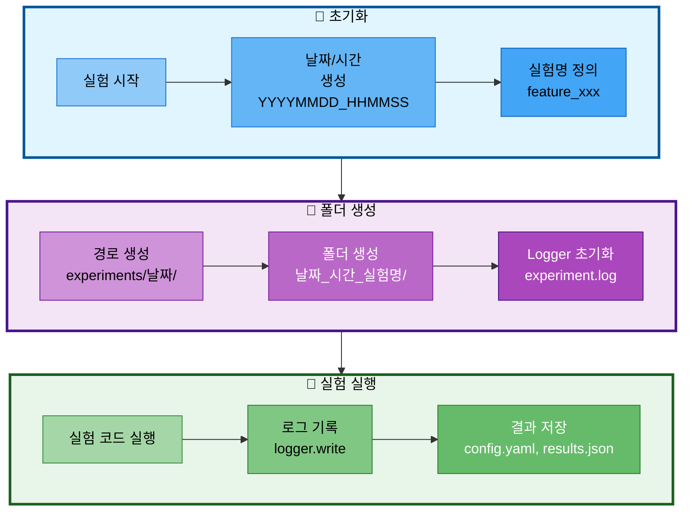

# 06. 실험 추적 관리

## 문서 정보
- **작성일**: 2025-10-30
- **프로젝트명**: 논문 리뷰 챗봇 (AI Agent + RAG)
- **팀명**: 연결의 민족

---

## 1. 실험 폴더 구조

### 1.1 실험 폴더 생성 흐름



### 1.2 필수 구조

모든 실험 결과물은 `experiments/날짜/날짜_시간_실험명/` 구조로 저장:

```
experiments/
└── 20251030/                              # 날짜 (YYYYMMDD)
    ├── 20251030_143052_rag_vectordb_build/
    │   ├── experiment.log                 # 로그 파일
    │   ├── config.yaml                    # 실험 설정
    │   ├── results.json                   # 실험 결과
    │   └── vectordb/                      # VectorDB 결과
    │
    └── 20251030_150823_agent_execution/
        ├── experiment.log
        ├── config.yaml
        └── responses.json
```

---

## 2. 실험명 명명 규칙

| 카테고리 | 형식 | 예시 |
|----------|------|------|
| 기능 개발 | `feature_<기능명>` | `feature_web_search_tool` |
| RAG 실험 | `rag_<내용>` | `rag_vectordb_build` |
| Agent 실험 | `agent_<내용>` | `agent_tool_calling` |
| 평가 | `eval_<대상>` | `eval_chatbot_accuracy` |
| 디버깅 | `debug_<문제>` | `debug_memory_leak` |

---

## 3. 실험 폴더 생성 템플릿

```python
import os
from datetime import datetime

# 날짜와 시간 생성
today = datetime.now().strftime("%Y%m%d")
time_now = datetime.now().strftime("%H%M%S")
experiment_name = "rag_vectordb_build"

# 실험 폴더 경로
experiment_dir = f"experiments/{today}/{today}_{time_now}_{experiment_name}"
os.makedirs(experiment_dir, exist_ok=True)

# Logger 생성
from src.utils.logger import Logger
logger = Logger(f"{experiment_dir}/experiment.log")
```

---

## 4. 실험 결과 저장

### 4.1 필수 파일

1. **experiment.log**: Logger로 기록된 로그
2. **config.yaml**: 실험 설정 (모델, 파라미터 등)
3. **results.json**: 실험 결과 (메트릭, 성능 등)

### 4.2 선택 파일

- **vectordb/**: VectorDB 저장소
- **outputs/**: 생성된 답변
- **screenshots/**: 스크린샷

---

## 5. 참고 자료

- 실험 폴더 규칙 상세: `docs/rules/실험_폴더명_규칙.md`
- Logger 사용법: `docs/rules/logger_사용법.md`
