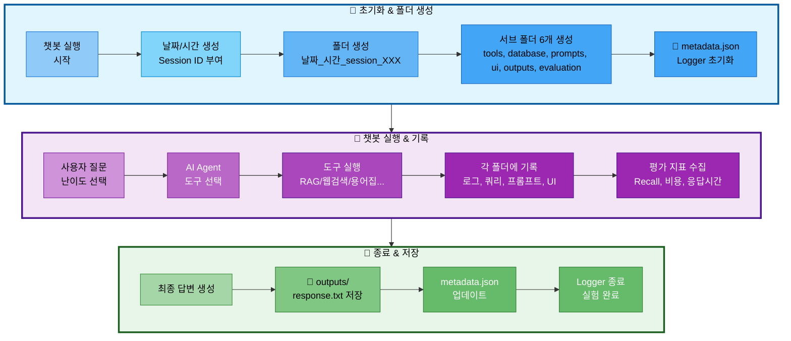

# 06. 실험 추적 관리

## 문서 정보
- **작성일**: 2025-10-30
- **프로젝트명**: 논문 리뷰 챗봇 (AI Agent + RAG)
- **팀명**: 연결의 민족

---

## 1. 실험 폴더 구조

### 1.1 실험 폴더 생성 흐름



**실험 폴더 생성 흐름 설명:**
- **초기화 단계**: 챗봇 실행 시 자동으로 Session ID 부여 (session_001, 002...) → 폴더 및 서브 폴더 6개 생성 → metadata.json과 Logger 초기화
- **실행 단계**: 사용자 질문 입력 및 난이도 선택 → AI Agent가 적절한 도구 선택 (RAG, 웹검색, 용어집 등) → 실행 과정을 각 폴더에 기록 (도구 로그, DB 쿼리, 프롬프트, UI 인터랙션) → 평가 지표 수집 (Recall@K, 비용, 응답시간)
- **종료 단계**: 최종 답변 생성 → outputs/response.txt 저장 → metadata.json 업데이트 → Logger 종료 및 실험 완료

### 1.2 필수 폴더 구조

모든 챗봇 실행 결과는 `experiments/날짜/날짜_시간_session_XXX/` 구조로 저장:

```
experiments/
└── 20251031/                                # 날짜 (YYYYMMDD)
    └── 20251031_103015_session_001/         # 시간_session_ID
        │
        ├── metadata.json                    # ⭐ 전체 실험 메타데이터
        ├── chatbot.log                      # 메인 실행 로그
        ├── config.yaml                      # 전체 설정
        │
        ├── tools/                           # 🔧 도구 실행 로그
        │   ├── rag_paper.log                # 논문 검색 로그
        │   ├── rag_glossary.log             # 용어집 검색 로그
        │   ├── web_search.log               # 웹 검색 로그
        │   ├── summary_paper.log            # 논문 요약 로그
        │   ├── file_save.log                # 파일 저장 로그
        │   └── general.log                  # 일반 답변 로그
        │
        ├── database/                        # 🗄️ DB 관련 기록
        │   ├── queries.sql                  # 실행된 SQL 쿼리 모음
        │   ├── pgvector_searches.json       # pgvector 검색 기록
        │   ├── search_results.json          # DB 검색 결과
        │   └── db_performance.json          # 쿼리 실행 시간 등
        │
        ├── prompts/                         # 💬 프롬프트 기록
        │   ├── system_prompt.txt            # 사용된 시스템 프롬프트
        │   ├── user_prompt.txt              # 사용자 질문 + 컨텍스트
        │   ├── final_prompt.txt             # LLM에 전달된 최종 프롬프트
        │   └── prompt_template.yaml         # 프롬프트 템플릿 정보
        │
        ├── ui/                              # 🖥️ UI 관련 기록
        │   ├── streamlit_session.json       # Streamlit 세션 상태
        │   ├── user_interactions.log        # 사용자 인터랙션 로그
        │   └── ui_events.json               # UI 이벤트 기록
        │
        ├── outputs/                         # 📄 생성된 결과물
        │   ├── response.txt                 # 최종 답변
        │   ├── summary.md                   # 요약본 (있을 경우)
        │   └── saved_file.txt               # 사용자가 저장 요청한 파일
        │
        ├── evaluation/                      # 📊 평가 지표
        │   ├── rag_metrics.json             # RAG 평가 지표
        │   ├── agent_accuracy.json          # Agent 정확도
        │   ├── latency_report.json          # 응답 시간 분석
        │   ├── cost_analysis.json           # 비용 분석
        │   └── test_results.json            # 테스트 결과
        │
        └── debug/                           # 🐛 디버그 정보 (선택)
            ├── agent_trace.json             # Agent 실행 추적
            ├── llm_tokens.json              # 토큰 사용량
            └── error_trace.log              # 에러 발생 시 스택 트레이스
```

### 1.3 metadata.json (핵심 메타데이터)

각 실험의 핵심 정보를 한 곳에 요약:

```json
{
  "session_id": "001",
  "start_time": "2025-10-31T10:30:15",
  "end_time": "2025-10-31T10:32:45",
  "difficulty": "easy",
  "tool_used": "rag_paper",
  "user_query": "RAG에 대해 알려줘",
  "success": true,
  "response_time_ms": 2500,
  "response_length": 450,
  "model": "gpt-4",
  "temperature": 0.7,
  "tokens_used": {
    "prompt": 1200,
    "completion": 800,
    "total": 2000
  },
  "db_queries_count": 4,
  "db_total_time_ms": 120
}
```

---

## 2. Session ID 자동 부여 규칙

### 2.1 자동 생성 방식

챗봇 실행 시마다 **Session ID가 자동으로 부여**됩니다:

- **형식**: `session_001`, `session_002`, `session_003` ...
- **부여 방식**: 당일 날짜 기준으로 순차적으로 증가
- **시작 번호**: 매일 `001`부터 시작

### 2.2 예시

```
experiments/20251031/
├── 20251031_103015_session_001/   # 오늘 첫 번째 실행
├── 20251031_110234_session_002/   # 오늘 두 번째 실행
└── 20251031_143520_session_003/   # 오늘 세 번째 실행

experiments/20251101/
└── 20251101_090012_session_001/   # 다음 날, 다시 001부터 시작
```

### 2.3 중복 방지

ExperimentManager 클래스가 자동으로:
1. 당일 폴더(`experiments/20251031/`) 스캔
2. 기존 session 폴더 확인
3. 가장 큰 번호 + 1로 새 session ID 부여

---

## 3. ExperimentManager 사용법

### 3.1 기본 사용 (자동 폴더 생성)

```python
from src.utils.experiment_manager import ExperimentManager

# with 문으로 자동 초기화 및 종료
with ExperimentManager() as exp:
    # 자동으로 다음 작업 수행:
    # 1. experiments/20251031/20251031_103015_session_001/ 생성
    # 2. 서브 폴더 생성 (tools, database, prompts, ui, outputs, evaluation)
    # 3. metadata.json 초기화
    # 4. Logger 초기화

    # 메인 로그 기록
    exp.logger.write("챗봇 실행 시작")

    # 사용자 질문
    question = "RAG에 대해 알려줘"

    # 메타데이터 업데이트
    exp.update_metadata(
        user_query=question,
        difficulty="easy"
    )

    # ... 챗봇 실행 ...

    # with 블록이 끝나면 자동으로 close() 호출
```

### 3.2 도구별 Logger 사용

```python
with ExperimentManager() as exp:
    # 도구별 독립 Logger 생성
    rag_logger = exp.get_tool_logger('rag_paper')
    rag_logger.write("논문 검색 시작")
    rag_logger.write("검색 완료: 5개 논문 발견")
    rag_logger.close()

    # 다른 도구
    web_logger = exp.get_tool_logger('web_search')
    web_logger.write("웹 검색 시작")
```

### 3.3 DB 쿼리 기록

```python
with ExperimentManager() as exp:
    # SQL 쿼리 기록
    exp.log_sql_query(
        query="SELECT * FROM papers WHERE paper_id = 123",
        description="논문 메타데이터 조회",
        tool="rag_paper",
        execution_time_ms=12
    )

    # pgvector 검색 기록
    exp.log_pgvector_search({
        "tool": "rag_paper",
        "collection": "paper_chunks",
        "query_text": "RAG에 대해 알려줘",
        "top_k": 5,
        "execution_time_ms": 45
    })

    # 검색 결과 저장
    exp.save_search_results("rag_paper", {
        "query": "RAG에 대해 알려줘",
        "results_count": 5,
        "papers": [...]
    })
```

### 3.4 프롬프트 저장

```python
with ExperimentManager() as exp:
    # 시스템 프롬프트 저장
    exp.save_system_prompt(
        system_prompt="당신은 논문을 쉽게 설명하는 전문가입니다.",
        metadata={"난이도": "easy", "템플릿": "EASY_SYSTEM_PROMPT"}
    )

    # 사용자 프롬프트 저장
    exp.save_user_prompt(
        user_prompt="[참고 논문]\n...\n\n[질문]\nRAG에 대해 알려줘",
        metadata={"검색 결과 수": 5}
    )

    # 최종 프롬프트 저장
    exp.save_final_prompt(final_prompt)

    # 프롬프트 템플릿 정보 저장
    exp.save_prompt_template({
        "difficulty": "easy",
        "llm_config": {"model": "gpt-4", "temperature": 0.7}
    })
```

### 3.5 UI 인터랙션 기록

```python
with ExperimentManager() as exp:
    # 인터랙션 로그
    exp.log_ui_interaction("페이지 접속")
    exp.log_ui_interaction("난이도 선택: easy")
    exp.log_ui_interaction("질문 입력: RAG에 대해 알려줘")

    # UI 이벤트 기록
    exp.log_ui_event({
        "event_type": "difficulty_changed",
        "old_value": None,
        "new_value": "easy"
    })

    # Streamlit 세션 저장
    exp.save_streamlit_session({
        "session_id": "abc123",
        "messages": [...]
    })
```

### 3.6 평가 지표 저장

```python
with ExperimentManager() as exp:
    # RAG 평가 지표
    exp.save_rag_metrics({
        "retrieval_metrics": {"recall_at_5": 0.8},
        "generation_metrics": {"faithfulness": 0.95}
    })

    # Agent 정확도
    exp.save_agent_accuracy({
        "routing_decision": {"predicted_tool": "rag_paper", "correct": True}
    })

    # 응답 시간 분석
    exp.save_latency_report({
        "total_latency": {"total_time_ms": 5000, "status": "PASS"}
    })

    # 비용 분석
    exp.save_cost_analysis({
        "llm_usage": {"total_tokens": 2345},
        "cost_breakdown_krw": {"total_cost": 30.51}
    })
```

### 3.7 결과물 저장

```python
with ExperimentManager() as exp:
    # 최종 답변 저장
    exp.save_output('response.txt', final_answer)

    # 요약본 저장 (있을 경우)
    exp.save_output('summary.md', summary_text)

    # 사용자 저장 요청 파일
    exp.save_output('saved_file.txt', content)
```

---

## 4. 저장되는 파일 및 폴더

### 4.1 최상위 필수 파일

| 파일명 | 설명 | 생성 방법 |
|--------|------|----------|
| **metadata.json** | 실험 핵심 정보 요약 | `exp.update_metadata()` |
| **chatbot.log** | 메인 실행 로그 | `exp.logger.write()` |
| **config.yaml** | 전체 설정 정보 | `exp.save_config()` |

### 4.2 tools/ 폴더 (도구별 로그)

| 파일명 | 설명 | 생성 시점 |
|--------|------|----------|
| `rag_paper.log` | 논문 검색 로그 | rag_paper 도구 실행 시 |
| `rag_glossary.log` | 용어집 검색 로그 | rag_glossary 도구 실행 시 |
| `web_search.log` | 웹 검색 로그 | web_search 도구 실행 시 |
| `summary_paper.log` | 논문 요약 로그 | summary_paper 도구 실행 시 |
| `file_save.log` | 파일 저장 로그 | file_save 도구 실행 시 |
| `general.log` | 일반 답변 로그 | general 도구 실행 시 |

**특징**: 실행된 도구만 로그 파일 생성 (빈 파일 없음)

### 4.3 database/ 폴더 (DB 관련)

| 파일명 | 설명 | 내용 |
|--------|------|------|
| `queries.sql` | 실행된 SQL 쿼리 모음 | 시간순 SQL 쿼리 + 설명 |
| `pgvector_searches.json` | pgvector 검색 기록 | 임베딩, 검색 타입, 결과 수 등 |
| `search_results.json` | DB 검색 결과 | 논문/용어 상세 정보 |
| `db_performance.json` | 쿼리 실행 시간 등 | 쿼리별 성능 분석 |

### 4.4 prompts/ 폴더 (프롬프트)

| 파일명 | 설명 | 내용 |
|--------|------|------|
| `system_prompt.txt` | 시스템 프롬프트 | Easy/Hard 난이도별 프롬프트 |
| `user_prompt.txt` | 사용자 프롬프트 | 질문 + 검색된 컨텍스트 |
| `final_prompt.txt` | 최종 프롬프트 | LLM에 전달된 전체 프롬프트 |
| `prompt_template.yaml` | 템플릿 정보 | LLM 설정, 토큰 수 등 |

### 4.5 ui/ 폴더 (Streamlit UI)

| 파일명 | 설명 | 내용 |
|--------|------|------|
| `streamlit_session.json` | 세션 상태 | 메시지 히스토리, 위젯 상태 |
| `user_interactions.log` | 인터랙션 로그 | 클릭, 입력 등 사용자 행동 |
| `ui_events.json` | UI 이벤트 | 이벤트 타임라인 |

### 4.6 outputs/ 폴더 (결과물)

| 파일명 | 설명 | 생성 시점 |
|--------|------|----------|
| `response.txt` | 최종 답변 | 항상 생성 |
| `summary.md` | 논문 요약본 | 요약 도구 사용 시 |
| `saved_file.txt` | 저장 요청 파일 | 파일 저장 도구 사용 시 |

### 4.7 evaluation/ 폴더 (평가 지표)

| 파일명 | 설명 | 주요 지표 |
|--------|------|----------|
| `rag_metrics.json` | RAG 평가 | Recall@K, Precision, Faithfulness |
| `agent_accuracy.json` | Agent 정확도 | 도구 선택 정확도, 실행 흐름 |
| `latency_report.json` | 응답 시간 | p50/p95/p99, 병목 분석 |
| `cost_analysis.json` | 비용 분석 | 토큰 사용량, USD/KRW 비용 |
| `test_results.json` | 테스트 결과 | 시나리오별 성공/실패 |

### 4.8 debug/ 폴더 (선택 사항)

| 파일명 | 설명 | 생성 시점 |
|--------|------|----------|
| `agent_trace.json` | Agent 실행 추적 | 디버깅 필요 시 |
| `llm_tokens.json` | 토큰 사용량 | 비용 상세 분석 시 |
| `error_trace.log` | 에러 스택 트레이스 | 에러 발생 시 |

---

## 5. 실험 검색 및 분석

### 5.1 메타데이터 기반 검색

`scripts/find_experiments.py` 스크립트로 실험 검색:

```python
from pathlib import Path
import json

# 난이도별 검색
easy_experiments = find_experiments(difficulty="easy")
hard_experiments = find_experiments(difficulty="hard")

# 도구별 검색
rag_experiments = find_experiments(tool="rag_paper")
web_experiments = find_experiments(tool="web_search")

# 날짜별 검색
today_experiments = find_experiments(date="20251031")

# 응답 시간 기준 검색
fast_experiments = find_experiments(max_response_time=3000)
slow_experiments = find_experiments(min_response_time=5000)

# 복합 조건 검색
filtered = find_experiments(
    difficulty="easy",
    tool="rag_paper",
    min_response_time=2000,
    max_response_time=5000
)
```

### 5.2 평가 지표 집계

```python
# 모든 실험의 평가 지표 수집
def aggregate_metrics(date: str):
    metrics_list = []
    for session_dir in Path(f"experiments/{date}").glob("*_session_*"):
        rag_metrics_file = session_dir / "evaluation" / "rag_metrics.json"
        if rag_metrics_file.exists():
            with open(rag_metrics_file) as f:
                metrics_list.append(json.load(f))

    # 평균 계산
    avg_recall = sum(m['retrieval_metrics']['recall_at_5'] for m in metrics_list) / len(metrics_list)
    avg_faithfulness = sum(m['generation_metrics']['faithfulness'] for m in metrics_list) / len(metrics_list)

    return {
        'total_sessions': len(metrics_list),
        'avg_recall_at_5': avg_recall,
        'avg_faithfulness': avg_faithfulness
    }
```

---

## 6. 참고 문서

- [실험_폴더_구조_최종안.md](../references/실험_폴더_구조_최종안.md) - 전체 폴더 구조 상세 가이드
- [05_로깅_시스템.md](05_로깅_시스템.md) - Logger 클래스 사용법
- [09_평가_기준.md](09_평가_기준.md) - RAG, Agent, DB 평가 지표
- [담당역할_06_로깅_모니터링.md](../roles/담당역할_06_로깅_모니터링.md) - ExperimentManager 구현 담당
