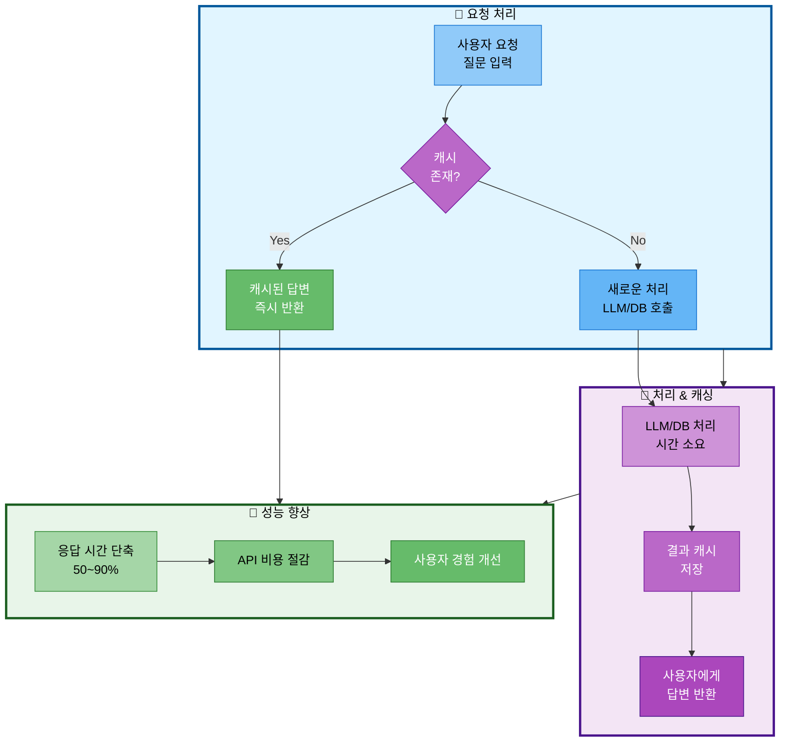

# 07. 성능 개선 전략

## 문서 정보
- **작성일**: 2025-10-30
- **프로젝트명**: 논문 리뷰 챗봇 (AI Agent + RAG)
- **팀명**: 연결의 민족

---

## 1. 캐싱 전략

### 1.1 캐싱 전략 흐름



**캐싱 전략 흐름 설명:**
- 사용자 요청 처리 시 캐시 활용을 통해 응답 시간을 50~90% 단축하고 API 비용을 절감하는 전략을 표현
- 요청 처리 단계에서 캐시 존재 여부를 확인하여 캐시된 답변이 있으면 즉시 반환하고, 없으면 새로 처리
- 처리 & 캐싱 단계에서 LLM/DB 호출로 결과를 생성하고 이를 캐시에 저장하여 동일한 질문에 재사용
- 성능 향상 단계에서 응답 시간 단축, API 비용 절감, 사용자 경험 개선이라는 3가지 이점을 제공

### 1.2 LLM 응답 캐싱

```python
from functools import lru_cache

@lru_cache(maxsize=100)
def cached_llm_call(prompt_hash):
    """LLM 응답 캐싱 (동일 질문에 대한 중복 호출 방지)"""
    return llm.invoke(prompt)
```

### 1.2 Vector DB 검색 캐싱

```python
@lru_cache(maxsize=50)
def cached_similarity_search(query_hash, k):
    """검색 결과 캐싱"""
    return vectorstore.similarity_search(query, k=k)
```

---

## 2. 비동기 처리

### 2.1 비동기 Agent 실행

```python
import asyncio

async def async_agent_invoke(question, difficulty):
    """비동기 Agent 실행"""
    result = await agent_executor.ainvoke({
        "question": question,
        "difficulty": difficulty
    })
    return result
```

### 2.2 배치 임베딩

```python
# 배치로 임베딩 생성 (한 번에 여러 문서 처리)
embeddings.embed_documents(texts, batch_size=100)
```

---

## 3. 데이터베이스 최적화

### 3.1 인덱스 활용

```sql
-- 자주 조회하는 컬럼에 인덱스 생성
CREATE INDEX idx_papers_title ON papers USING GIN (to_tsvector('english', title));
CREATE INDEX idx_papers_category ON papers(category);
```

### 3.2 Connection Pooling

```python
from psycopg2 import pool

connection_pool = pool.SimpleConnectionPool(
    minconn=1,
    maxconn=10,
    **db_config
)
```

---

## 4. 참고 자료

- Langchain Performance: https://python.langchain.com/docs/guides/performance
- PostgreSQL Tuning: https://www.postgresql.org/docs/current/performance-tips.html
