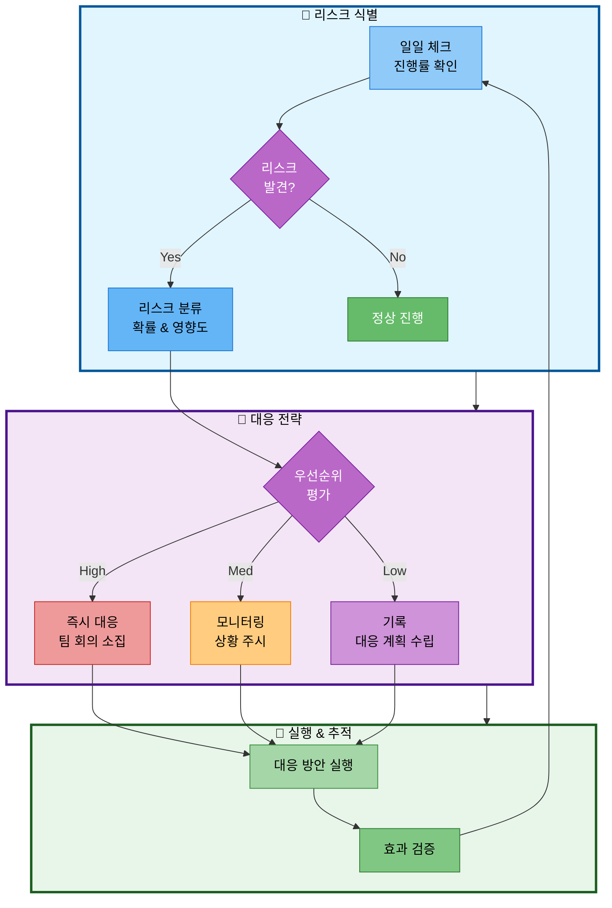

# 08. 리스크 관리

## 문서 정보
- **작성일**: 2025-10-30
- **프로젝트명**: 논문 리뷰 챗봇 (AI Agent + RAG)
- **팀명**: 연결의 민족

---

## 1. 주요 리스크

### 1.1 리스크 대응 프로세스

### 1.2 리스크 목록

| 리스크 | 확률 | 영향도 | 대응 방안 |
|--------|------|--------|-----------|
| OpenAI API 비용 초과 | 중 | 중 | - 개발 시 GPT-3.5-turbo 사용 - 최종 테스트만 GPT-4 사용 - 토큰 사용량 모니터링 |
| 모듈 통합 충돌 | 높음 | 중 | - 주기적인 동기화 - 인터페이스 사전 합의 - 일찍 병합하여 충돌 조기 발견 |
| 시간 부족 | 높음 | 높음 | - 선택 기능 포기 (Text-to-SQL 등) - 핵심 기능 우선 완성 - 팀장이 통합 작업 집중 지원 |
| 팀원 부재 (박재홍) | 확정 | 중 | - 10/31까지 데이터 수집 완료 - 인수인계 문서 작성 - 나머지 팀원이 역할 분담 |

---

## 2. 백업 플랜

### 2.1 생략 가능한 기능 (시간 부족 시)

1. ~~Text-to-SQL~~ (선택 기능)
2. ~~성능 평가 기능~~ (선택 기능)
3. ~~Reranking~~ (RAG 성능 개선 옵션)
4. ~~대화 히스토리 DB 저장~~ (메모리만 사용)

### 2.2 반드시 완성해야 하는 핵심 기능

1. ✅ 일반 답변
2. ✅ RAG 논문 검색
3. ✅ 웹 검색
4. ✅ 용어집 검색
5. ✅ 논문 요약
6. ✅ 파일 저장
7. ✅ 난이도별 답변 (Easy/Hard)
8. ✅ Streamlit UI
9. ✅ AI Agent 라우팅 (6가지 도구)

---

## 3. 리스크 모니터링

### 3.1 일일 체크리스트

- [ ] 진행률이 계획 대비 80% 이상인가?
- [ ] OpenAI API 비용이 예산 내인가?
- [ ] 모듈 통합 충돌이 없는가?
- [ ] 팀원 간 소통이 원활한가?

### 3.2 긴급 대응

**문제 발생 시:**
1. 팀장에게 즉시 보고
2. 팀 회의 소집 (15분 이내)
3. 대응 방안 결정
4. 실행 및 모니터링
