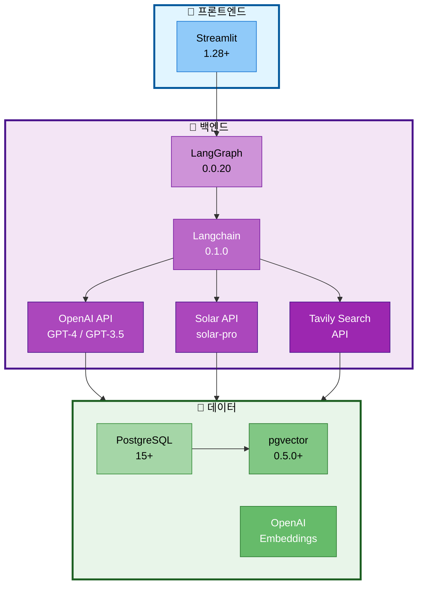

# 10. 기술 요구사항

## 문서 정보
- **작성일**: 2025-10-30
- **프로젝트명**: 논문 리뷰 챗봇 (AI Agent + RAG)
- **팀명**: 연결의 민족
- **작성자**: 연결의 민족 팀

---

## 1. 기술 스택 요약

### 1.1 기술 스택 구조도



### 1.2 기술 스택 상세

| 구분 | 선택 기술 | 버전 | 이유 |
|------|----------|------|------|
| **LLM API** | OpenAI (GPT-4/GPT-3.5-turbo) + Solar (solar-pro) | Latest | OpenAI: 높은 성능, 안정적 Function Calling<br/>Solar: 한국어 특화, 비용 효율적 |
| **Framework** | Langchain + LangGraph | 0.1.0+ | AI Agent 및 RAG 통합 개발 |
| **Database** | PostgreSQL + pgvector | 15+ / 0.5.0+ | 관계형 + 벡터 검색 통합 |
| **Embeddings** | OpenAI text-embedding-3-small | Latest | 비용 효율적, 높은 정확도 |
| **UI Framework** | Streamlit | 1.28+ | 빠른 개발, 채팅 UI 최적화 |
| **Web Search** | Tavily Search API | Latest | AI Agent 도구, 무료 티어 |
| **Python** | Python | 3.10+ | Langchain 호환성 |

---

## 2. 필수 라이브러리

### 2.1 Core Dependencies

```txt
# requirements.txt

# Langchain & LangGraph
langchain==0.1.0
langchain-openai==0.0.2
langchain-community==0.0.13
langgraph==0.0.20
langchain-postgres==0.0.1

# OpenAI
openai==1.6.1

# Database
psycopg2-binary==2.9.9
pgvector==0.2.3

# Vector Store
chromadb==0.4.18  # 선택 사항 (로컬 테스트용)

# Web Search
tavily-python==0.3.0

# UI
streamlit==1.28.2
streamlit-chat==0.1.1

# Document Processing
pypdf==3.17.1
pdfplumber==0.10.3
arxiv==2.1.0

# Text Splitting
tiktoken==0.5.2

# Evaluation (선택)
ragas==0.1.0

# Utilities
python-dotenv==1.0.0
pydantic==2.5.3
pyyaml==6.0.1

# Logging & Monitoring
tqdm==4.66.1

# Testing
pytest==7.4.3
pytest-asyncio==0.21.1
```

### 2.2 개발 도구 (Development Dependencies)

```txt
# requirements-dev.txt

black==23.12.1       # 코드 포맷팅
flake8==7.0.0        # 린팅
mypy==1.7.1          # 타입 체킹
ipython==8.18.1      # 대화형 셸
jupyter==1.0.0       # 노트북 (실험용)
```

---

## 3. 환경 설정

### 3.1 Python 환경

**권장:** Python 3.10 이상

```bash
# Python 버전 확인
python --version  # Python 3.10+ 필요

# 가상 환경 생성
python -m venv venv

# 가상 환경 활성화 (Linux/Mac)
source venv/bin/activate

# 가상 환경 활성화 (Windows)
venv\Scripts\activate

# 패키지 설치
pip install -r requirements.txt
```

### 3.2 환경 변수 설정

**.env 파일 생성:**

```bash
# .env

# OpenAI API
OPENAI_API_KEY=your-openai-api-key-here

# Solar API (Upstage)
SOLAR_API_KEY=your-solar-api-key-here

# PostgreSQL
POSTGRES_USER=your_username
POSTGRES_PASSWORD=your_password
POSTGRES_HOST=localhost
POSTGRES_PORT=5432
POSTGRES_DB=papers

# Tavily Search API
TAVILY_API_KEY=your-tavily-api-key-here

# 개발 환경
ENVIRONMENT=development  # development, production
LOG_LEVEL=INFO          # DEBUG, INFO, WARNING, ERROR

# LLM 설정
LLM_MODEL=gpt-3.5-turbo  # development: gpt-3.5-turbo/solar-pro, production: gpt-4
LLM_TEMPERATURE=0.7
LLM_MAX_TOKENS=2000

# Solar LLM 설정
SOLAR_MODEL=solar-pro  # solar-pro, solar-mini
SOLAR_TEMPERATURE=0.7
SOLAR_MAX_TOKENS=2000

# Embeddings 설정
EMBEDDING_MODEL=text-embedding-3-small
EMBEDDING_DIMENSION=1536
```

**.env.example 파일:**

```bash
# .env.example (Git에 포함)

OPENAI_API_KEY=sk-...
SOLAR_API_KEY=up-...
POSTGRES_USER=your_username
POSTGRES_PASSWORD=your_password
POSTGRES_HOST=localhost
POSTGRES_PORT=5432
POSTGRES_DB=papers
TAVILY_API_KEY=tvly-...
ENVIRONMENT=development
LOG_LEVEL=INFO
LLM_MODEL=gpt-3.5-turbo
LLM_TEMPERATURE=0.7
LLM_MAX_TOKENS=2000
EMBEDDING_MODEL=text-embedding-3-small
EMBEDDING_DIMENSION=1536
```

---

## 4. 데이터베이스 요구사항

### 4.1 PostgreSQL 설치

**Linux (Ubuntu):**
```bash
sudo apt update
sudo apt install postgresql postgresql-contrib
sudo systemctl start postgresql
sudo systemctl enable postgresql
```

**macOS (Homebrew):**
```bash
brew install postgresql@15
brew services start postgresql@15
```

**Windows:**
- [PostgreSQL 공식 사이트](https://www.postgresql.org/download/windows/)에서 설치 프로그램 다운로드

### 4.2 pgvector 확장 설치

```bash
# PostgreSQL 15+에서 pgvector 설치
git clone https://github.com/pgvector/pgvector.git
cd pgvector
make
sudo make install

# PostgreSQL에서 확장 활성화
psql -U postgres -d papers
CREATE EXTENSION vector;
```

### 4.3 데이터베이스 생성

```bash
# PostgreSQL 접속
sudo -u postgres psql

# 데이터베이스 생성
CREATE DATABASE papers;

# 사용자 생성 (선택)
CREATE USER your_username WITH PASSWORD 'your_password';

# 권한 부여
GRANT ALL PRIVILEGES ON DATABASE papers TO your_username;

# pgvector 확장 활성화
\c papers
CREATE EXTENSION vector;
```

### 4.4 스키마 초기화

```bash
# 스키마 스크립트 실행
psql -U your_username -d papers -f database/schema.sql
```

---

## 5. API 키 발급

### 5.1 OpenAI API

1. [OpenAI Platform](https://platform.openai.com/) 가입
2. API Keys 메뉴에서 새 API 키 생성
3. `.env` 파일에 `OPENAI_API_KEY` 설정

**비용:**
- GPT-4: $0.03/1K tokens (input), $0.06/1K tokens (output)
- GPT-3.5-turbo: $0.0015/1K tokens (input), $0.002/1K tokens (output)
- text-embedding-3-small: $0.02 / 1M tokens

### 5.2 Solar API (Upstage)

1. [Upstage Console](https://console.upstage.ai/) 가입
2. API Keys 메뉴에서 새 API 키 생성
3. `.env` 파일에 `SOLAR_API_KEY` 설정

**비용:**
- Solar-pro: 한국어 특화, 비용 효율적
- 무료 티어 제공

### 5.3 Tavily Search API

1. [Tavily](https://tavily.com/) 가입
2. API Keys 생성
3. `.env` 파일에 `TAVILY_API_KEY` 설정

**무료 티어:** 월 1,000 검색 무료

---

## 6. 개발 도구 설정

### 6.1 Git 설정

```bash
# Git 초기화
git init

# .gitignore 설정
cat > .gitignore << EOF
# Python
__pycache__/
*.py[cod]
*$py.class
*.so
.Python
venv/
env/

# 환경 변수
.env

# 데이터
data/raw/pdfs/
data/processed/
experiments/

# IDE
.vscode/
.idea/
*.swp

# OS
.DS_Store
Thumbs.db

# Logs
*.log
EOF
```

### 6.2 VS Code 설정

**.vscode/settings.json:**
```json
{
    "python.defaultInterpreterPath": "./venv/bin/python",
    "python.linting.enabled": true,
    "python.linting.flake8Enabled": true,
    "python.formatting.provider": "black",
    "editor.formatOnSave": true,
    "editor.rulers": [88],
    "[python]": {
        "editor.tabSize": 4
    }
}
```

**.vscode/extensions.json:**
```json
{
    "recommendations": [
        "ms-python.python",
        "ms-python.vscode-pylance",
        "ms-python.black-formatter",
        "ms-toolsai.jupyter"
    ]
}
```

---

## 7. 시스템 요구사항

### 7.1 하드웨어

**최소 요구사항:**
- CPU: 2 cores
- RAM: 4GB
- 저장 공간: 10GB

**권장 요구사항:**
- CPU: 4+ cores
- RAM: 8GB+
- 저장 공간: 20GB+
- SSD (PostgreSQL 성능 향상)

### 7.2 운영 체제

- Linux (Ubuntu 20.04+, Debian 11+)
- macOS (12.0+)
- Windows 10/11 (WSL2 권장)

---

## 8. 설치 및 실행 가이드

### 8.1 전체 설치 절차

```bash
# 1. 저장소 클론
git clone <repository-url>
cd langchain-project

# 2. 가상 환경 생성 및 활성화
python -m venv venv
source venv/bin/activate  # Linux/Mac
# venv\Scripts\activate  # Windows

# 3. 패키지 설치
pip install -r requirements.txt

# 4. 환경 변수 설정
cp .env.example .env
# .env 파일을 편집하여 API 키 등 설정

# 5. PostgreSQL 설정
# (위의 4.3, 4.4 참조)

# 6. 데이터베이스 초기화
python scripts/init_database.py

# 7. 논문 데이터 수집 (선택)
python scripts/collect_papers.py

# 8. VectorDB 구축 (선택)
python scripts/build_vectordb.py

# 9. Streamlit 실행
streamlit run ui/app.py
```

### 8.2 개발 서버 실행

```bash
# Streamlit UI 실행
streamlit run ui/app.py

# 브라우저에서 자동으로 열림 (http://localhost:8501)
```

---

## 9. 설정 파일

### 9.1 데이터베이스 설정 (configs/db_config.yaml)

```yaml
postgresql:
  host: ${POSTGRES_HOST}
  port: ${POSTGRES_PORT}
  database: ${POSTGRES_DB}
  user: ${POSTGRES_USER}
  password: ${POSTGRES_PASSWORD}

pgvector:
  collections:
    - name: paper_chunks
      dimension: 1536
    - name: paper_abstracts
      dimension: 1536
    - name: glossary_embeddings
      dimension: 1536
```

### 9.2 모델 설정 (configs/model_config.yaml)

```yaml
llm:
  development:
    model: gpt-3.5-turbo
    temperature: 0.7
    max_tokens: 2000
    streaming: true
  production:
    model: gpt-4
    temperature: 0.7
    max_tokens: 3000
    streaming: true

embeddings:
  model: text-embedding-3-small
  dimension: 1536
  batch_size: 100

rag:
  chunk_size: 1000
  chunk_overlap: 200
  top_k: 5
  search_type: mmr  # similarity, mmr
```

---

## 10. 트러블슈팅

### 10.1 PostgreSQL 연결 오류

**문제:** `psycopg2.OperationalError: could not connect to server`

**해결:**
```bash
# PostgreSQL 실행 확인
sudo systemctl status postgresql

# PostgreSQL 시작
sudo systemctl start postgresql

# 연결 테스트
psql -U your_username -d papers -h localhost
```

### 10.2 pgvector 설치 오류

**문제:** `ERROR: extension "vector" is not available`

**해결:**
```bash
# pgvector 재설치
git clone https://github.com/pgvector/pgvector.git
cd pgvector
make clean
make
sudo make install

# PostgreSQL 재시작
sudo systemctl restart postgresql
```

### 10.3 OpenAI API 오류

**문제:** `openai.error.AuthenticationError: Incorrect API key`

**해결:**
1. `.env` 파일에서 `OPENAI_API_KEY` 확인
2. API 키 유효성 확인: https://platform.openai.com/api-keys
3. 환경 변수 재로드: `source .env` 또는 서버 재시작

### 10.4 Streamlit 실행 오류

**문제:** `ModuleNotFoundError: No module named 'streamlit'`

**해결:**
```bash
# 가상 환경 활성화 확인
which python  # venv 경로가 나와야 함

# Streamlit 재설치
pip install streamlit --upgrade
```

---

## 11. 성능 최적화 설정

### 11.1 PostgreSQL 성능 튜닝

**postgresql.conf 수정:**
```ini
# /etc/postgresql/15/main/postgresql.conf

shared_buffers = 256MB          # RAM의 25%
effective_cache_size = 1GB      # RAM의 50~75%
work_mem = 16MB
maintenance_work_mem = 128MB
```

### 11.2 Connection Pooling

```python
# src/utils/db.py

from psycopg2 import pool

connection_pool = pool.SimpleConnectionPool(
    minconn=1,
    maxconn=10,
    host=os.getenv("POSTGRES_HOST"),
    port=os.getenv("POSTGRES_PORT"),
    database=os.getenv("POSTGRES_DB"),
    user=os.getenv("POSTGRES_USER"),
    password=os.getenv("POSTGRES_PASSWORD")
)
```

---

## 12. 보안 권장사항

### 12.1 API 키 관리

1. **.env 파일을 Git에 커밋하지 않기**
   - `.gitignore`에 `.env` 추가

2. **환경 변수 사용**
   - 코드에 API 키 하드코딩 금지

3. **키 로테이션**
   - 주기적으로 API 키 변경

### 12.2 데이터베이스 보안

1. **강력한 비밀번호 사용**
2. **외부 접근 제한** (localhost만 허용)
3. **정기 백업**

---

## 13. 참고 자료

- Langchain 공식 문서: https://python.langchain.com/docs/
- LangGraph 공식 문서: https://langchain-ai.github.io/langgraph/
- PostgreSQL 공식 문서: https://www.postgresql.org/docs/
- pgvector GitHub: https://github.com/pgvector/pgvector
- Streamlit 공식 문서: https://docs.streamlit.io/
- OpenAI API 문서: https://platform.openai.com/docs/
