# 12. AI Agent 설계

## 문서 정보
- **작성일**: 2025-10-30
- **프로젝트명**: 논문 리뷰 챗봇 (AI Agent + RAG)
- **팀명**: 연결의 민족

---

## 1. AI Agent 아키텍처

### 1.1 LangGraph 기반 Agent

**프레임워크**: LangGraph StateGraph

**이유:**
- 복잡한 워크플로우를 그래프로 표현
- 조건부 분기 및 상태 관리 용이
- Langchain과 완벽한 통합

---

## 2. Agent 그래프 구조

```mermaid
graph LR
    START([🔸 시작<br/>질문 입력]) --> Router{라우터 노드<br/>질문 분석}

    Router -->|일반 질문| General[일반 답변<br/>직접 응답]
    Router -->|논문 검색| RAG[RAG 검색<br/>DB 조회]
    Router -->|웹 검색| Web[웹 검색<br/>최신 정보]
    Router -->|용어 질문| Glossary[용어집<br/>정의 설명]
    Router -->|요약 요청| Summarize[논문 요약<br/>난이도 적용]
    Router -->|저장 요청| Save[파일 저장<br/>💾 다운로드]

    General --> END([✅ 종료<br/>답변 전달])
    RAG --> END
    Web --> END
    Glossary --> END
    Summarize --> END
    Save --> END

    %% 노드 스타일
    style START fill:#81c784,stroke:#388e3c,stroke-width:2px,color:#000
    style END fill:#66bb6a,stroke:#2e7d32,stroke-width:2px,color:#fff
    style Router fill:#ba68c8,stroke:#7b1fa2,stroke-width:2px,color:#fff

    %% 도구 노드 스타일 (보라 계열)
    style General fill:#ce93d8,stroke:#7b1fa2,color:#000
    style RAG fill:#ce93d8,stroke:#7b1fa2,color:#000
    style Web fill:#ce93d8,stroke:#7b1fa2,color:#000
    style Glossary fill:#ce93d8,stroke:#7b1fa2,color:#000
    style Summarize fill:#ce93d8,stroke:#7b1fa2,color:#000
    style Save fill:#ce93d8,stroke:#7b1fa2,color:#000
```



---

## 3. AgentState 정의

```python
from typing import TypedDict, Annotated
import operator

class AgentState(TypedDict):
    question: str                              # 사용자 질문
    difficulty: str                            # 'easy' 또는 'hard'
    messages: Annotated[list, operator.add]    # 대화 히스토리
    tool_choice: str                           # 선택된 도구
    tool_result: str                           # 도구 실행 결과
    final_answer: str                          # 최종 답변
```

---

## 4. 도구 정의

### 4.1 도구 목록

| 번호 | 도구 이름 | 파일 | 직접 구현 | 설명 |
|------|-----------|------|-----------|------|
| 1 | search_paper_database | rag_search.py | ✅ | 논문 DB 검색 |
| 2 | web_search | web_search.py | ❌ Tavily | 웹 검색 |
| 3 | search_glossary | glossary.py | ✅ | 용어집 검색 |
| 4 | summarize_paper | summarize.py | ✅ | 논문 요약 |
| 5 | save_to_file | file_save.py | ✅ | 파일 저장 |

### 4.2 도구 구현 예시

```python
from langchain.tools import tool

@tool
def search_paper_database(query: str) -> str:
    """논문 데이터베이스에서 관련 논문을 검색합니다."""
    docs = vectorstore.similarity_search(query, k=5)
    return format_search_results(docs)
```

---

## 5. LangGraph 구현

```python
from langgraph.graph import StateGraph, END

# 그래프 생성
workflow = StateGraph(AgentState)

# 노드 추가
workflow.add_node("router", router_node)
workflow.add_node("search_paper", search_paper_node)
workflow.add_node("web_search", web_search_node)
workflow.add_node("glossary", glossary_node)
workflow.add_node("summarize", summarize_node)
workflow.add_node("save_file", save_file_node)
workflow.add_node("general", general_node)

# 시작점 설정
workflow.set_entry_point("router")

# 조건부 엣지
workflow.add_conditional_edges(
    "router",
    route_to_tool,
    {
        "search_paper": "search_paper",
        "web_search": "web_search",
        "glossary": "glossary",
        "summarize": "summarize",
        "save_file": "save_file",
        "general": "general"
    }
)

# 종료 엣지
for node in ["search_paper", "web_search", "glossary", "summarize", "save_file", "general"]:
    workflow.add_edge(node, END)

# 컴파일
agent_executor = workflow.compile()
```

---

## 6. 라우팅 로직

```python
def route_to_tool(state: AgentState) -> str:
    """질문을 분석하여 적절한 도구 선택"""
    question = state["question"]
    
    # LLM에게 라우팅 결정 요청
    routing_prompt = f"""
    사용자 질문: {question}
    
    다음 중 가장 적절한 도구를 선택하세요:
    - search_paper: 논문 DB 검색
    - web_search: 웹 검색
    - glossary: 용어 정의
    - summarize: 논문 요약
    - save_file: 파일 저장
    - general: 일반 답변
    
    도구:
    """
    
    tool_choice = llm.invoke(routing_prompt).strip()
    return tool_choice
```

---

## 7. 참고 자료

- LangGraph 공식 문서: https://langchain-ai.github.io/langgraph/
- Langchain Agent: https://python.langchain.com/docs/tutorials/agents/
