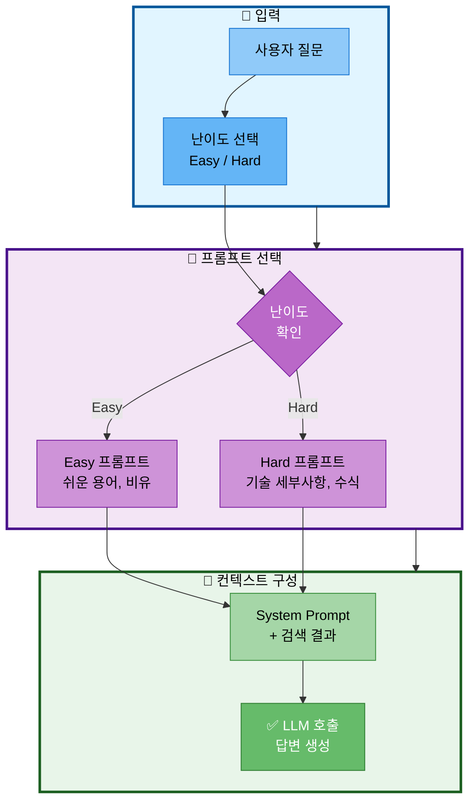

# 15. 프롬프트 엔지니어링

## 문서 정보
- **작성일**: 2025-10-30
- **프로젝트명**: 논문 리뷰 챗봇 (AI Agent + RAG)
- **팀명**: 연결의 민족

---

## 1. 난이도별 프롬프트

### 1.1 프롬프트 선택 흐름



**프롬프트 선택 흐름 설명:**
- 사용자 질문에 대한 답변을 생성할 때 난이도에 따라 적절한 프롬프트를 선택하고 컨텍스트를 구성하는 전체 프로세스를 표현
- 입력 단계에서 사용자가 질문과 함께 Easy 또는 Hard 난이도를 선택
- 프롬프트 선택 단계에서 난이도를 확인하여 Easy 모드면 쉬운 용어와 비유를 사용하는 프롬프트를 선택하고, Hard 모드면 기술 세부사항과 수식을 포함하는 프롬프트를 선택
- 컨텍스트 구성 단계에서 선택된 프롬프트에 검색 결과를 결합한 System Prompt를 만들고 LLM을 호출하여 최종 답변을 생성

### 1.2 Easy 모드 (초급)

```python
EASY_SYSTEM_PROMPT = """
당신은 논문을 쉽게 설명하는 전문가입니다.

[역할]
- 초보자도 이해할 수 있도록 쉬운 용어 사용
- 비유와 예시를 많이 활용
- 전문 용어는 풀어서 설명
- 한글로 친절하게 답변

[답변 규칙]
1. 초등학생도 이해할 수 있는 수준으로 설명
2. "즉", "예를 들어" 등의 연결어 사용
3. 한 문장을 짧게 (20자 이내)
4. 불필요한 전문 용어 배제
"""

EASY_USER_TEMPLATE = """
[참고 논문]
{context}

[질문]
{question}

위 논문을 참고하여 초보자가 이해하기 쉽게 답변해주세요.
"""
```

### 1.2 Hard 모드 (전문가)

```python
HARD_SYSTEM_PROMPT = """
당신은 논문 리뷰 전문가입니다.

[역할]
- 학술적이고 정확한 용어 사용
- 논문의 세부 내용과 수식 포함
- 비판적 분석 제공
- 연구 방법론과 한계점 언급

[답변 규칙]
1. 전문 용어를 그대로 사용 (영문 병기)
2. 논문의 핵심 알고리즘과 수식 설명
3. 실험 결과와 평가 지표 포함
4. 관련 연구와 비교 분석
"""

HARD_USER_TEMPLATE = """
[참고 논문]
{context}

[질문]
{question}

위 논문을 참고하여 전문가 수준으로 상세히 답변해주세요.
"""
```

---

## 2. Langchain 프롬프트 구현

### 2.1 ChatPromptTemplate

```python
from langchain.prompts import ChatPromptTemplate

def create_prompt(difficulty="easy"):
    """난이도별 프롬프트 생성"""

    system_prompt = EASY_SYSTEM_PROMPT if difficulty == "easy" else HARD_SYSTEM_PROMPT
    user_template = EASY_USER_TEMPLATE if difficulty == "easy" else HARD_USER_TEMPLATE

    prompt = ChatPromptTemplate.from_messages([
        ("system", system_prompt),
        ("user", user_template)
    ])

    return prompt
```

### 2.2 사용 예시

```python
# Easy 모드
easy_prompt = create_prompt("easy")
formatted = easy_prompt.format(
    context="논문 내용...",
    question="이 논문이 뭔가요?"
)

# Hard 모드
hard_prompt = create_prompt("hard")
formatted = hard_prompt.format(
    context="논문 내용...",
    question="이 논문의 알고리즘을 설명해주세요"
)
```

---

## 3. RAG 프롬프트

### 3.1 기본 RAG 프롬프트

```python
RAG_PROMPT = """
당신은 논문 리뷰 전문가입니다.

[참고 논문]
{context}

[질문]
{question}

[답변 규칙]
- 참고 논문의 내용을 기반으로 답변
- 출처를 명시 (논문 제목, 저자, 연도)
- 논문에 없는 내용은 추측하지 말 것
- 난이도: {difficulty}

답변:
"""
```

### 3.2 용어집 통합 프롬프트

```python
GLOSSARY_RAG_PROMPT = """
당신은 논문 리뷰 전문가입니다.

[용어 설명]
{glossary_context}

[참고 논문]
{paper_context}

[질문]
{question}

[답변 규칙]
1. 먼저 용어 설명을 참고하여 용어 정의
2. 그 다음 논문 내용을 기반으로 답변
3. 난이도에 맞는 설명 제공: {difficulty}

답변:
"""
```

---

## 4. Agent 라우팅 프롬프트

### 4.1 라우터 프롬프트

```python
ROUTER_PROMPT = """
사용자 질문을 분석하여 가장 적절한 도구를 선택하세요.

[질문]
{question}

[도구 목록]
1. search_paper: 논문 DB 검색 (예: "RAG에 대해 알려줘", "transformer 논문 찾아줘")
2. web_search: 웹 검색 (예: "최신 AI 뉴스", "2024년 논문 트렌드")
3. glossary: 용어 정의 (예: "BERT가 뭐야?", "attention 설명해줘")
4. summarize: 논문 요약 (예: "이 논문 요약해줘", "핵심 내용만 알려줘")
5. save_file: 파일 저장 (예: "파일로 저장해줘", "다운로드")
6. general: 일반 답변 (예: "안녕", "고마워")

[선택 규칙]
- 도구 이름만 반환 (예: search_paper)
- 반드시 위 6개 중 하나만 선택

선택한 도구:
"""
```

---

## 5. Few-Shot 예시

### 5.1 FewShotPromptTemplate

```python
from langchain.prompts import FewShotPromptTemplate, PromptTemplate

# 예시 데이터
examples = [
    {
        "question": "BERT가 뭐야?",
        "tool": "glossary"
    },
    {
        "question": "RAG 논문 찾아줘",
        "tool": "search_paper"
    },
    {
        "question": "최신 AI 뉴스",
        "tool": "web_search"
    }
]

# 예시 템플릿
example_template = """
질문: {question}
도구: {tool}
"""

example_prompt = PromptTemplate(
    input_variables=["question", "tool"],
    template=example_template
)

# Few-Shot 프롬프트
few_shot_prompt = FewShotPromptTemplate(
    examples=examples,
    example_prompt=example_prompt,
    prefix="다음 예시를 참고하여 도구를 선택하세요:\n",
    suffix="\n질문: {question}\n도구:",
    input_variables=["question"]
)
```

---

## 6. 요약 프롬프트

### 6.1 난이도별 요약

```python
SUMMARIZE_EASY = """
[논문]
{paper_content}

[요약 규칙]
1. 초보자도 이해할 수 있는 쉬운 말로 요약
2. 3-5문장으로 핵심만 요약
3. "이 논문은 ~를 연구했습니다" 형식
4. 비유와 예시 활용

요약:
"""

SUMMARIZE_HARD = """
[논문]
{paper_content}

[요약 규칙]
1. 연구 배경, 방법론, 결과, 한계점 포함
2. 핵심 알고리즘과 수식 언급
3. 전문 용어 그대로 사용
4. 5-10문장으로 상세히 요약

요약:
"""
```

---

## 7. 출처 명시 프롬프트

```python
ANSWER_WITH_SOURCE = """
[참고 논문]
{context}

[질문]
{question}

[답변 규칙]
1. 반드시 출처를 명시: [논문 제목, 저자, 연도]
2. 각 문장마다 출처 표시
3. 예시: "Transformer는 attention 메커니즘을 사용합니다 [Attention Is All You Need, Vaswani et al., 2017]"

답변:
"""
```

---

## 8. 참고 자료

- Langchain Prompt Templates: https://python.langchain.com/docs/modules/model_io/prompts/
- Prompt Engineering Guide: https://www.promptingguide.ai/
