# 16. UI 설계

## 문서 정보
- **작성일**: 2025-10-30
- **프로젝트명**: 논문 리뷰 챗봇 (AI Agent + RAG)
- **팀명**: 연결의 민족

---

## 1. Streamlit 기본 구조

### 1.1 페이지 설정

```python
import streamlit as st

st.set_page_config(
    page_title="논문 리뷰 챗봇",
    page_icon="📚",
    layout="wide"
)

st.title("📚 논문 리뷰 챗봇 (AI Agent + RAG)")
st.caption("🤖 LangGraph + RAG 기반 논문 검색 및 질문 답변")
```

---

## 2. UI 워크플로우

```mermaid
graph LR
    A[👤 사용자<br/>접속] --> B[🎚️ 난이도 선택<br/>Easy/Hard]
    B --> C[💬 질문 입력<br/>채팅창]
    C --> D{🤖 Agent<br/>처리}

    D --> E1[📄 논문 검색]
    D --> E2[🌐 웹 검색]
    D --> E3[📖 용어 설명]
    D --> E4[📝 요약]
    D --> E5[💾 파일 저장]

    E1 --> F[✅ 답변 표시<br/>출처 포함]
    E2 --> F
    E3 --> F
    E4 --> F
    E5 --> G[⬇️ 파일 다운로드]

    F --> C
    G --> C

    %% 노드 스타일
    style A fill:#81c784,stroke:#388e3c,stroke-width:2px,color:#000
    style B fill:#64b5f6,stroke:#1976d2,stroke-width:2px,color:#000
    style C fill:#64b5f6,stroke:#1976d2,stroke-width:2px,color:#000
    style D fill:#ba68c8,stroke:#7b1fa2,stroke-width:2px,color:#fff

    style E1 fill:#ce93d8,stroke:#7b1fa2,color:#000
    style E2 fill:#ce93d8,stroke:#7b1fa2,color:#000
    style E3 fill:#ce93d8,stroke:#7b1fa2,color:#000
    style E4 fill:#ce93d8,stroke:#7b1fa2,color:#000
    style E5 fill:#ce93d8,stroke:#7b1fa2,color:#000

    style F fill:#66bb6a,stroke:#2e7d32,stroke-width:2px,color:#fff
    style G fill:#66bb6a,stroke:#2e7d32,stroke-width:2px,color:#fff
```



---

## 3. 난이도 선택 UI

### 3.1 사이드바 구현

```python
with st.sidebar:
    st.header("⚙️ 설정")

    # 난이도 선택
    difficulty = st.radio(
        "🎚️ 난이도 선택",
        options=["easy", "hard"],
        format_func=lambda x: "초급 (쉬운 설명)" if x == "easy" else "전문가 (상세 설명)",
        index=0
    )

    st.divider()

    # 정보 표시
    st.info("""
    **초급 모드**: 쉬운 용어, 비유와 예시 활용
    **전문가 모드**: 전문 용어, 수식 및 상세 분석
    """)

    # 리셋 버튼
    if st.button("🔄 대화 초기화"):
        st.session_state.messages = []
        st.rerun()
```

---

## 4. 채팅 인터페이스

### 4.1 채팅 히스토리 초기화

```python
# 세션 상태 초기화
if "messages" not in st.session_state:
    st.session_state.messages = []
```

### 4.2 기존 메시지 표시

```python
# 채팅 히스토리 표시
for message in st.session_state.messages:
    with st.chat_message(message["role"]):
        st.markdown(message["content"])
```

### 4.3 사용자 입력 처리

```python
# 사용자 입력
if prompt := st.chat_input("논문에 대해 질문해보세요..."):
    # 사용자 메시지 추가
    st.session_state.messages.append({"role": "user", "content": prompt})

    with st.chat_message("user"):
        st.markdown(prompt)

    # Agent 실행
    with st.chat_message("assistant"):
        message_placeholder = st.empty()

        # 스트리밍 콜백
        st_callback = StreamlitCallbackHandler(st.container())

        # Agent 호출
        response = agent_executor.invoke(
            {"question": prompt, "difficulty": difficulty},
            config={"callbacks": [st_callback]}
        )

        answer = response["final_answer"]
        message_placeholder.markdown(answer)

    # 어시스턴트 메시지 추가
    st.session_state.messages.append({"role": "assistant", "content": answer})
```

---

## 5. StreamlitCallbackHandler 통합

### 5.1 Agent 실행 시각화

```python
from langchain.callbacks import StreamlitCallbackHandler

# Callback Handler 생성
st_callback = StreamlitCallbackHandler(
    parent_container=st.container(),
    expand_new_thoughts=True,
    collapse_completed_thoughts=True
)

# Agent 실행
response = agent_executor.invoke(
    {"question": question, "difficulty": difficulty},
    config={"callbacks": [st_callback]}
)
```

### 5.2 실행 과정 표시

StreamlitCallbackHandler는 다음을 자동으로 표시합니다:
- 🔧 선택된 도구
- 🔍 검색 과정
- 💭 Agent의 사고 과정
- ✅ 완료된 단계

---

## 6. 파일 다운로드 기능

### 6.1 다운로드 버튼

```python
def create_download_button(content, filename):
    """파일 다운로드 버튼 생성"""
    st.download_button(
        label="⬇️ 파일 다운로드",
        data=content,
        file_name=filename,
        mime="text/plain"
    )
```

### 6.2 사용 예시

```python
# 답변에 "파일 저장" 요청이 있는 경우
if "save" in response["tool_choice"]:
    content = response["final_answer"]
    filename = f"paper_summary_{datetime.now().strftime('%Y%m%d_%H%M%S')}.txt"

    with st.chat_message("assistant"):
        st.success("✅ 파일이 준비되었습니다!")
        create_download_button(content, filename)
```

---

## 7. 로딩 상태 표시

### 7.1 Spinner 사용

```python
with st.spinner("🤖 답변 생성 중..."):
    response = agent_executor.invoke({
        "question": prompt,
        "difficulty": difficulty
    })
```

### 7.2 Progress Bar

```python
progress_bar = st.progress(0)
status_text = st.empty()

# Agent 실행 중 진행률 업데이트
for i in range(100):
    progress_bar.progress(i + 1)
    status_text.text(f"처리 중... {i+1}%")
    time.sleep(0.01)

progress_bar.empty()
status_text.empty()
```

---

## 8. 에러 처리 UI

### 8.1 에러 메시지 표시

```python
try:
    response = agent_executor.invoke({
        "question": prompt,
        "difficulty": difficulty
    })
except Exception as e:
    st.error(f"❌ 오류 발생: {str(e)}")
    logger.write(f"UI 에러: {e}")
```

### 8.2 경고 메시지

```python
# API 키 미설정 경고
if not os.getenv("OPENAI_API_KEY"):
    st.warning("⚠️ OPENAI_API_KEY가 설정되지 않았습니다. .env 파일을 확인해주세요.")
    st.stop()
```

---

## 9. 출처 표시

### 9.1 Expander로 출처 표시

```python
with st.expander("📚 참고 논문"):
    for doc in response.get("source_documents", []):
        st.markdown(f"""
        **제목**: {doc.metadata.get('title', 'N/A')}
        **저자**: {doc.metadata.get('authors', 'N/A')}
        **연도**: {doc.metadata.get('year', 'N/A')}
        **URL**: {doc.metadata.get('url', 'N/A')}
        """)
        st.divider()
```

---

## 10. 전체 UI 코드 구조

```python
import streamlit as st
from datetime import datetime
from src.agent.graph import create_agent
from langchain.callbacks import StreamlitCallbackHandler

# 페이지 설정
st.set_page_config(page_title="논문 리뷰 챗봇", page_icon="📚", layout="wide")
st.title("📚 논문 리뷰 챗봇 (AI Agent + RAG)")

# 사이드바
with st.sidebar:
    st.header("⚙️ 설정")
    difficulty = st.radio(
        "🎚️ 난이도 선택",
        options=["easy", "hard"],
        format_func=lambda x: "초급" if x == "easy" else "전문가",
        index=0
    )
    if st.button("🔄 대화 초기화"):
        st.session_state.messages = []
        st.rerun()

# 세션 상태 초기화
if "messages" not in st.session_state:
    st.session_state.messages = []

# Agent 초기화
agent_executor = create_agent()

# 채팅 히스토리 표시
for message in st.session_state.messages:
    with st.chat_message(message["role"]):
        st.markdown(message["content"])

# 사용자 입력
if prompt := st.chat_input("논문에 대해 질문해보세요..."):
    # 사용자 메시지
    st.session_state.messages.append({"role": "user", "content": prompt})
    with st.chat_message("user"):
        st.markdown(prompt)

    # Agent 실행
    with st.chat_message("assistant"):
        st_callback = StreamlitCallbackHandler(st.container())

        try:
            with st.spinner("🤖 답변 생성 중..."):
                response = agent_executor.invoke(
                    {"question": prompt, "difficulty": difficulty},
                    config={"callbacks": [st_callback]}
                )

            answer = response["final_answer"]
            st.markdown(answer)

            # 출처 표시
            if "source_documents" in response:
                with st.expander("📚 참고 논문"):
                    for doc in response["source_documents"]:
                        st.markdown(f"**{doc.metadata.get('title', 'N/A')}**")
                        st.caption(f"{doc.metadata.get('authors', 'N/A')} ({doc.metadata.get('year', 'N/A')})")
                        st.divider()

            # 어시스턴트 메시지 추가
            st.session_state.messages.append({"role": "assistant", "content": answer})

        except Exception as e:
            st.error(f"❌ 오류 발생: {str(e)}")
```

---

## 11. 참고 자료

- Streamlit Chat Elements: https://docs.streamlit.io/develop/api-reference/chat
- Langchain Streamlit: https://python.langchain.com/docs/integrations/callbacks/streamlit/
