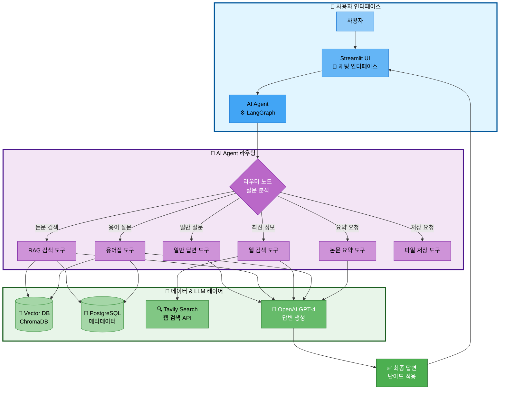
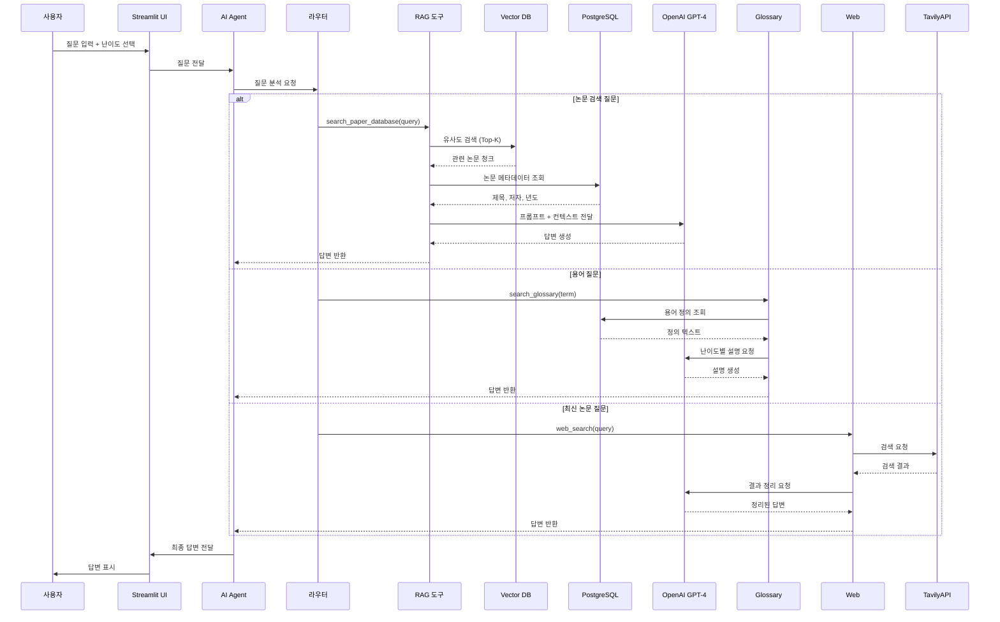
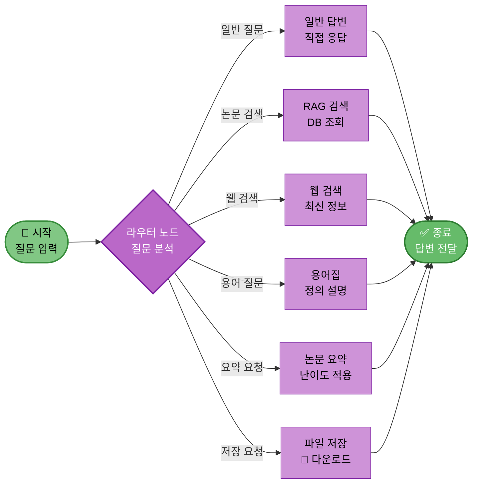
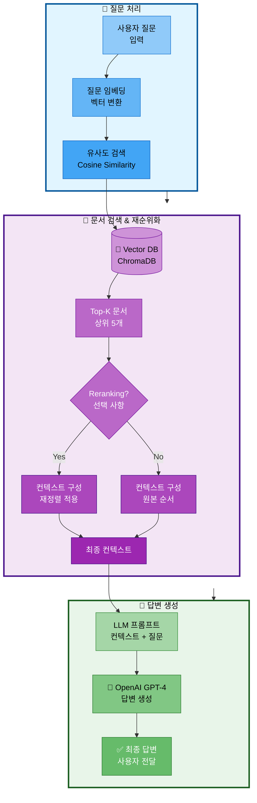
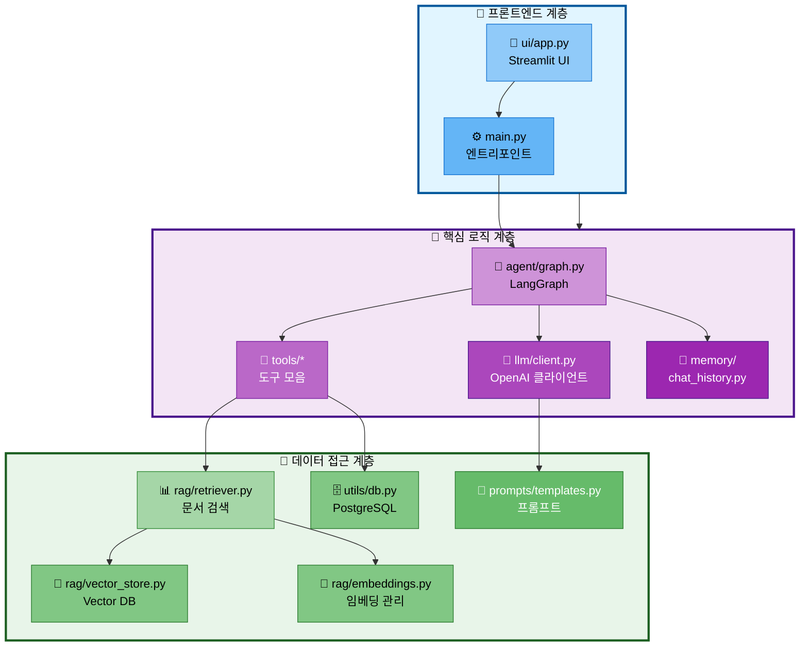
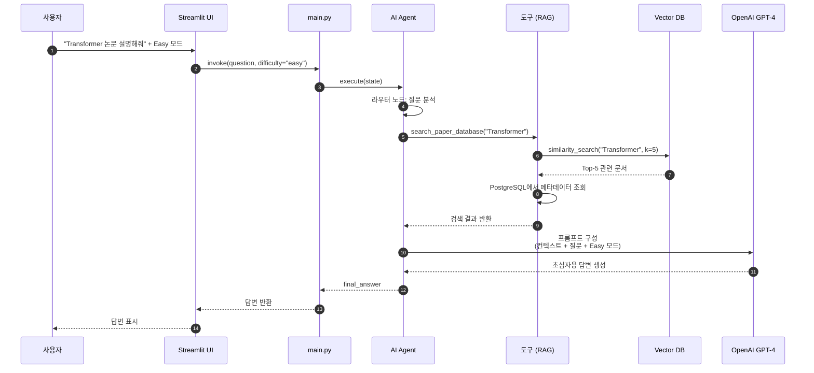
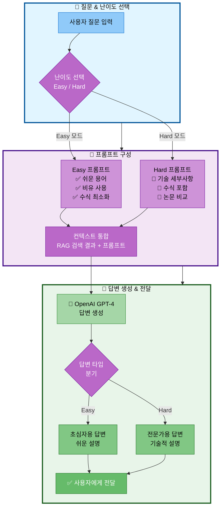

# 자료조사: 시스템 아키텍처

## 문서 정보
- **작성일**: 2025-10-29
- **프로젝트**: 논문 리뷰 챗봇 (AI Agent + RAG)
- **팀명**: 연결의 민족

---

## 1. 시스템 개요

논문 리뷰 챗봇은 **AI Agent**와 **RAG (Retrieval-Augmented Generation)**를 결합하여, 사용자의 질문에 대해 지능적으로 도구를 선택하고 난이도별(Easy/Hard) 맞춤 답변을 제공하는 시스템입니다.

### 1.1 핵심 기능

1. **지능형 라우팅**: 질문 유형에 따라 일반 답변, RAG 검색, 웹 검색 자동 선택
2. **논문 검색 및 요약**: 로컬 DB에서 논문 검색 및 난이도별 요약 제공
3. **용어집 관리**: 전문 용어 자동 설명
4. **웹 검색**: 최신 논문 정보 검색
5. **파일 저장**: 대화 내용 및 요약 저장
6. **난이도별 답변**: Easy 모드(초심자), Hard 모드(전문가)

---

## 2. 전체 시스템 아키텍처

### 2.1 High-Level Architecture



---

### 2.2 상세 데이터 흐름



---

## 3. 컴포넌트별 상세 설계

### 3.1 UI Layer (Streamlit)

**역할:**
- 사용자 인터페이스 제공
- 난이도 선택 (Easy/Hard)
- 채팅 히스토리 관리
- 파일 다운로드 기능

**주요 기능:**
```python
# ui/app.py

import streamlit as st

# 난이도 선택
difficulty = st.selectbox(
    "답변 난이도",
    ["Easy 모드 (초심자용)", "Hard 모드 (전문가용)"]
)

# 채팅 인터페이스
if "messages" not in st.session_state:
    st.session_state.messages = []

# 메시지 표시
for msg in st.session_state.messages:
    with st.chat_message(msg["role"]):
        st.markdown(msg["content"])

# 사용자 입력
if prompt := st.chat_input("논문에 대해 질문해주세요"):
    # Agent 호출
    response = agent_executor.invoke({
        "question": prompt,
        "difficulty": "easy" if "Easy" in difficulty else "hard"
    })
```

---

### 3.2 AI Agent Layer (LangGraph)

**역할:**
- 사용자 질문 분석
- 적절한 도구 선택 및 실행
- 도구 결과를 LLM에 전달하여 최종 답변 생성

**그래프 구조:**



**구현 코드:**
```python
# src/agent/graph.py

from langgraph.graph import StateGraph, END
from typing import TypedDict

class AgentState(TypedDict):
    question: str
    difficulty: str
    tool_choice: str
    tool_result: str
    final_answer: str

def router_node(state: AgentState):
    """
    질문을 분석하여 어떤 도구를 사용할지 결정
    """
    question = state["question"]

    # LLM에게 라우팅 결정 요청
    routing_prompt = f"""
    사용자 질문: {question}

    다음 중 가장 적절한 도구를 선택하세요:
    - search_paper: 논문 데이터베이스에서 검색
    - web_search: 최신 정보 웹 검색
    - glossary: 용어 정의 검색
    - summarize: 논문 요약
    - save_file: 파일 저장
    - general: 일반 답변

    도구:
    """

    tool_choice = llm.invoke(routing_prompt).strip()
    state["tool_choice"] = tool_choice

    return state

def conditional_edge(state: AgentState):
    """라우팅 결정에 따라 다음 노드 선택"""
    return state["tool_choice"]

# 그래프 구성
workflow = StateGraph(AgentState)

workflow.add_node("router", router_node)
workflow.add_node("search_paper", search_paper_node)
workflow.add_node("web_search", web_search_node)
workflow.add_node("glossary", glossary_node)
workflow.add_node("summarize", summarize_node)
workflow.add_node("save_file", save_file_node)
workflow.add_node("general", general_node)

workflow.set_entry_point("router")

workflow.add_conditional_edges(
    "router",
    conditional_edge,
    {
        "search_paper": "search_paper",
        "web_search": "web_search",
        "glossary": "glossary",
        "summarize": "summarize",
        "save_file": "save_file",
        "general": "general"
    }
)

# 모든 노드에서 종료
for node in ["search_paper", "web_search", "glossary", "summarize", "save_file", "general"]:
    workflow.add_edge(node, END)

agent_executor = workflow.compile()
```

---

### 3.3 Tools Layer

**역할:**
- 각 도구별 구체적인 기능 구현
- 외부 API 및 DB 연동

#### 도구 1: RAG 검색 도구

```python
# src/tools/rag_search.py

from langchain.tools import tool

@tool
def search_paper_database(query: str) -> str:
    """논문 데이터베이스에서 관련 논문을 검색합니다."""
    # 1. Vector DB에서 유사도 검색
    docs = vectorstore.similarity_search(query, k=5)

    # 2. PostgreSQL에서 메타데이터 조회
    results = []
    for doc in docs:
        paper_id = doc.metadata['paper_id']
        meta = get_paper_metadata(paper_id)  # PostgreSQL 조회
        results.append({
            'title': meta['title'],
            'authors': meta['authors'],
            'year': meta['year'],
            'content': doc.page_content
        })

    return format_search_results(results)
```

#### 도구 2: 웹 검색 도구

```python
# src/tools/web_search.py

from langchain.tools import TavilySearchResults

web_search_tool = TavilySearchResults(
    max_results=5,
    search_depth="advanced",
    include_answer=True
)
```

#### 도구 3: 용어집 도구

```python
# src/tools/glossary.py

@tool
def search_glossary(term: str, difficulty: str = "easy") -> str:
    """논문 용어집에서 용어를 검색합니다."""
    # PostgreSQL 용어집 테이블 조회
    result = db.execute(
        "SELECT term, easy_explanation, hard_explanation FROM glossary WHERE term ILIKE %s",
        (f"%{term}%",)
    ).fetchone()

    if result:
        explanation = result['easy_explanation'] if difficulty == "easy" else result['hard_explanation']
        return f"**{result['term']}**: {explanation}"
    else:
        # 용어집에 없으면 RAG 검색
        return search_paper_database(f"{term} 정의")
```

---

### 3.4 RAG Layer

**역할:**
- 문서 임베딩 및 검색
- 검색 결과 재순위화 (Reranking)
- 컨텍스트 구성

**컴포넌트:**



**구현:**
```python
# src/rag/retriever.py

from langchain.vectorstores import Chroma
from langchain.retrievers import ContextualCompressionRetriever

class PaperRetriever:
    def __init__(self, vectorstore, embeddings):
        self.vectorstore = vectorstore
        self.embeddings = embeddings

    def retrieve(self, query: str, k: int = 5):
        """유사도 기반 검색"""
        docs = self.vectorstore.similarity_search(query, k=k)
        return docs

    def retrieve_with_rerank(self, query: str, k: int = 5):
        """Reranking을 포함한 검색"""
        # 먼저 k*2 개 후보 조회
        docs = self.vectorstore.similarity_search(query, k=k*2)

        # Reranking (Cohere 또는 자체 구현)
        reranked_docs = self.rerank(query, docs)

        return reranked_docs[:k]
```

---

### 3.5 Database Layer

**역할:**
- 데이터 영구 저장
- 메타데이터 관리
- 임베딩 벡터 저장

#### PostgreSQL 스키마

```sql
-- 논문 메타데이터 테이블
CREATE TABLE papers (
    paper_id SERIAL PRIMARY KEY,
    title VARCHAR(500) NOT NULL,
    authors TEXT,
    publish_date DATE,
    source VARCHAR(100),
    url TEXT UNIQUE,
    category VARCHAR(100),
    citation_count INT DEFAULT 0,
    abstract TEXT,
    created_at TIMESTAMP DEFAULT CURRENT_TIMESTAMP
);

-- 용어집 테이블
CREATE TABLE glossary (
    term_id SERIAL PRIMARY KEY,
    term VARCHAR(200) NOT NULL UNIQUE,
    definition TEXT NOT NULL,
    easy_explanation TEXT,
    hard_explanation TEXT,
    category VARCHAR(100),
    difficulty_level VARCHAR(20),
    created_at TIMESTAMP DEFAULT CURRENT_TIMESTAMP
);

-- 사용자 질의 로그 테이블
CREATE TABLE query_logs (
    log_id SERIAL PRIMARY KEY,
    user_query TEXT NOT NULL,
    difficulty_mode VARCHAR(20),
    tool_used VARCHAR(50),
    response_time_ms INT,
    created_at TIMESTAMP DEFAULT CURRENT_TIMESTAMP
);

-- 인덱스 생성
CREATE INDEX idx_papers_title ON papers USING GIN (to_tsvector('english', title));
CREATE INDEX idx_papers_category ON papers(category);
CREATE INDEX idx_glossary_term ON glossary(term);
```

#### Vector DB 컬렉션

```python
# data/vectordb/ 구조

vectordb/
├── paper_chunks/        # 논문 본문 청크
├── paper_abstracts/     # 논문 초록
└── glossary/            # 용어집 임베딩
```

---

### 3.6 LLM Layer

**역할:**
- 자연어 이해 및 생성
- 도구 호출 결정 (Function Calling)
- 난이도별 답변 생성

**모델 선택:**
- **GPT-4**: 복잡한 추론, 높은 정확도 필요 시
- **GPT-3.5-turbo**: 비용 효율적, 빠른 응답

**프롬프트 예시:**

```python
# src/prompts/templates.py

EASY_MODE_PROMPT = """
당신은 AI 초심자를 위한 논문 리뷰 어시스턴트입니다.

답변 규칙:
1. 전문 용어는 쉬운 말로 풀어서 설명
2. 실생활 비유 사용
3. 수식은 최소화
4. 핵심 아이디어 3가지 이내로 요약

컨텍스트: {context}
질문: {question}

답변:
"""

HARD_MODE_PROMPT = """
당신은 AI 전문가를 위한 논문 리뷰 어시스턴트입니다.

답변 규칙:
1. 기술적 세부사항 포함
2. 수식 및 알고리즘 설명
3. 관련 논문 비교
4. 구현 세부사항

컨텍스트: {context}
질문: {question}

답변:
"""
```

---

## 4. 모듈 구조

### 4.1 디렉토리 구조

```
langchain-project/
├── main.py                    # 애플리케이션 엔트리 포인트
├── ui/
│   └── app.py                 # Streamlit UI
├── src/
│   ├── agent/
│   │   ├── graph.py           # LangGraph 그래프 정의
│   │   ├── nodes.py           # 노드 함수들
│   │   └── state.py           # State 정의
│   ├── tools/
│   │   ├── rag_search.py      # RAG 검색 도구
│   │   ├── web_search.py      # 웹 검색 도구
│   │   ├── glossary.py        # 용어집 도구
│   │   ├── summarize.py       # 요약 도구
│   │   └── file_save.py       # 파일 저장 도구
│   ├── rag/
│   │   ├── retriever.py       # 문서 검색
│   │   ├── embeddings.py      # 임베딩 관리
│   │   └── vector_store.py    # Vector DB 인터페이스
│   ├── llm/
│   │   ├── client.py          # OpenAI 클라이언트
│   │   └── config.py          # LLM 설정
│   ├── prompts/
│   │   └── templates.py       # 프롬프트 템플릿
│   ├── memory/
│   │   └── chat_history.py    # 대화 히스토리 관리
│   └── utils/
│       ├── logger.py          # 로깅
│       └── db.py              # DB 유틸리티
├── data/
│   ├── raw/                   # 원본 데이터
│   ├── processed/             # 전처리된 데이터
│   ├── vectordb/              # Vector DB
│   └── rdbms/                 # PostgreSQL 백업
├── configs/
│   ├── db_config.yaml         # DB 설정
│   └── model_config.yaml      # 모델 설정
├── scripts/
│   ├── collect_papers.py      # 논문 수집 스크립트
│   ├── preprocess.py          # 전처리 스크립트
│   └── load_to_db.py          # DB 로드 스크립트
├── tests/
│   ├── test_agent.py
│   ├── test_rag.py
│   └── test_tools.py
└── requirements.txt
```

---

### 4.2 모듈 간 의존성



---

## 5. 실행 흐름 (Sequence Diagram)

### 5.1 일반적인 질문 처리 흐름



---

## 6. 난이도별 답변 처리

### 6.1 난이도 모드 흐름



---

## 7. 배포 아키텍처 (선택 사항)

### 7.1 로컬 개발 환경

```
[사용자 브라우저] <--> [Streamlit (localhost:8501)]
                              ↓
                     [main.py + Agent]
                              ↓
        ┌─────────────────────┼─────────────────────┐
        ↓                     ↓                     ↓
[Vector DB (로컬)]    [PostgreSQL (로컬)]   [OpenAI API (클라우드)]
```

### 7.2 클라우드 배포 (발표용)

```
[사용자] --> [Streamlit Cloud]
                   ↓
         [Agent + Tools (Container)]
                   ↓
    ┌──────────────┼──────────────┐
    ↓              ↓              ↓
[ChromaDB]  [PostgreSQL]  [OpenAI API]
(Docker)     (Docker)      (클라우드)
```

---

## 8. 성능 및 확장성 고려사항

### 8.1 캐싱 전략

```python
# LLM 응답 캐싱
from functools import lru_cache

@lru_cache(maxsize=100)
def cached_llm_call(prompt_hash):
    return llm.invoke(prompt)

# Vector DB 검색 결과 캐싱
@lru_cache(maxsize=50)
def cached_similarity_search(query_hash, k):
    return vectorstore.similarity_search(query, k=k)
```

### 8.2 비동기 처리

```python
import asyncio

async def async_agent_invoke(question, difficulty):
    """비동기 Agent 실행"""
    result = await agent_executor.ainvoke({
        "question": question,
        "difficulty": difficulty
    })
    return result
```

---

## 9. 참고 자료

- LangGraph 공식 문서: https://langchain-ai.github.io/langgraph/
- Langchain Agent 가이드: https://python.langchain.com/docs/tutorials/agents/
- Streamlit 공식 문서: https://docs.streamlit.io/
- ChromaDB 문서: https://docs.trychroma.com/
- PostgreSQL 문서: https://www.postgresql.org/docs/
