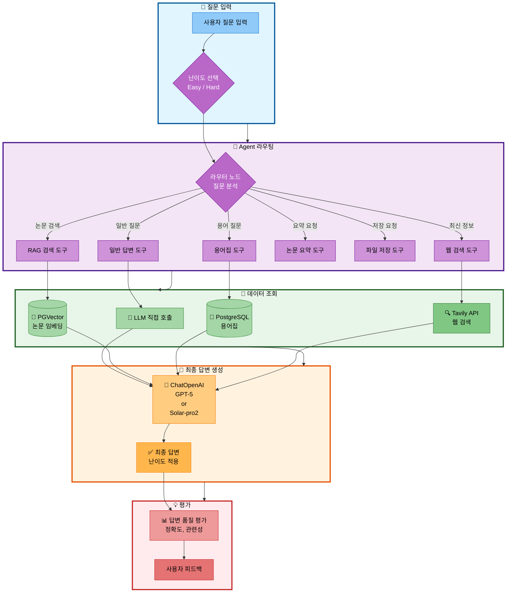
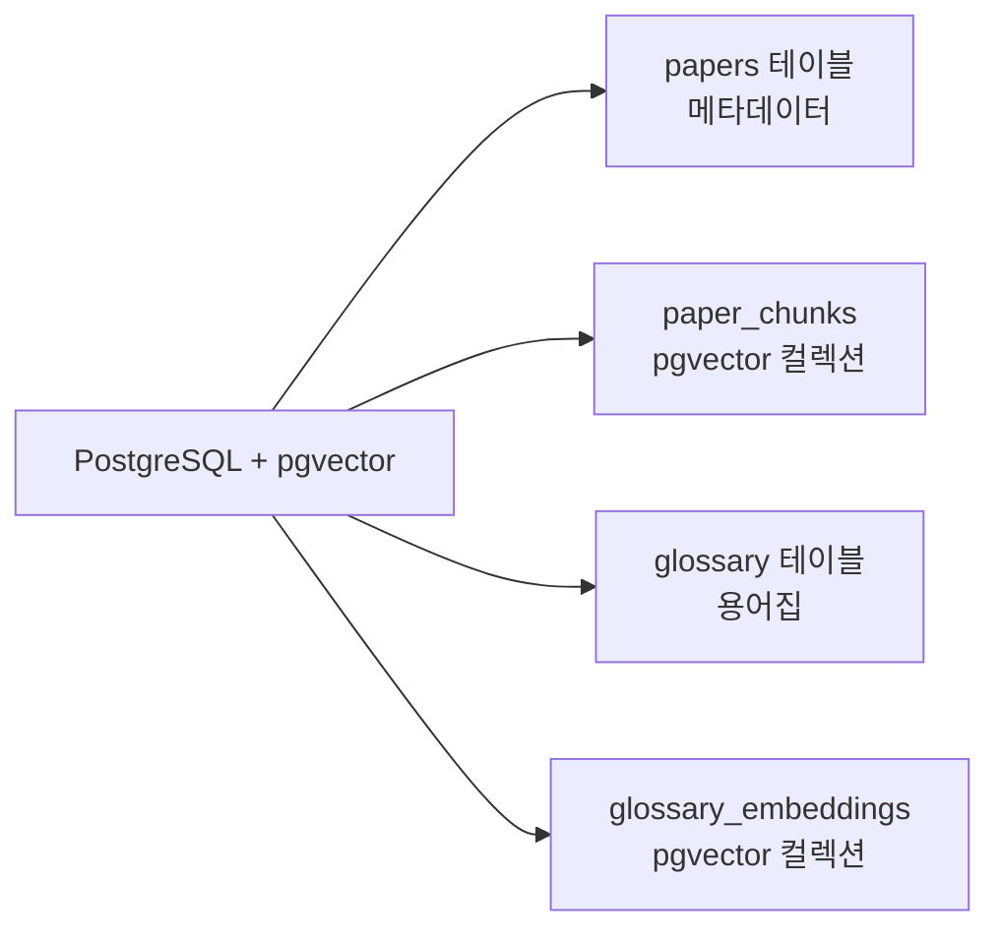
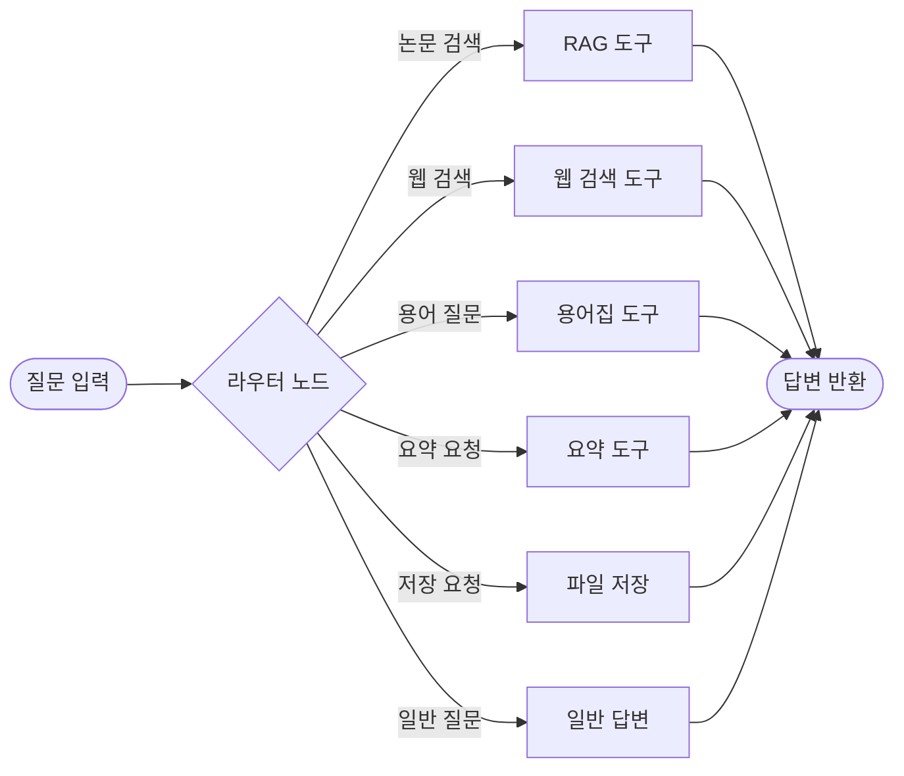

# 멘토링 질의응답 (2025.10.30)

## 프로젝트 개요

### 프로젝트명
**논문 리뷰 챗봇 (AI Agent + RAG)**

### 팀 정보
- **팀명**: 연결의 민족
- **팀 구성**: 4명 (10/31 이후 3명)
- **프로젝트 기간**: 2025.10.28 ~ 11.06 (10일)
- **발표일**: 11월 6일 (목) 13:00

### 프로젝트 소개

본 프로젝트는 AI/ML 논문을 누구나 쉽게 이해하고 활용할 수 있도록 돕는 지능형 논문 리뷰 챗봇입니다. 전문 용어와 수식이 많아 초심자가 논문을 이해하기 어렵고, 초심자와 전문가 간 정보 격차가 크며, LLM의 지식 컷오프로 최신 논문 정보가 부족한 문제를 해결합니다.

LangGraph 기반 AI Agent가 사용자 질문을 분석하여 6가지 도구(일반 답변, RAG 검색, 웹 검색, 용어집, 논문 요약, 파일 저장) 중 적절한 도구를 자동으로 선택합니다. 사용자는 Easy/Hard 모드를 선택하여 난이도에 맞는 답변을 받을 수 있으며, Easy 모드는 쉬운 용어와 비유를 사용하고, Hard 모드는 기술 세부사항과 수식을 포함합니다. PostgreSQL + pgvector 통합 DB를 사용하여 논문 메타데이터와 벡터 검색을 하나의 DB에서 처리하며, 용어집 DB와 논문 DB를 하이브리드 검색하여 전문 용어를 자동으로 설명합니다. Tavily Search API를 통해 최신 논문 정보를 실시간으로 검색할 수 있습니다.

### 기술 스택

#### Core Technologies

| 구분 | 기술 | 비고 |
|------|------|------|
| **LLM** | OpenAI GPT-5 / GPT-4 / GPT-3.5-turbo Upstage Solar-pro2 | Easy: Solar-pro2 (한국어 특화) Hard: GPT-5 (기술 정확도) |
| **Framework** | Langchain + LangGraph | AI Agent 및 RAG 통합 |
| **Database** | PostgreSQL + pgvector | 관계형 + 벡터 검색 통합 |
| **Embeddings** | OpenAI text-embedding-3-small | 비용 효율적 |
| **UI** | Streamlit | 빠른 개발, 채팅 UI |
| **Web Search** | Tavily Search API | 최신 논문 검색 |
| **Document** | PyPDFLoader, RecursiveCharacterTextSplitter | 논문 처리 |

#### 개발 환경
- Python 3.11.9
- Git + GitHub (Feature Branch 전략)

### 시스템 아키텍처

### 데이터 범위
- **논문**: arXiv 기반 AI/ML 논문 50-100편
- **카테고리**: Transformer, BERT, GPT, Attention Mechanism 등
- **용어집**: 50-100개 항목

---

## Q&A

### Q1. 이중 LLM 전략의 효과성과 운영 복잡도

현재 프로젝트에서 난이도별로 다른 LLM을 사용하는 전략을 계획하고 있습니다:

**계획한 전략:**
- **Easy 모드**: Solar-pro2 (한국어 특화, 비용 효율적)
- **Hard 모드**: GPT-5 (기술적 정확도, 전문성)

**궁금한 점:**
1. 난이도별로 다른 LLM을 사용하는 것이 실제로 효과적인가요?
2. 단일 LLM (예: GPT-5)에 프롬프트만 달리 주는 것과 비교했을 때, 이중 LLM 전략의 실질적인 이점이 있나요?
3. 모델 전환 로직으로 인한 운영 복잡도 증가 대비 성능 향상 효과가 충분한가요?
4. 비용 절감 측면에서 실제로 의미 있는 차이가 발생하나요? (Easy 모드에 Solar-pro2 사용 시)

**배경:**
- 프로젝트 기간이 10일로 짧고, 복잡도를 최소화해야 하는 상황
- Easy 모드는 한국어 답변이 주를 이루고, Hard 모드는 전문 용어와 수식 포함

**A1.**

---

### Q2. PostgreSQL + pgvector 단일 통합 전략의 적합성

별도의 Vector DB (Pinecone, Weaviate 등) 대신 PostgreSQL + pgvector로 통합하여 관계형 데이터와 벡터 검색을 한 DB에서 처리하려고 합니다.

**계획한 아키텍처:**

**아키텍처 구성요소 설명:**

1. **papers 테이블** (관계형 데이터)
   - 논문의 메타데이터를 저장 (paper_id, title, authors, publish_date, source, url, category, abstract 등)
   - 벡터 검색 결과의 paper_id로 조회하여 논문 정보를 제공
   - Full-text 검색 인덱스 지원 (제목 검색)

2. **paper_chunks** (pgvector 컬렉션)
   - 논문 본문을 RecursiveCharacterTextSplitter로 1000자 단위 청크 분할
   - OpenAI text-embedding-3-small (1536차원) 임베딩 벡터 저장
   - 코사인 유사도 기반 벡터 검색으로 관련 논문 청크 추출
   - 각 청크는 paper_id와 연결되어 메타데이터 조회 가능

3. **glossary 테이블** (관계형 데이터)
   - AI/ML 전문 용어 50-100개 저장 (term, definition)
   - 난이도별 설명: easy_explanation (초심자용), hard_explanation (전문가용)
   - 카테고리 분류 (ML, NLP, CV, RL 등) 및 난이도 레벨
   - 관련 용어 배열 (related_terms) 및 사용 예시

4. **glossary_embeddings** (pgvector 컬렉션)
   - 용어 정의의 임베딩 벡터 저장
   - 유사 용어 검색 및 자동 용어 인식에 사용
   - 사용자 질문에 포함된 전문 용어 자동 감지

**궁금한 점:**
1. 논문 50-100편 규모에서 PostgreSQL + pgvector의 성능이 충분한가요?
2. 벡터 검색과 관계형 조회를 동시에 수행할 때 성능 병목이 발생할 가능성은 없나요?
3. 별도의 Vector DB를 사용하는 것과 비교했을 때 단점이 있나요?
4. pgvector의 유사도 검색 성능을 최적화하기 위한 인덱스 설정이나 튜닝 팁이 있나요?

**배경:**
- 운영 및 유지보수 간소화를 위해 단일 DB 솔루션 선호
- Langchain의 PGVector 통합 사용 예정
- 데이터 규모: 논문 50-100편, 청크 약 500-1000개

**A2.**

---

### Q3. AI Agent 도구 구조와 라우팅 정확도 개선 방법

LangGraph StateGraph를 사용하여 6개 도구를 라우팅하는 AI Agent를 구현하려고 합니다.

**계획한 Agent 구조:**

**궁금한 점:**
1. 6개 도구가 적절한 개수인가요? (너무 많거나 적지 않은지)
2. 라우터가 질문을 분석하여 도구를 선택할 때, 정확도를 높이는 효과적인 방법이 있나요?
3. Few-shot 예시를 라우팅 프롬프트에 포함하는 것이 실제로 도움이 되나요?
4. 도구 선택이 잘못되었을 때 재라우팅하거나 fallback 처리를 구현해야 하나요?

**배경:**
- LangGraph는 처음 사용해보는 기술
- 라우팅 정확도가 전체 시스템 품질에 큰 영향을 미칠 것으로 예상
- 10개 테스트 시나리오에서 모두 정확한 도구 선택이 필요

**A3.**

---

### Q4. 프롬프트만으로 난이도 구분의 한계와 개선 방안

Easy/Hard 모드의 답변 차이를 프롬프트 엔지니어링만으로 구현하려고 합니다.

**계획한 프롬프트 전략:**

**Easy 프롬프트:**
- 초등학생도 이해할 수 있는 수준
- 비유와 실생활 예시 활용
- 전문 용어는 풀어서 설명
- 한 문장을 짧게 (20자 이내)

**Hard 프롬프트:**
- 학술적이고 정확한 용어 사용
- 논문의 세부 내용과 수식 포함
- 비판적 분석 제공
- 연구 방법론과 한계점 언급

**궁금한 점:**
1. 프롬프트만으로 난이도 차이를 명확하게 구분할 수 있나요?
2. LLM이 프롬프트 지시를 일관되게 따르지 않을 때 대처 방법이 있나요?
3. 난이도 차이를 더 명확하게 보여주기 위한 추가적인 접근 방법이 있나요? (예: Temperature 조절, Few-shot 예시 등)
4. 발표 시연에서 Easy/Hard 차이를 효과적으로 보여주기 위한 좋은 예시 질문이 있나요?

**배경:**
- 프롬프트 엔지니어링이 프로젝트의 핵심 차별화 요소
- 발표 시 난이도 차이가 명확하지 않으면 감점 가능성
- Easy 모드는 초심자, Hard 모드는 전문가를 대상으로 설계

**A4.**

---

### Q5. RAG 검색 최적화 전략과 실무 튜닝 방법

RAG 시스템의 검색 성능을 최적화하기 위해 여러 전략을 검토하고 있습니다.

**계획한 검색 전략:**

1. **검색 방식:**
   - Similarity Search vs MMR (Maximal Marginal Relevance)
   - MultiQueryRetriever로 쿼리 확장

2. **청크 분할:**
   - chunk_size: 1000자
   - chunk_overlap: 200자
   - separator: `["\n\n", "\n", ". ", " "]`

3. **하이브리드 검색:**
   - 용어집 Vector DB + 논문 Vector DB 동시 검색
   - 검색 결과 결합하여 컨텍스트 구성

**궁금한 점:**
1. MMR과 기본 유사도 검색 중 어떤 것이 논문 검색에 더 효과적인가요?
2. MultiQueryRetriever가 실제로 검색 정확도를 향상시키나요? (추가 API 호출 비용 대비)
3. 청크 사이즈 1000자, overlap 200자가 적절한가요? 조정이 필요하다면 기준은 무엇인가요?
4. 용어집과 논문 본문을 하이브리드 검색할 때, 결과를 결합하는 효과적인 방법이 있나요? (가중치, 순서 등)
5. RAG 검색 품질을 평가하고 개선하는 실무적인 접근 방법이 있나요?

**배경:**
- RAG 시스템 구축 경험이 부족
- 검색 품질이 답변 품질에 직접적인 영향
- 시간이 제한적이라 효과적인 전략에 집중하고 싶음

**A5.**

---

## 멘토링 결과

**인사이트:**
-
