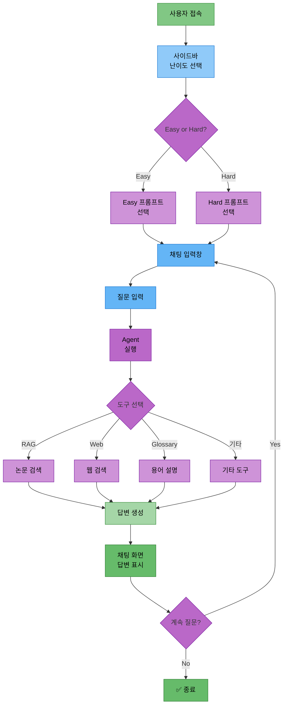
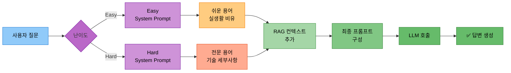

# 담당역할: 임예슬 - Streamlit UI & 프롬프트 & 웹검색/파일저장 도구

## 담당자 정보
- **이름**: 임예슬
- **역할**: UI 및 프롬프트 담당
- **참여 기간**: 전체 기간
- **핵심 역할**: Streamlit UI 개발, 프롬프트 템플릿, 웹 검색 도구, 파일 저장 도구

---

## 담당 모듈 및 도구

### 1. Streamlit UI (`ui/app.py`)
- 채팅 인터페이스 구현
- LangGraph Agent 스트리밍 연동 (astream_events)
- StreamlitCallbackHandler 구현
- 난이도 선택 UI (Easy/Hard)
- 대화 히스토리 표시 (ChatMessageHistory 연동)
- 파일 다운로드 기능

### 2. 프롬프트 템플릿 (`src/prompts/`)
- Langchain PromptTemplate 구현
- ChatPromptTemplate으로 Easy/Hard 모드 프롬프트 구성
- FewShotPromptTemplate (예시 기반 프롬프트, 선택)
- 도구별 프롬프트 (SystemMessage, HumanMessage)

### 3. 도구 2: 웹 검색 도구 (`src/tools/web_search.py`)
- Langchain TavilySearchResults 도구 연동
- @tool 데코레이터로 커스텀 웹 검색 래퍼 구현
- 검색 결과 포맷팅

### 4. 도구 5: 파일 저장 도구 (`src/tools/file_save.py`)
- Langchain @tool 데코레이터로 save_to_file 구현
- 대화 내용 저장
- 요약 내용 저장
- Streamlit 다운로드 버튼 연동

---

## UI 아키텍처 다이어그램

### 1. Streamlit UI 워크플로우



### 2. 프롬프트 선택 흐름



---

## Streamlit UI 구현

### 1. 기본 채팅 인터페이스

**파일 경로**: `ui/app.py`

**구현 방법**:
1. Streamlit 페이지 설정
   - page_title, page_icon, layout 설정
2. 제목 및 설명 표시
3. 사이드바에 난이도 선택 UI 구현
   - selectbox로 Easy/Hard 모드 선택
   - 사용 방법 및 예시 질문 표시
4. 세션 상태 초기화
   - messages 리스트 (대화 이력)
   - memory_manager (ChatMemoryManager 인스턴스)
   - agent (LangGraph Agent)
5. 대화 히스토리 표시
   - st.session_state.messages를 순회하며 각 메시지 출력
6. 사용자 입력 처리
   - st.chat_input()으로 질문 입력
   - 사용자 메시지를 messages에 추가하고 화면에 표시
7. AI 답변 생성
   - st.spinner()로 로딩 표시
   - Agent.invoke()로 답변 생성 (question, difficulty, messages 전달)
   - 답변을 messages에 추가하고 화면에 표시
   - ChatMemoryManager에 대화 내용 저장
8. 대화 초기화 버튼 구현
   - 버튼 클릭 시 messages와 memory 초기화
   - st.rerun()으로 화면 새로고침

### 예제 코드

```python
# ui/app.py

import os
from datetime import datetime
import streamlit as st
from src.agent.graph import create_agent_graph
from src.memory.chat_history import ChatMemoryManager
from src.utils.logger import Logger

# Logger 초기화
today = datetime.now().strftime("%Y%m%d")
time_now = datetime.now().strftime("%H%M%S")
experiment_name = "ui_app"
log_dir = f"experiments/{today}/{today}_{time_now}_{experiment_name}"
os.makedirs(log_dir, exist_ok=True)
logger = Logger(log_path=f"{log_dir}/experiment.log")

# 페이지 설정
st.set_page_config(
    page_title="논문 리뷰 챗봇",
    page_icon="📚",
    layout="wide"
)

# 제목 및 설명
st.title("📚 논문 리뷰 챗봇")
st.markdown("AI Agent + RAG를 활용한 지능형 논문 검색 및 요약 시스템")

# 사이드바 - 난이도 선택
with st.sidebar:
    st.header("설정")

    difficulty_mode = st.selectbox(
        "답변 난이도",
        ["Easy 모드 (초심자용)", "Hard 모드 (전문가용)"]
    )

    difficulty = "easy" if "Easy" in difficulty_mode else "hard"

    st.markdown("---")
    st.markdown("### 사용 방법")
    st.markdown("""
    1. 난이도를 선택하세요
    2. 질문을 입력하세요
    3. AI Agent가 자동으로 적절한 도구를 선택합니다
    """)

    st.markdown("### 예시 질문")
    st.markdown("""
    - Transformer 논문 설명해줘
    - Attention이 뭐야?
    - BERT 논문 요약해줘
    - 2024년 최신 LLM 논문은?
    """)

# 세션 상태 초기화
if "messages" not in st.session_state:
    st.session_state.messages = []

if "memory_manager" not in st.session_state:
    st.session_state.memory_manager = ChatMemoryManager()

if "agent" not in st.session_state:
    st.session_state.agent = create_agent_graph()

# 대화 히스토리 표시
for message in st.session_state.messages:
    with st.chat_message(message["role"]):
        st.markdown(message["content"])

# 사용자 입력
if prompt := st.chat_input("논문에 대해 질문해주세요"):
    # 사용자 메시지 추가
    st.session_state.messages.append({"role": "user", "content": prompt})
    logger.write(f"질문: {prompt}")

    with st.chat_message("user"):
        st.markdown(prompt)

    # AI 답변 생성
    with st.chat_message("assistant"):
        with st.spinner("답변 생성 중..."):
            # Agent 실행
            response = st.session_state.agent.invoke({
                "question": prompt,
                "difficulty": difficulty,
                "messages": st.session_state.memory_manager.get_history()
            })

            answer = response.get("final_answer", "답변을 생성할 수 없습니다.")
            logger.write(f"답변: {answer}")

            st.markdown(answer)

    # 메시지 추가
    st.session_state.messages.append({"role": "assistant", "content": answer})

    # 메모리에 저장
    st.session_state.memory_manager.add_user_message(prompt)
    st.session_state.memory_manager.add_ai_message(answer)

# 사이드바 - 대화 초기화
with st.sidebar:
    st.markdown("---")
    if st.button("대화 초기화"):
        st.session_state.messages = []
        st.session_state.memory_manager.clear()
        st.rerun()
```

### 2. 스트리밍 응답 (고급)

**파일 경로**: `ui/app_streaming.py`

**구현 방법**:
1. StreamlitCallbackHandler 생성
   - st.container()를 전달하여 초기화
2. 응답을 표시할 placeholder 생성
   - st.empty()로 빈 컨테이너 생성
3. Agent 스트리밍 실행
   - agent.astream_events()로 비동기 이벤트 스트림 생성
   - question, difficulty 전달
4. 이벤트 처리
   - "on_chat_model_stream" 이벤트에서 청크 추출
   - 청크를 full_response에 누적
   - placeholder에 실시간으로 응답 업데이트 (커서 효과: "▌")
5. 최종 응답 표시
   - 스트리밍 완료 후 최종 응답 표시

### 3. 파일 다운로드 기능

**파일 경로**: `ui/app.py` (추가 기능)

**구현 방법**:
1. 사이드바에 파일 저장 섹션 추가
2. "대화 내용 저장" 버튼 구현
3. 버튼 클릭 시 처리
   - st.session_state.messages를 순회하며 텍스트로 변환
   - 각 메시지의 role에 따라 "사용자" 또는 "AI" 레이블 추가
4. 파일명 생성
   - datetime.now()로 현재 시간 기반 파일명 생성
5. st.download_button() 구현
   - conversation_text를 데이터로 전달
   - 생성된 파일명 사용
   - MIME 타입: text/plain
6. 성공 또는 경고 메시지 표시

---

## 프롬프트 템플릿 구현

### 1. Easy/Hard 모드 프롬프트

**파일 경로**: `src/prompts/templates.py`

**구현 방법**:
1. Langchain 프롬프트 모듈 임포트
   - ChatPromptTemplate, SystemMessagePromptTemplate, HumanMessagePromptTemplate, PromptTemplate
2. Easy 모드 시스템 프롬프트 정의
   - 전문 용어를 쉬운 말로 설명
   - 실생활 비유 사용
   - 수식 최소화 및 직관적 설명
   - 핵심 아이디어 3가지 이내로 요약
   - 초심자도 이해할 수 있는 언어 사용
3. Easy 모드 ChatPromptTemplate 생성
   - SystemMessage와 HumanMessage 조합
4. Hard 모드 시스템 프롬프트 정의
   - 기술적 세부사항 및 수식 포함
   - 알고리즘의 시간/공간 복잡도 분석
   - 관련 논문과의 비교 (장단점)
   - 구현 시 고려사항 설명
   - 최신 연구 동향과의 연결
5. Hard 모드 ChatPromptTemplate 생성
6. `get_difficulty_prompt` 함수 구현
   - 난이도에 따라 적절한 프롬프트 반환

### 2. RAG 프롬프트

**구현 방법**:
1. RAG_PROMPT_TEMPLATE을 ChatPromptTemplate으로 생성
2. SystemMessage에 다음 규칙 포함
   - 논문 리뷰 전문가 역할
   - 검색 결과의 내용을 기반으로 답변
   - 출처 명시 (논문 제목, 저자)
   - 검색 결과에 없는 내용은 추측하지 않음
   - 난이도 모드 반영
   - 검색 결과(context) 포함
3. HumanMessage에 사용자 질문 포함

### 3. Few-Shot 프롬프트 (선택)

**구현 방법**:
1. 예시 데이터 리스트 정의
   - Easy 모드 예시: "Transformer가 뭐야?" → 쉬운 설명
   - Hard 모드 예시: "Transformer의 시간 복잡도는?" → 기술적 설명
2. example_prompt 생성
   - PromptTemplate으로 question, difficulty, answer 포함
3. FewShotPromptTemplate 생성
   - examples: 예시 데이터
   - example_prompt: 예시 포맷
   - prefix: 도입 문구
   - suffix: 실제 질문 부분
   - input_variables: question, difficulty

### 예제 코드

```python
# src/prompts/templates.py

from langchain.prompts import (
    ChatPromptTemplate,
    SystemMessagePromptTemplate,
    HumanMessagePromptTemplate,
    PromptTemplate
)

# Easy 모드 시스템 프롬프트
EASY_SYSTEM_PROMPT = """
당신은 AI 초심자를 위한 친절한 논문 리뷰 어시스턴트입니다.

답변 규칙:
1. 전문 용어는 쉬운 말로 풀어서 설명하세요
2. 실생활 비유를 사용하세요
3. 수식은 최소화하고 직관적으로 설명하세요
4. 핵심 아이디어 3가지 이내로 요약하세요
5. 초심자도 이해할 수 있는 언어를 사용하세요
"""

# Hard 모드 시스템 프롬프트
HARD_SYSTEM_PROMPT = """
당신은 AI 전문가를 위한 기술적인 논문 리뷰 어시스턴트입니다.

답변 규칙:
1. 기술적 세부사항 및 수식을 포함하세요
2. 알고리즘의 시간/공간 복잡도를 분석하세요
3. 관련 논문과의 비교 (장단점)를 제시하세요
4. 구현 시 고려사항을 설명하세요
5. 최신 연구 동향과의 연결을 제공하세요
"""

# Easy 모드 ChatPromptTemplate
EASY_CHAT_PROMPT = ChatPromptTemplate.from_messages([
    SystemMessagePromptTemplate.from_template(EASY_SYSTEM_PROMPT),
    HumanMessagePromptTemplate.from_template("{question}")
])

# Hard 모드 ChatPromptTemplate
HARD_CHAT_PROMPT = ChatPromptTemplate.from_messages([
    SystemMessagePromptTemplate.from_template(HARD_SYSTEM_PROMPT),
    HumanMessagePromptTemplate.from_template("{question}")
])

# RAG 프롬프트
RAG_PROMPT_TEMPLATE = """
당신은 논문 리뷰 전문가입니다.

아래 논문 내용을 참고하여 사용자의 질문에 답변해주세요.

[참고 논문]
{context}

[사용자 질문]
{question}

[답변 규칙]
- 참고 논문의 내용을 기반으로 답변하세요
- 출처를 명시하세요 (논문 제목, 저자)
- 논문에 없는 내용은 추측하지 마세요
- 난이도: {difficulty} 모드

답변:
"""

RAG_CHAT_PROMPT = ChatPromptTemplate.from_template(RAG_PROMPT_TEMPLATE)

def get_difficulty_prompt(difficulty):
    """난이도에 따라 적절한 프롬프트 반환"""
    if difficulty == "easy":
        return EASY_CHAT_PROMPT
    else:
        return HARD_CHAT_PROMPT
```

---

## 도구 2: 웹 검색 도구

### 기능 설명
최신 논문 정보를 웹에서 실시간으로 검색하는 도구

### Langchain 구현

#### 1. TavilySearchResults 연동

**파일 경로**: `src/tools/web_search.py`

**구현 방법**:
1. TavilySearchResults 초기화
   - max_results: 5
   - search_depth: "advanced"
   - include_answer: True
   - include_raw_content: False
   - API 키를 환경변수에서 로드
2. `search_latest_papers` 함수를 @tool 데코레이터로 정의
   - 인자: query (검색 질문)
   - 검색 쿼리 확장 (AI ML paper 2024 2025 arxiv 추가)
   - tavily_search.invoke()로 검색 수행
3. `format_web_search_results` 함수 구현
   - 검색 결과를 Markdown 형식으로 포맷팅
   - 각 결과의 title, url, content 포함
   - 결과가 없으면 "검색 결과가 없습니다." 반환

#### 2. arXiv 검색 (선택)

**구현 방법**:
1. `search_arxiv` 함수를 @tool 데코레이터로 정의
   - 인자: query, max_docs
2. ArxivLoader로 검색 수행
   - query와 max_docs 전달
   - load()로 문서 로드
3. 결과 포맷팅
   - 각 문서의 Title, Authors, Published 메타데이터 추출
   - page_content에서 요약 500자 추출
   - Markdown 형식으로 포맷팅

### 사용하는 DB
**DB 사용 없음** (외부 API 호출)

### 예제 코드

```python
# src/tools/web_search.py

from langchain.tools import tool
from langchain_community.tools.tavily_search import TavilySearchResults
import os

# Tavily Search API 초기화
tavily_search = TavilySearchResults(
    max_results=5,
    search_depth="advanced",
    include_answer=True,
    include_raw_content=False,
    api_key=os.getenv("TAVILY_API_KEY")
)

@tool
def search_latest_papers(query: str) -> str:
    """
    웹에서 최신 논문 정보를 검색합니다.

    Args:
        query: 검색 질문

    Returns:
        검색 결과 (Markdown 형식)
    """
    # 검색 쿼리 확장 (논문 검색에 특화)
    enhanced_query = f"{query} AI ML paper 2024 2025 arxiv"

    # Tavily 검색 실행
    results = tavily_search.invoke(enhanced_query)

    # 결과 포맷팅
    return format_web_search_results(results)


def format_web_search_results(results):
    """검색 결과를 Markdown 형식으로 포맷팅"""
    if not results:
        return "검색 결과가 없습니다."

    formatted = "## 웹 검색 결과\n\n"

    for i, result in enumerate(results, 1):
        formatted += f"### {i}. {result.get('title', '제목 없음')}\n"
        formatted += f"- **URL**: {result.get('url', '')}\n"
        formatted += f"{result.get('content', '')[:300]}...\n\n"
        formatted += "---\n\n"

    return formatted


# arXiv 검색 (선택)
from langchain.document_loaders import ArxivLoader

@tool
def search_arxiv(query: str, max_docs: int = 5) -> str:
    """
    arXiv에서 논문을 검색합니다.

    Args:
        query: 검색 질문
        max_docs: 최대 검색 논문 수

    Returns:
        검색 결과 (Markdown 형식)
    """
    # ArxivLoader로 검색
    loader = ArxivLoader(query=query, load_max_docs=max_docs)
    docs = loader.load()

    if not docs:
        return "검색 결과가 없습니다."

    formatted = "## arXiv 검색 결과\n\n"

    for i, doc in enumerate(docs, 1):
        title = doc.metadata.get('Title', '제목 없음')
        authors = doc.metadata.get('Authors', '저자 없음')
        published = doc.metadata.get('Published', '')

        formatted += f"### {i}. {title}\n"
        formatted += f"- **저자**: {authors}\n"
        formatted += f"- **출판일**: {published}\n"
        formatted += f"{doc.page_content[:500]}...\n\n"
        formatted += "---\n\n"

    return formatted
```

---

## 도구 5: 파일 저장 도구

### 기능 설명
대화 내용, 논문 요약, 참고 자료를 파일로 저장하는 도구

### Langchain 구현

#### 1. 텍스트 파일 저장

**파일 경로**: `src/tools/file_save.py`

**구현 방법**:
1. `save_to_file` 함수를 @tool 데코레이터로 정의
   - 인자: content (저장할 내용), filename (선택적)
2. 파일명이 없으면 타임스탬프 기반으로 자동 생성
3. output_dir (data/outputs) 생성
4. 파일 경로 생성 및 파일 저장
5. 저장 성공 메시지 반환

#### 2. Markdown 형식 저장

**구현 방법**:
1. `save_to_markdown` 함수를 @tool 데코레이터로 정의
   - 인자: content, title, filename (선택적)
2. 파일명이 없으면 타임스탬프 기반으로 자동 생성
3. Markdown 형식으로 content 포맷팅
   - 제목, 생성일, 내용, 푸터 포함
4. output_dir 생성 및 파일 저장
5. 저장 성공 메시지 반환

#### 3. Streamlit 다운로드 버튼 연동

**파일 경로**: `ui/app.py` (파일 저장 UI)

**구현 방법**:
1. 사이드바에 파일 저장 섹션 추가
2. st.radio()로 저장 내용 선택 ("대화 내용" 또는 "마지막 답변만")
3. "파일 저장" 버튼 구현
4. 선택된 옵션에 따라 content 생성
   - "대화 내용": 전체 messages를 순회하며 텍스트 생성
   - "마지막 답변만": assistant 역할의 마지막 메시지 추출
5. save_to_file.invoke()로 파일 저장
6. st.download_button()으로 다운로드 버튼 생성
   - 타임스탬프 기반 파일명
   - MIME 타입: text/plain

### 사용하는 DB
**DB 사용 없음** (파일 시스템 직접 접근)

### 예제 코드

```python
# src/tools/file_save.py

from langchain.tools import tool
import os
from datetime import datetime

@tool
def save_to_file(content: str, filename: str = None) -> str:
    """
    내용을 텍스트 파일로 저장합니다.

    Args:
        content: 저장할 내용
        filename: 파일명 (선택, 없으면 자동 생성)

    Returns:
        저장된 파일 경로
    """
    # 파일명이 없으면 타임스탬프 기반으로 자동 생성
    if filename is None:
        timestamp = datetime.now().strftime("%Y%m%d_%H%M%S")
        filename = f"paper_review_{timestamp}.txt"

    # data/outputs 폴더에 저장
    output_dir = "data/outputs"
    os.makedirs(output_dir, exist_ok=True)

    filepath = os.path.join(output_dir, filename)

    # 파일 저장
    with open(filepath, "w", encoding="utf-8") as f:
        f.write(content)

    return f"파일이 저장되었습니다: {filepath}"


@tool
def save_to_markdown(content: str, title: str = "논문 리뷰", filename: str = None) -> str:
    """
    내용을 Markdown 형식으로 저장합니다.

    Args:
        content: 저장할 내용
        title: 문서 제목
        filename: 파일명 (선택, 없으면 자동 생성)

    Returns:
        저장된 파일 경로
    """
    # 파일명이 없으면 타임스탬프 기반으로 자동 생성
    if filename is None:
        timestamp = datetime.now().strftime("%Y%m%d_%H%M%S")
        filename = f"paper_review_{timestamp}.md"

    # Markdown 형식으로 포맷팅
    markdown_content = f"# {title}\n\n"
    markdown_content += f"**생성일**: {datetime.now().strftime('%Y-%m-%d %H:%M:%S')}\n\n"
    markdown_content += "---\n\n"
    markdown_content += content
    markdown_content += "\n\n---\n\n"
    markdown_content += "*이 문서는 논문 리뷰 챗봇에서 자동 생성되었습니다.*\n"

    # data/outputs 폴더에 저장
    output_dir = "data/outputs"
    os.makedirs(output_dir, exist_ok=True)

    filepath = os.path.join(output_dir, filename)

    # 파일 저장
    with open(filepath, "w", encoding="utf-8") as f:
        f.write(markdown_content)

    return f"Markdown 파일이 저장되었습니다: {filepath}"


# Streamlit UI와 연동 (ui/app.py에 추가)
def add_file_download_to_sidebar():
    """사이드바에 파일 다운로드 기능 추가"""
    import streamlit as st

    with st.sidebar:
        st.markdown("---")
        st.markdown("### 파일 저장")

        # 저장 내용 선택
        save_option = st.radio(
            "저장할 내용",
            ["대화 내용", "마지막 답변만"]
        )

        if st.button("파일 저장"):
            # 대화 내용 텍스트로 변환
            if save_option == "대화 내용":
                conversation_text = ""
                for msg in st.session_state.messages:
                    role = "사용자" if msg["role"] == "user" else "AI"
                    conversation_text += f"[{role}]\n{msg['content']}\n\n"

                content = conversation_text
            else:
                # 마지막 assistant 메시지 찾기
                last_assistant_msg = None
                for msg in reversed(st.session_state.messages):
                    if msg["role"] == "assistant":
                        last_assistant_msg = msg["content"]
                        break

                content = last_assistant_msg if last_assistant_msg else "저장할 내용이 없습니다."

            # 파일명 생성
            timestamp = datetime.now().strftime("%Y%m%d_%H%M%S")
            filename = f"conversation_{timestamp}.txt"

            # st.download_button으로 다운로드 제공
            st.download_button(
                label="다운로드",
                data=content,
                file_name=filename,
                mime="text/plain"
            )

            st.success("다운로드 준비 완료!")
```

---

## LangGraph 통합 (웹 검색/파일 저장 노드)

**파일 경로**: `src/agent/nodes.py`

### 1. 웹 검색 노드

**구현 방법**:
1. `web_search_node` 함수 정의
   - 인자: state (AgentState)
2. state에서 질문 추출
3. 웹 검색 도구 호출
   - search_latest_papers.invoke()로 검색 수행
4. 검색 결과를 state["tool_result"]에 저장
5. 프롬프트 구성
   - 검색 결과와 사용자 질문 포함
6. LLM 호출하여 최종 답변 생성
   - SystemMessage: "당신은 최신 AI/ML 정보를 제공하는 전문가입니다."
   - HumanMessage: 프롬프트
7. 최종 답변을 state["final_answer"]에 저장 후 반환

### 2. 파일 저장 노드

**구현 방법**:
1. `save_file_node` 함수 정의
   - 인자: state (AgentState)
2. state에서 이전 답변(final_answer) 추출
3. 답변이 있으면 파일 저장 도구 호출
   - save_to_file.invoke()로 저장 수행
   - 저장 결과를 state["final_answer"]에 저장
4. 답변이 없으면 "저장할 내용이 없습니다." 메시지 반환
5. state 반환

---

## 개발 일정

### Phase 1: Streamlit UI 기초 개발
- 기본 채팅 인터페이스 구현
- 난이도 선택 UI
- 대화 히스토리 표시
- StreamlitCallbackHandler 연동

### Phase 2: 프롬프트 템플릿 개발
- Easy/Hard 모드 프롬프트
- RAG 프롬프트
- FewShotPromptTemplate (선택)

### Phase 3: 도구 개발
- 웹 검색 도구 (TavilySearchResults)
- 파일 저장 도구
- Streamlit 다운로드 버튼 연동

### Phase 4: 스트리밍 및 최적화
- 스트리밍 응답 구현
- UI 디자인 개선
- 통합 테스트

---

## Feature 브랜치

- `feature/streamlit-ui` - Streamlit UI
- `feature/prompts` - 프롬프트 템플릿
- `feature/tool-web-search` - 웹 검색 도구
- `feature/tool-file-save` - 파일 저장 도구

---

## 테스트 코드

**파일 경로**: `tests/test_tools.py`

### 테스트 항목

1. **test_web_search**: 웹 검색 도구 테스트
   - search_latest_papers.invoke() 호출 (query: "transformer 2025")
   - 반환 결과에 "검색 결과" 텍스트가 포함되어 있는지 확인
   - 결과가 비어있지 않은지 확인

2. **test_file_save**: 파일 저장 도구 테스트
   - save_to_file.invoke() 호출 (content: "테스트 내용입니다.", filename: "test_file.txt")
   - 반환 결과에 "저장되었습니다" 텍스트가 포함되어 있는지 확인
   - 파일이 실제로 생성되었는지 확인 (data/outputs/test_file.txt)

---

## 로깅 및 실험 추적 관리

### 로깅 시스템 사용

**중요**: 모든 출력은 Logger 클래스를 사용해야 합니다.

**파일 경로**: `src/utils/logger.py`

**사용 방법**:
1. Logger 인스턴스 생성
   - 실험 폴더 생성 및 Logger 초기화
   ```python
   import os
   from datetime import datetime
   from src.utils.logger import Logger

   # 실험 폴더 생성
   today = datetime.now().strftime("%Y%m%d")
   time_now = datetime.now().strftime("%H%M%S")
   experiment_name = "ui_app"  # 또는 "ui_test" 등
   log_dir = f"experiments/{today}/{today}_{time_now}_{experiment_name}"
   os.makedirs(log_dir, exist_ok=True)

   # Logger 초기화
   logger = Logger(log_path=f"{log_dir}/experiment.log")
   ```

2. 로그 기록
   - Streamlit에서 st.write() 외에 logger.write()로 로그 기록
   - 예: `logger.write(f"질문: {prompt}")`

3. 실험 종료
   - `logger.close()` 필수 호출

### 실험 폴더 구조

PRD 문서 06_실험_추적_관리.md 참조

---

## 참고 PRD 문서

개발 시 반드시 참고해야 할 PRD 문서 목록:

### 필수 참고 문서
1. [01_프로젝트_개요.md](../PRD/01_프로젝트_개요.md) - 프로젝트 전체 개요
2. [02_프로젝트_구조.md](../PRD/02_프로젝트_구조.md) - 폴더 구조 (ui/)
3. [05_로깅_시스템.md](../PRD/05_로깅_시스템.md) ⭐ - Logger 사용법
4. [06_실험_추적_관리.md](../PRD/06_실험_추적_관리.md) ⭐ - 실험 폴더 구조
5. [14_LLM_설정.md](../PRD/14_LLM_설정.md) - LLM 선택 및 에러 핸들링
6. [15_프롬프트_엔지니어링.md](../PRD/15_프롬프트_엔지니어링.md) - Easy/Hard 프롬프트 템플릿
7. [16_UI_설계.md](../PRD/16_UI_설계.md) - Streamlit 구현 가이드

### 참고 문서
- [03_브랜치_전략.md](../PRD/03_브랜치_전략.md) - Feature 브랜치
- [04_일정_관리.md](../PRD/04_일정_관리.md) - 개발 일정
- [12_AI_Agent_설계.md](../PRD/12_AI_Agent_설계.md) - Agent 연동

---

## 참고 자료

- Streamlit 공식 문서: https://docs.streamlit.io/
- Streamlit Chat Elements: https://docs.streamlit.io/library/api-reference/chat
- Langchain Prompts: https://python.langchain.com/docs/modules/model_io/prompts/
- Langchain Callbacks: https://python.langchain.com/docs/modules/callbacks/
- TavilySearchResults: https://python.langchain.com/docs/integrations/tools/tavily_search/
- StreamlitCallbackHandler: https://python.langchain.com/docs/integrations/callbacks/streamlit

